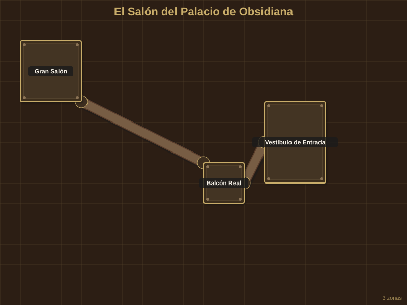
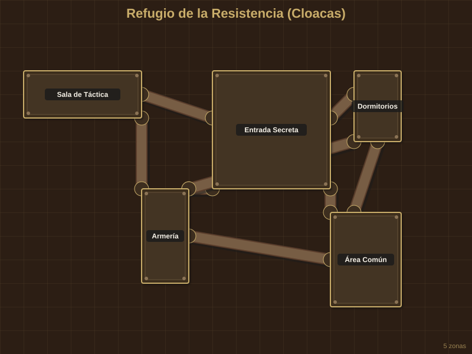
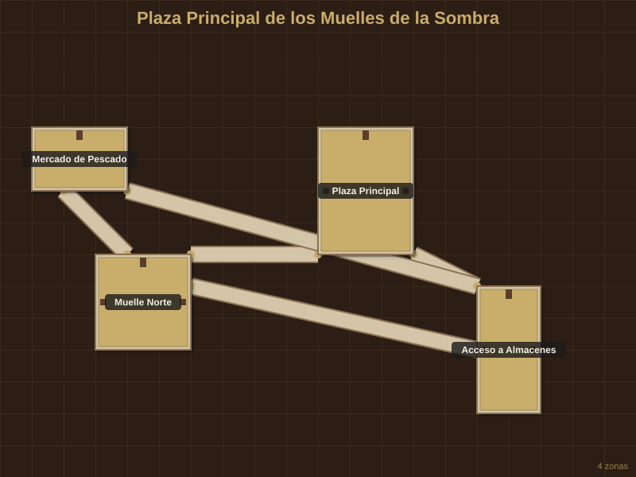

# Mapas y Escenas: Sombras de Argentia

## El Salón del Palacio de Obsidiana

**Tipo:** Interior (Gala)
**Dimensiones:** 80x60 pies
**Iluminación:** Arañas de cristal encantadas (Luz brillante)
**Atmósfera:** Perfume caro, música de cámara sutil, el eco de zapatos de seda sobre mármol negro.
**Vinculado a:** Acto 2, La Gala de la Purga

---

### Descripción General para Leer en Voz Alta

> Las puertas dobles se abren hacia un mar de obsidiana pulida. El suelo es tan negro y brillante que parece que los invitados caminan sobre un cielo nocturno sin estrellas. Arañas de cristal flotan a diez metros de altura, bañando a la nobleza de Argentia en una luz cálida y artificial que oculta las dagas y las conspiraciones que se esconden tras las máscaras.

---

### Características Generales

- **Luces:** Cientos de velas encantadas que no gotean cera.
- **Sonidos:** Murmullos constantes, risas forzadas y un cuarteto de cuerdas en el balcón.
- **Olores:** Rosas frescas, vino añejo y el sutil ozono de la magia defensiva.
- **Temperatura:** Perfectamente regulada por magos de clima.

---

### Mapa

---

### Áreas Numeradas

#### Área 1: Gran Salón
El corazón de la gala, donde se baila y se cierran tratos.

#### Área 2: Balcón Real
Desde aquí, la familia gobernante observa el evento. Es un punto táctico elevado.

#### Área 3: Vestíbulo de Entrada
Donde se anuncian los nombres y se revisan las invitaciones (y las armas).

---

## Refugio de la Resistencia (Cloacas)

**Tipo:** Mazmorra / Escondite
**Dimensiones:** 100x80 pies
**Iluminación:** Antorchas de sebo escasas y hongos bioluminiscentes (Luz tenue)
**Atmósfera:** Humedad calada hasta los huesos, el goteo rítmico del agua y el olor a metal oxidado.
**Vinculado a:** Acto 1 y 2, Base de los Buscadores del Sol

---

### Mapa

---

### Áreas Numeradas

#### Área 1: Entrada Secreta
Camuflada tras una pared de ladrillos ilusoria.

#### Área 2: Área Común
Donde los rebeldes descansan y comparten raciones escasas.

#### Área 3: Armería
Pocas armas, pero bien cuidadas.

#### Área 4: Sala de Táctica
Un mapa de la ciudad con alfileres de colores domina la mesa central.

#### Área 5: Dormitorios
Hamacas apretadas para maximizar el espacio.

---

## Plaza Principal de los Muelles de la Sombra

**Tipo:** Ciudad / Exterior
**Dimensiones:** 120x100 pies
**Iluminación:** Faroles de aceite y la luna (Oscuridad parcial)
**Atmósfera:** Viento salado, gritos de estibadores y el crujido de madera vieja.
**Vinculado a:** Acto 1, Sombras en los Muelles de Ébano

---

### Mapa

---

### Áreas Numeradas

#### Área 1: Plaza Principal
Un espacio abierto ideal para una emboscada o una persecución.

#### Área 2: Muelle Norte
Donde atracan los barcos de calado medio.

#### Área 3: Acceso a Almacenes
Puertas reforzadas que guardan mercancías "especiales".

#### AREA 4: Mercado de Pescado
Puestos abandonados por la noche, perfectos para cobertura.
