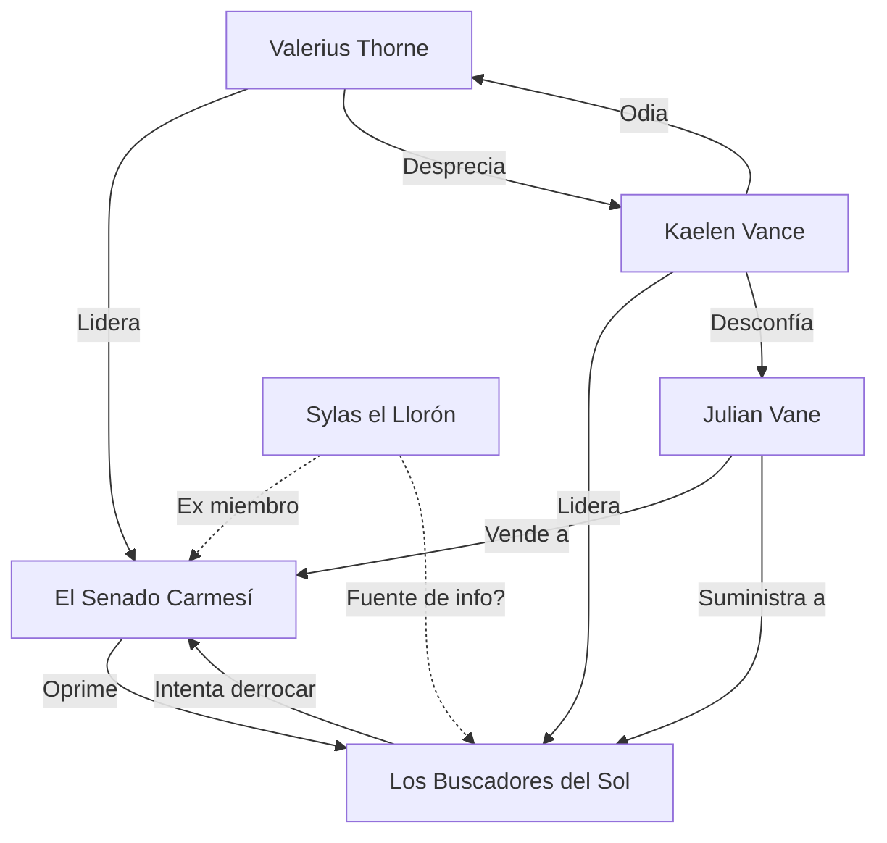

# NPCs y Facciones: Sombras de Argentia

Argentia no es solo una ciudad; es un organismo vivo que se alimenta de la desesperación de los vivos y la ambición de los muertos. En este escenario, la política es tan letal como un colmillo en la yugular.

---

## Sistema de Facciones

### El Senado Carmesí

- **Tipo:** Aristocracia Vampírica / Consejo de Gobierno.
- **Objetivo:** Mantener la estabilidad de Argentia, asegurar el suministro de "sangre tributaria" y evitar que las disputas entre linajes destruyan la ciudad.
- **Relación con jugadores:** Antagonistas sistémicos. Ven a los PJs como peones, amenazas o, en el mejor de los casos, curiosidades entretenidas.
- **Líder:** Gran Canciller Valerius Thorne.
- **Recursos:** La Guardia de Ébano (fuerza militar), control total de la economía de la ciudad, magia de sangre ancestral y una red de informantes humanos (los "Besa-Anillos").
- **Motivación grupal:** La preservación del status quo. Creen que sin su gobierno, Argentia caería en el caos y la barbarie.

#### Miembros Clave
- **Valerius Thorne** — El Canciller que equilibra los clanes.
- **Lady Elara von Stein** — Maestra de Susurros y espionaje.
- **Conde Malakor** — El puño militar del Senado.

---

### Los Buscadores del Sol

- **Tipo:** Resistencia Humana / Grupo Rebelde.
- **Objetivo:** Derrocar al Senado Carmesí, abolir el sistema de tributo de sangre y encontrar una manera de disipar la Niebla Eterna que oculta el sol.
- **Relación con jugadores:** Aliados potenciales, aunque extremistas. Su desconfianza hacia cualquiera que no sea un humano "puro" puede generar fricción.
- **Líder:** Kaelen Vance.
- **Recursos:** Escondites en los barrios bajos, conocimiento de los pasadizos subterráneos, armas de plata robadas y algunos artefactos lumínicos antiguos.
- **Motivación grupal:** Supervivencia y libertad. Están cansados de vivir como ganado.

#### Miembros Clave
- **Kaelen Vance** — Líder carismático y estratega.
- **Elena "Paso Sombrío"** — Especialista en infiltración y asesinato.
- **Padre Markus** — Antiguo sacerdote que mantiene la fe en la luz.

---

## NPCs Principales

### Gran Canciller Valerius Thorne

- **Raza/Clase:** Vampiro (Noble / Mago de Sangre).
- **Alineamiento:** Legal Malvado.
- **Ubicación:** El Capitel de la Sangre, Distrito Alto.
- **Estadísticas de Combate:** CA 18, PG 144, Ataque: Bastón de Hueso +9 (2d8+5 daño necrótico). Puede usar *Dominar Persona* (CD 17).
- **Nivel/CR:** CR 13.

#### Apariencia
Un hombre de elegancia atemporal, que aparenta unos 40 años. Viste sedas de color borgoña y negro. Su piel es como el mármol pulido y sus ojos, de un azul gélido, parecen leer las intenciones más ocultas. Siempre lleva un anillo de sello con un rubí del tamaño de un ojo humano.

#### Personalidad
Cortesía impecable que oculta una crueldad absoluta. Habla con una voz suave y pausada, nunca alzándola. Es un pragmático total: no mata por placer, sino por necesidad política.

#### Motivación
Mantener la paz entre los clanes vampíricos a cualquier costo. Teme que una guerra civil entre inmortales sea el fin de Argentia.

#### Secreto
Valerius está empezando a sufrir de "El Desgaste", una degeneración mental que afecta a los vampiros más ancianos. A veces olvida siglos enteros de historia en un parpadeo.

#### Conexiones
- **Aliados:** El Senado Carmesí (tenso).
- **Enemigos:** Los Buscadores del Sol, clanes rebeldes.
- **Facción:** El Senado Carmesí.

**Cita típica:** *"La paz tiene un precio, querido. En Argentia, ese precio se mide en decilitros, no en monedas."*

---

### Kaelen Vance

- **Raza/Clase:** Humano (Pícaro / Estratega).
- **Alineamiento:** Caótico Bueno.
- **Ubicación:** El Refugio de la Esperanza (Barrios Bajos).
- **Estadísticas de Combate:** CA 16, PG 65, Ballesta pesada de plata +7 (1d10+4).

#### Apariencia
Cansado, con cicatrices que cuentan historias de escapes por poco. Sus manos siempre están manchadas de aceite de lámpara o hollín. Viste ropa práctica y desgastada, pero sus ojos brillan con una intensidad fanática.

#### Personalidad
Directo, apasionado y profundamente cínico respecto a la política. No cree en las palabras de los vampiros. Es un líder que daría la vida por cualquiera de sus hombres, pero espera la misma lealtad.

#### Motivación
Venganza por su familia, que fue "reclamada" como tributo excesivo hace diez años. Su objetivo final es ver el sol sobre las agujas de Argentia una vez más.

#### Secreto
Está experimentando con alquimia prohibida para crear una "Bomba Solar", pero los materiales que usa son tan inestables que podrían volar medio barrio bajo.

#### Conexiones
- **Aliados:** Los Buscadores del Sol.
- **Enemigos:** El Senado Carmesí, Julian Vane (lo odia por "colaboracionista").
- **Facción:** Los Buscadores del Sol.

**Cita típica:** *"No estamos aquí para sobrevivir. Estamos aquí para recordarles que la noche siempre termina, incluso para ellos."*

---

## Figuras Políticas Ambiguas

### Julian Vane "El Facilitador"

- **Rol:** Comerciante de lujo e informante.
- **Motivación:** Riqueza y supervivencia.
- **Secreto:** Es un agente doble. Pasa información al Senado sobre los rebeldes para mantener su licencia comercial, pero ayuda a los rebeldes a conseguir suministros médicos de contrabando para tener un "seguro de vida" si la revolución triunfa.

#### Personalidad
Adulador, siempre tiene una sonrisa y una copa de vino caro a mano. Es el hombre que puede conseguirte cualquier cosa en Argentia, desde un frasco de sangre virgen hasta un salvoconducto para salir de la ciudad.

**Cita:** *"En Argentia, los principios son un lujo que los vivos no podemos permitirnos."*

---

### Sylas el Llorón

- **Rol:** Erudito exiliado (Vampiro).
- **Motivación:** Redención o simple olvido.
- **Secreto:** Fue uno de los fundadores del Senado, pero se autoexilió cuando vio en lo que se habían convertido. Conoce las debilidades estructurales del Capitel de la Sangre.

#### Personalidad
Melancólico y filosófico. Vive en una biblioteca en ruinas en el Distrito de los Cementerios. No ataca a los humanos a menos que lo provoquen, y prefiere alimentarse de animales.

**Cita:** *"La inmortalidad es solo una forma muy lenta de morir."*

---

## Resumen de Relaciones

