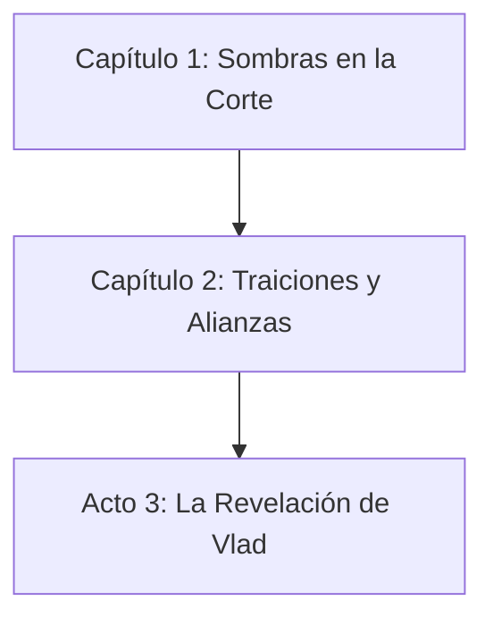

# Campaign Flowchart — Nivel Act

**Campaña:** La Hoja de Vlad  
**Nivel de Detalle:** Act (vista de capítulos)  
**Fecha de Generación:** 2026-05-09

---

## Diagrama Mermaid

---

## Descripción de la Estructura

### Capítulo 1: Sombras en la Corte
- **Niveles:** 1
- **Áreas:** 1-12 (Mansión Dragomir + Escape)
- **Tono:** Intriga + Exploración
- **Objetivo Principal:** Sobrevivir al Banquete Sangriento, obtener invitación al Círculo Interior, primer fragmento de la Hoja (1/7)
- **Villano:** Arzobispo Sergei (escapa)
- **Activo Transferido:** Invitación sellada al Círculo Interior

### Capítulo 2: Traiciones y Alianzas
- **Niveles:** 2-3
- **Áreas:** Catacumbas de la Catedral
- **Tono:** Dungeon crawl + Intriga
- **Objetivo Principal:** Obtener segundo fragmento, descubrir aliados y traidores
- **Villano:** Tenientes del culto
- **Activo Transferido:** Pruebas de la conspiración

### Acto 3: La Revelación de Vlad
- **Niveles:** 4-5
- **Áreas:** Por definir (confrontación final)
- **Tono:** Épico + Revelaciones
- **Objetivo Principal:** Reunir los 7 fragmentos, confrontar al verdadero villano
- **Villano:** Por revelar
- **Resolución:** Destino de Vladgrad

---

## Puntos de Decisión Críticos

| Capítulo | Decisión | Consecuencia |
|----------|----------|--------------|
| Cap 1 | Salvar nobles en capilla | +10 reputación Nobleza, aliados futuros |
| Cap 1 | Obtener fragmento pacíficamente | Espectros como aliados potenciales |
| Cap 1 | Alianza con Viuda Negra | Acceso a mercado negro, información |
| Cap 2 | (Por definir en sesiones) | (Por definir) |
| Cap 3 | (Por definir en sesiones) | (Por definir) |

---

## Notas para el DM

1. **Estructura Lineal con Ramas:** La campaña sigue una estructura principal lineal (Cap 1 → Cap 2 → Cap 3) pero con decisiones que afectan reputaciones, aliados y recursos.

2. **Los 7 Fragmentos:** La campaña está estructurada alrededor de los 7 fragmentos de la Hoja. El Capítulo 1 otorga el primero (1/7).

3. **Límite de Tiempo:** La luna sangre es en 3 noches (desde el final del Capítulo 1). Esto crea urgencia narrativa.

4. **Flowchart Detallado:** Para decisiones específicas por área, consultar el flowchart nivel "decision".

---

*Documento generado automáticamente por grimorio_generate_flowchart*
