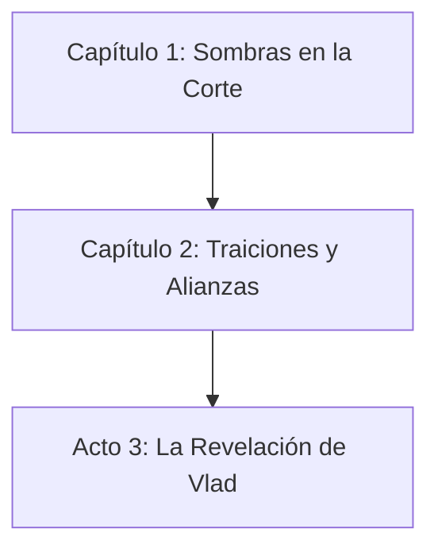

# Campaign Flowchart — Nivel Decisión

**Campaña:** La Hoja de Vlad  
**Nivel de Detalle:** Decisión (vista detallada)  
**Fecha de Generación:** 2026-05-09

---

## Diagrama Mermaid

---

## Decisiones Detalladas por Área

### Capítulo 1: Sombras en la Corte

#### Área 1: Vestíbulo de los Ancestros
| Decisión | Condición | Consecuencia | Afecta |
|----------|-----------|--------------|--------|
| Examinar retratos | PJs investigan | Ventaja en primera tirada social | Área 2 |
| Encontrar pergamino | Investigación DC 14 | Conocen 3 nombres de víctimas | Área 5, Acto 2 |
| Ignorar todo | PJs no interactúan | Mayordomo hostil | Área 2 |

#### Área 2: Salón del Banquete
| Decisión | Condición | Consecuencia | Afecta |
|----------|-----------|--------------|--------|
| Acusan al Arzobispo | Confrontación directa | Niega y escapa con *Paso Brumoso* | Área 6, Acto 2 |
| Prueban el vino | Beben sin investigar | CON DC 14 o envenenados (desventaja 1h) | Todas las tiradas futuras |
| Se alían con Conde | Persuasión/Insight | Reciben Anillo de Protección Menor | Área 5 |

#### Área 3: Las Cocinas
| Decisión | Condición | Consecuencia | Afecta |
|----------|-----------|--------------|--------|
| Matan al asesino | Combate | Obtienen medallón del culto | Área 6 (prueba) |
| Dejan escapar | Sigilo/Combate fallido | Aparece en Área 6 con refuerzos | Área 6 (más difícil) |
| Examinan olla | Investigación | Identifican sangre del Duque Mircea | Acto 2 (Duque no-muerto) |

#### Área 4: Biblioteca Prohibida
| Decisión | Condición | Consecuencia | Afecta |
|----------|-----------|--------------|--------|
| Leen grimorios | Investigación | Aprenden: Hoja es llave dimensional | TODA la campaña |
| Destruyen círculo | Interrupción | Imp ataca furioso | Área 4 (combate) |
| Ignoran círculo | No interactúan | Imp los sigue y ataca en Área 6 | Área 6 (combate adicional) |

#### Área 5: Dormitorios del Servicio
| Decisión | Condición | Consecuencia | Afecta |
|----------|-----------|--------------|--------|
| Salvan al sirviente | Medicina DC 12 | Informa sobre cripta antes de morir | Área 6 (información) |
| Liberan almas | Religión DC 15 | Ventaja en próxima salvación | Área 6 (beneficio) |
| Ignoran víctimas | No interactúan | Almas los maldicen | Desventaja temporal en Sabiduría |

#### Área 6: Capilla Privada
| Decisión | Condición | Consecuencia | Afecta |
|----------|-----------|--------------|--------|
| Destruyen cáliz | Combate/Interrupción | Ritual se interrumpe, Arzobispo escapa | Acto 2 (ritual incompleto) |
| Salvan a los nobles | Dispel/No-letal | +10 reputación Nobleza, 3 aliados | Todas las interacciones sociales |
| Matan al Arzobispo | (Imposible por diseño) | Si lo logran: campaña cambia drásticamente | TODA la campaña |

#### Área 7: Cripta Secreta
| Decisión | Condición | Consecuencia | Afecta |
|----------|-----------|--------------|--------|
| Toman fragmento | Sin ritual | Espectros atacan | Área 7 (combate) |
| Calman espectros | Religión/Ritual | Obtienen fragmento sin combate | Área 7 (sin pérdida de recursos) |
| Examinan sarcófagos | Investigación | Aprenden: 7 fragmentos existen | TODA la campaña (estructura) |

#### Área 8: Túneles de Escape
| Decisión | Condición | Consecuencia | Afecta |
|----------|-----------|--------------|--------|
| Combaten ratas | Combate | Limpian túnel, llegan frescos | Área 9 (llegan frescos) |
| Evitan ratas | Sigilo | Ratas los persiguen | Área 9 (combate en salida) |
| Ruta del río | Supervivencia | Escapan sin ser vistos | Área 10 (llegan al distrito del río) |

#### Área 9: Salida del Río
| Decisión | Condición | Consecuencia | Afecta |
|----------|-----------|--------------|--------|
| Sobornan guardias | 50 po | Pasan sin combate | Recursos (-50 po) |
| Intimidación | Intimidación DC 13 | Guardias huyen, alertan ciudad | Área 10 (guardias alertados) |
| Combate | Atacan | Obtienen equipo de guardias | Equipo de los PJs |

#### Área 10: Distrito del Río
| Decisión | Condición | Consecuencia | Afecta |
|----------|-----------|--------------|--------|
| Siguen a Viuda Negra | Aceptan ayuda | Llegan a guarida segura | Área 11 |
| Muestran fragmento | Confían | Ella ofrece protección adicional | Recursos futuros |
| Ocultan fragmento | Desconfían | Ella sospecha, los vigila | Futuras interacciones |

---

## Resumen de Consecuencias Globales

### Reputaciones Afectadas
| Facción | Evento | Delta |
|---------|--------|-------|
| Nobleza | Salvar nobles en capilla | +10 |
| Nobleza | Espectros calmados | +5 |
| Nobleza | Nobles mueren | -20 |
| Nobleza | Espectros destruidos | -10 |
| Gremio de Ladrones | Alianza con Viuda Negra | +10 |
| Guardia de la Ciudad | Alertados en salida | -5 |
| Iglesia | Herejía revelada | -50 |

### Activos Narrativos Obtenidos
| Activo | Ubicación | Uso |
|--------|-----------|-----|
| Invitación al Círculo Interior | Área 6 | Acceso a catacumbas (Cap 2) |
| Fragmento de la Hoja (1/7) | Área 7 | McGuffin principal |
| Medallón del Culto | Área 3 | Prueba contra el culto |
| Mapa de Catacumbas | Área 11 | Navegación (Cap 2) |
| Lista de Nobles Corruptos | Área 11 | Información/Advantage social |

---

## Notas para el DM

1. **Este flowchart es dinámico:** Las decisiones de los PJs pueden cambiar las consecuencias. Usá esto como guía, no como camisa de fuerza.

2. **Recuperación:** Si los PJs pierden una pista crucial (ej: no encuentran el pergamino), hay mecanismos de recuperación descritos en las áreas.

3. **Consecuencias a Largo Plazo:** Las decisiones del Capítulo 1 afectan el Capítulo 2 y más allá. Mantené un registro de las decisiones importantes.

4. **Estado del Mundo:** Actualizá el `narrative_state.json` después de cada sesión con las decisiones clave.

---

*Documento generado automáticamente por grimorio_generate_flowchart*
