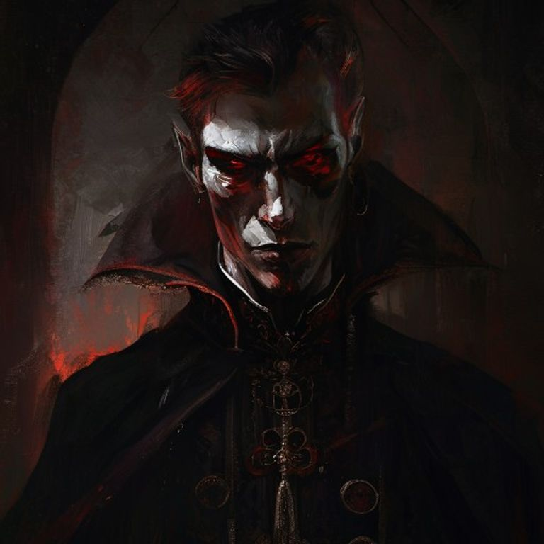

# La Hoja de Vlad — Lore del Mundo

## I. La Historia de Vlad y La Hoja

### El Ascenso del Rey Cuervo

Vlad "El Cuervo" Dragomir no nació para el trono. Era el tercer hijo del Duque de Valachia, una región montañosa en las fronteras del Reino de Aethelgard. En el año 847 del Calendario del Alba, cuando Vlad tenía apenas diecisiete años, su padre y sus dos hermanos mayores murieron en un "accidente" de caza que muchos sospecharon fue orquestado por la mano ambiciosa del joven.

En los siguientes cinco años, Vlad transformó Valachia de un ducado fronterizo olvidado en una fortaleza inexpugnable. Su genio militar se combinaba con una crueldad calculada que le valió su apodo: los prisioneros de guerra no eran ejecutados, sino empalados en las murallas de su castillo, creando un bosque de cuerpos que servía de advertencia a cualquier enemigo potencial.

### La Forja de La Hoja

En el año 853, Vlad desapareció durante cuarenta días. Cuando regresó, llevaba consigo una espada que ningún herrero había forjado: **La Hoja del Cuervo**.

Según los registros fragmentados que sobrevivieron, Vlad descendió a las **Criptas de los Antiguos**, un complejo subterráneo prehumano bajo las montañas de Valachia. Allí encontró no oro ni joyas, sino algo más antiguo: un pacto con una entidad que los eruditos llaman **El Susurrante de las Sombras**.

La Hoja no corta carne; corta **vínculos**. Con ella, Vlad podía:
- Romper juramentos de lealtad, haciendo que ejércitos enteros desertaran
- Separar almas de cuerpos sin matar al recipiente
- Destruir linajes sanguíneos, eliminando reclamos al trono

### La Traición Final

El año 859 marcó el cenit del poder de Vlad. Había conquistado tres reinos vecinos y marchaba sobre la capital de Aethelgard. Pero en la **Batalla del Río Sangriento**, algo salió terriblemente mal.

Los cronistas discrepan sobre qué ocurrió exactamente. Algunos dicen que La Hoja se volvió contra su maestro. Otros afirman que un asesino logró arrebatarle la espada. Lo único cierto es que Vlad murió esa noche, y La Hoja desapareció con él.

Su cuerpo nunca fue encontrado.

---

## II. El Reino de Aethelgard: Estado Actual

### La Corona Fracturada

Han pasado ciento sesenta y siete años desde la caída de Vlad. El Reino de Aethelgard, que una vez se extendía desde los Picos de Hierro hasta el Mar del Ocaso, ahora es una sombra de su antiguo esplendor.

El **Rey Aldric IV** gobierna desde la capital, **Corona del Alba**, pero su autoridad es cada vez más precaria. A sus sesenta y dos años, el rey muestra signos de demencia senil, y los rumores sugieren que pasa más tiempo hablando con fantasmas imaginarios que atendiendo los asuntos del reino.

### Las Casas Nobles

Cinco grandes casas nobles dominan el panorama político, cada una con sus propias ambiciones:

**Casa Valmont** — Los más poderosos económicamente. Controlan las rutas comerciales del sur y los puertos principales. Su emblema es un león dorado sobre campo azul. Liderados por la astuta **Duquesa Seraphina Valmont**, de cuarenta y dos años, quien muchos sospechan que envenenó a su primer marido para ascender al poder.

**Casa Blackthorne** — Maestros de la guerra y la estrategia militar. Controlan las fronteras del norte y mantienen la única ejército profesional significativo del reino. Su emblema es un halcón negro. El actual patriarca, **Lord Marcus Blackthorne**, es un veterano de guerra que perdió un ojo en la última rebelión y nunca lo ha perdonado.

**Casa Ravenshade** — Guardianes de la tradición y la religión. Controlan los templos principales y la sucesión de altos sacerdotes. Su emblema es un cuervo plateado. La **Gran Sacerdotisa Elara Ravenshade** afirma tener visiones proféticas, aunque nadie sabe cuántas son genuinas y cuántas son manipulación política.

**Casa Ironwood** — Señores de las minas y la industria. Controlan la producción de hierro, acero y piedras preciosas. Su emblema es un roble con raíces de hierro. El **Conde Theodore Ironwood** es conocido por su avaricia legendaria y su colección de artefactos antiguos, algunos de los cuales podrían tener conexiones con La Hoja.

**Casa Whisperwind** — Los espías y diplomáticos. Oficialmente son una casa menor, pero su red de informantes se extiende por todo el reino y más allá. Su emblema es una pluma sobre viento. Nadie conoce realmente al líder de esta casa; se dice que cambian de identidad cada pocos años.

### Tensiones Actuales

**La Crisis de Sucesión**: El Rey Aldric no tiene herederos legítimos. Su único hijo, el Príncipe Edric, murió en circunstancias sospechosas hace tres años. Oficialmente fue un accidente de caza; extraoficialmente, cada casa noble tiene su propia teoría sobre quién lo mató.

**La Rebelión del Sur**: Las provincias del sur, cansadas de los impuestos exorbitantes y la negligencia de la capital, han comenzado a organizarse bajo el estandarte de un líder carismático que se hace llamar **El Libertador**. Nadie conoce su verdadera identidad, pero sus tácticas sugieren entrenamiento militar de alto nivel.

**La Amenaza del Norte**: Más allá de las fronteras del reino, en las Tierras Yermas, tribus bárbaras se están unificando bajo un nuevo jefe de guerra que afirma haber encontrado un artefacto antiguo. Los refugiados hablan de un hombre que blandía una espada que "cortaba la voluntad misma".

---

## III. Mitos, Leyendas y Profecías

### La Profecía del Cuervo Sangriento

Transcrita de los **Archivos Prohibidos de Ravenshade**, esta profecía data de aproximadamente el año 860:

> *"Cuando el cuervo sangre tres veces sobre el trono vacío,*
> *La Hoja despertará de su sueño de hierro.*
> *El heredero de sombras reclamará lo que fue robado,*
> *Y los vínculos del reino se romperán como hilo podrido.*
> *Siete traiciones marcarán el camino,*
> *Y solo la sangre de sangre podrá cerrar la herida."*

Los eruditos debaten sobre el significado de esta profecía. Algunos creen que "el heredero de sombras" se refiere a un descendiente secreto de Vlad. Otros interpretan que La Hoja misma elegirá a su próximo portador.

### La Maldición del Linaje Roto

Una leyenda menos conocida sugiere que Vlad, antes de morir, lanzó una maldición sobre las cinco casas nobles:

> *"Ninguna de vuestras líneas verá el trono.*
> *Cada heredero caerá antes que el padre.*
> *Cada juramento se quebrará.*
> *Hasta que La Hoja sea devuelta a las sombras."*

Curiosamente, en los últimos cincuenta años, cada casa noble ha sufrido la muerte prematura de al menos un heredero. Las coincidencias son... inquietantes.

### El Culto del Susurrante

Existen rumores persistentes sobre un culto secreto que adora a la entidad que le dio La Hoja a Vlad. Se hacen llamar **Los Hijos del Susurro** y operan en las sombras de todas las ciudades principales.

Sus creencias centrales:
- La Hoja no es un arma, sino una llave
- Vlad no murió, sino que fue "transformado"
- Cuando La Hoja corte siete vínculos específicos, el Susurrante caminará nuevamente en el mundo material

Los símbolos del culto incluyen cuervos con ojos vacíos, espadas rotas, y círculos concéntricos que representan "vínculos rotos".

### Rumores y Habladurías de Taberna

1. **La Hoja fue encontrada** hace diez años por un mercader en las ruinas del campo de batalla original. El mercader desapareció tres días después.

2. **El Príncipe Edric no murió** — fue exiliado y vive bajo una identidad falsa, esperando el momento de reclamar su trono.

3. **El Rey Aldric está muerto** y ha sido reemplazado por un doble controlado por Casa Whisperwind.

4. **Vlad regresará** cuando La Hoja corte el último vínculo de sangre real. Algunos apuntan a que el Rey Aldric es el séptimo y último descendiente directo de la línea que derrotó a Vlad.

5. **La Hoja tiene conciencia propia** y ha estado manipulando eventos durante siglos para asegurar su propio regreso.

---

## IV. Cronología de Eventos (Últimos 100 Años)

| Año | Evento |
|-----|--------|
| **859** | Muerte de Vlad en la Batalla del Río Sangriento. La Hoja desaparece. |
| **862** | Fundación formal de las Cinco Casas Nobles por el nuevo rey, Guillermo I. |
| **879** | Primera Rebelión del Sur, sofocada por Casa Blackthorne. |
| **891** | El Gran Incendio de Corona del Alba destruye los Archivos Reales. Muchos registros históricos se pierden. |
| **903** | Descubrimiento de las Criptas de los Antiguos por exploradores de Casa Ironwood. La entrada es sellada por orden real. |
| **917** | La Pregunta de Sangre: epidemia misteriosa mata al 20% de la población rural. Los rumores culpan a rituales del culto. |
| **924** | Guerra de las Tres Coronas: conflicto breve entre Valmont, Blackthorne y Ravenshade por derechos de sucesión. Termina con el Tratado de Hierro. |
| **931** | Nacimiento del Príncipe Edric, único heredero del Rey Aldric IV. |
| **945** | El Rey Aldric IV asciende al trono tras la muerte de su padre. Muestra signos tempranos de inestabilidad mental. |
| **952** | Descubrimiento de una red de espionaje de Whisperwind en la corte de Valmont. Ejecuciones públicas de doce agentes. |
| **958** | **Muerte del Príncipe Edric**. Oficialmente: accidente de caza. Extraoficialmente: nunca se encontró el cuerpo. |
| **960** | Formación de la Resistencia del Sur. Primeros ataques coordinados contra caravanas reales. |
| **963** | **Año Actual**. Los rumores sobre La Hoja se intensifican. Refugiados del norte hablan de un guerrero con una espada negra. |

---

## V. Secretos Descubribles por los Jugadores

### Secreto 1: El Verdadero Destino de Vlad

**La Verdad**: Vlad no murió. Fue traicionado por su propio teniente, quien lo apuñaló con La Hoja. En lugar de matarlo, el arma lo transformó en un ser semi-espectral, atrapado entre la vida y la muerte. Su conciencia está fragmentada, pero consciente.

**Cómo descubrirlo**: Los jugadores pueden encontrar fragmentos del diario de Vlad en las Criptas de los Antiguos, o encontrarse con un NPC que ha tenido visiones del "Rey Cuervo" hablando desde las sombras.

**Implicaciones**: Vlad podría ser un aliado o un villano, dependiendo de cómo los jugadores interactúen con él. Su objetivo principal es recuperar La Hoja para completar su transformación y reclamar su venganza.

### Secreto 2: La Identidad del Libertador

**La Verdad**: El Libertador es en realidad **Lady Cassandra Valmont**, hija ilegítima de la Duquesa Seraphina. Fue exiliada al nacer y criada por rebeldes en el sur. Su madre conoce su identidad pero la mantiene en secreto para proteger sus propias ambiciones políticas.

**Cómo descubrirlo**: Los jugadores pueden encontrar cartas interceptadas entre Cassandra y un espía doble, o descubrir un sello familiar oculto en el estandarte del Libertador.

**Implicaciones**: Esto crea un dilema moral. ¿Deberían los jugadores exponer la verdad y destruir la rebelión? ¿O ayudar a Cassandra a reclamar su lugar legítimo, arriesgando una guerra civil?

### Secreto 3: La Naturaleza de La Hoja

**La Verdad**: La Hoja no es una espada en el sentido tradicional. Es un **fragmento cristalizado de la entidad conocida como El Susurrante**. Cada vez que corta un vínculo (juramento, sangre, amor, lealtad, esperanza, fe, vida), el Susurrante gana poder en el mundo material.

Los siete vínculos que debe cortar son:
1. Juramento (ya cortado — la traición del teniente de Vlad)
2. Sangre (ya cortado — la muerte del Príncipe Edric)
3. Amor (pendiente)
4. Lealtad (pendiente)
5. Esperanza (pendiente)
6. Fe (pendiente)
7. Vida (pendiente — esto completaría el ritual)

**Cómo descubrirlo**: Los jugadores pueden encontrar textos antiguos en los archivos de Ravenshade, o recibir visiones de un sacerdote moribundo que estudió el culto.

**Implicaciones**: Los jugadores deben decidir si destruir La Hoja es posible (requeriría un ritual masivo) o si deben asegurarse de que nunca corte los vínculos restantes.

### Secreto 4: La Conexión del Rey Aldric

**La Verdad**: El Rey Aldric no está loco. Ha estado recibiendo **visiones genuinas** del Susurrante, quien le muestra el futuro si permite que La Hoja complete los siete cortes. El rey está siendo manipulado, pero también tiene miedo: sabe que si se resiste, su reino caerá de todos modos.

**Cómo descubrirlo**: Los jugadores que ganen acceso a las cámaras privadas del rey pueden encontrar sus diarios personales, donde documenta las visiones y su lucha interna.

**Implicaciones**: El rey podría ser rescatado de la manipulación, o podría convertirse en un villano trágico que cree que está salvando al reino al permitir la destrucción.

### Secreto 5: El Octavo Vínculo

**La Verdad Más Oscura**: La profecía del Cuervo Sangriento está incompleta. Existe un **octavo vínculo** que no se menciona en los registros públicos: **Memoria**. Si La Hoja corta la memoria colectiva del reino, nadie recordará que alguna vez hubo un Aethelgard. El Susurrante podría reescribir la realidad misma.

Este secreto fue conocido solo por Vlad, quien intentó destruir La Hoja antes de su "muerte" al darse cuenta de lo que había desatado. Pero era demasiado tarde.

**Cómo descubrirlo**: Requiere que los jugadores encuentren las páginas faltantes del diario de Vlad, que están escondidas en diferentes ubicaciones a lo largo de la campaña.

**Implicaciones**: Este es el verdadero stakes de la campaña. No se trata solo de quién gobierna el reino, sino de si el reino (y sus habitantes) seguirán existiendo en alguna forma reconocible.

---

## VI. Ganchos de Aventura Integrados

1. **El Mercader Desaparecido**: Un NPC contrata a los jugadores para investigar la desaparición de un mercader que afirmaba haber encontrado "una espada que hablaba".

2. **La Boda Sangrienta**: Los jugadores son invitados a una boda entre dos casas nobles. Durante la ceremonia, un asesino intenta matar al novio con un arma que deja heridas que no sangran.

3. **El Templo Silenciado**: Un templo de Ravenshade ha dejado de enviar reportes. Cuando los jugadores llegan, encuentran a todos los sacerdotes vivos pero en estado catatónico, murmurando sobre "el susurro que vino".

4. **La Mina Cerrada**: Casa Ironwood ha cerrado una mina importante sin explicación. Los trabajadores desaparecidos están siendo usados en rituales del culto para "cortar vínculos" experimentales.

5. **El Heredero Perdido**: Un joven afirma ser el Príncipe Edric, exiliado pero vivo. ¿Es genuino o un impostor? Cada casa noble tiene una opinión diferente, y los jugadores deben descubrir la verdad.

---

## VII. El Estado del Mundo Mágico

La magia en Aethelgard es **rara y temida**. Después de los eventos con Vlad, la población general asocia la magia poderosa con la corrupción y la traición.

**Los Hechiceros Reales**: Oficialmente, el rey mantiene una corte de magos. En realidad, solo quedan tres, y todos trabajan en secreto para contener las fugas mágicas que La Hoja ha causado a lo largo de los siglos.

**Las Líneas Ley**: El reino está construido sobre antiguas líneas de poder mágico. Las Criptas de los Antiguos están en un nodo donde cinco líneas se cruzan, lo que explica por qué Vlad pudo encontrar algo tan poderoso allí.

**Los Precios de la Magia**: Cada hechizo lanzado deja una "cicatriz" en la realidad. En lugares donde se ha usado mucha magia, la realidad se vuelve... delgada. Las sombras se mueven solas. Los susurros se escuchan sin fuente. Estos son los **Ecos del Susurrante**.

---

*Este documento representa el lore base de la campaña. Los DMs deben adaptar y expandir según las decisiones de los jugadores. Recordad: en una campaña de intriga política, la información es el recurso más valioso. Distribuid los secretos gradualmente, y dejad que los jugadores descubran que la verdad es siempre más complicada que los rumores.*
