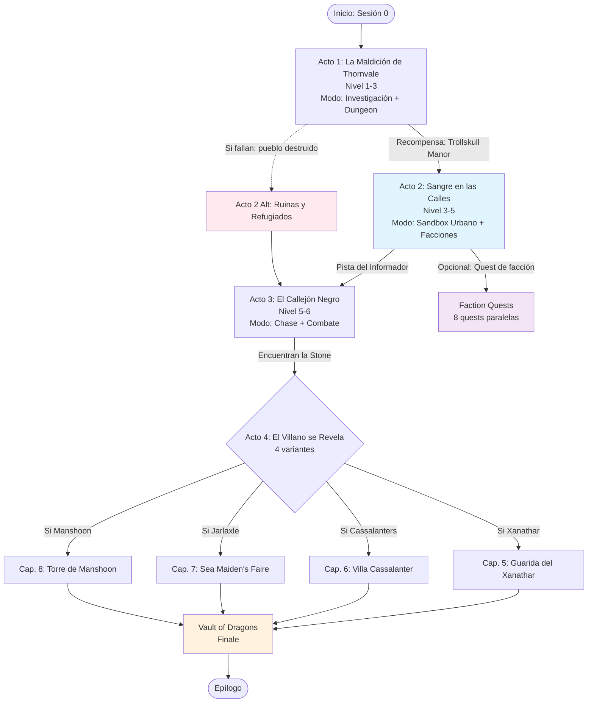

# Grimorio MCP — System Design Document (SDD) & Roadmap de Coherencia Narrativa

> **Versión:** 1.0.0
> **Fecha:** Mayo 2026
> **Autoría:** Análisis orquestado sobre Grimorio MCP + Campañas Oficiales D&D 5e
> **Propósito:** Diseñar e implementar un subsistema de coherencia narrativa que permita a Grimorio generar campañas de D&D 5e con la calidad estructural, cohesión interna y usabilidad de una aventura oficial de Wizards of the Coast.

---

## Tabla de Contenidos

- [1. Análisis de Estructuras de Campañas Oficiales D&D 5e](#1-análisis-de-estructuras-de-campañas-oficiales-dd-5e)
  - [1.1. Metodología de Análisis](#11-metodología-de-análisis)
  - [1.2. Patrones Estructurales Detectados](#12-patrones-estructurales-detectados)
  - [1.3. Comparativa entre Aventuras](#13-comparativa-entre-aventuras)
  - [1.4. Elementos Narrativos Clave](#14-elementos-narrativos-clave)
  - [1.5. Elementos Mecánicos Clave](#15-elementos-mecánicos-clave)
  - [1.6. Modelo de Coherencia en Aventuras Oficiales](#16-modelo-de-coherencia-en-aventuras-oficiales)
- [2. Estado Actual de Grimorio y Brechas de Coherencia](#2-estado-actual-de-grimorio-y-brechas-de-coherencia)
  - [2.1. Arquitectura Técnica del MCP](#21-arquitectura-técnica-del-mcp)
  - [2.2. Pipeline de Generación Actual](#22-pipeline-de-generación-actual)
  - [2.3. Sistema de Coherencia: Análisis Crítico](#23-sistema-de-coherencia-análisis-crítico)
  - [2.4. Brechas Identificadas](#24-brechas-identificadas)
  - [2.5. Comparativa con Estándar Oficial](#25-comparativa-con-estándar-oficial)
  - [2.6. Riesgos de la Arquitectura Actual](#26-riesgos-de-la-arquitectura-actual)
- [3. Diseño de Sistema (SDD) — Subsistema de Coherencia Narrativa](#3-diseño-de-sistema-sdd--subsistema-de-coherencia-narrativa)
  - [3.1. Principios de Diseño](#31-principios-de-diseño)
  - [3.2. Adventure Bible / Canon Service](#32-adventure-bible--canon-service)
  - [3.3. Narrative State Tracker](#33-narrative-state-tracker)
  - [3.4. Cross-Reference Validation Engine](#34-cross-reference-validation-engine)
  - [3.5. Faction & Reputation System](#35-faction--reputation-system)
  - [3.6. Consequence & World Reactivity Engine](#36-consequence--world-reactivity-engine)
  - [3.7. Random Tables & Session Prep Generator](#37-random-tables--session-prep-generator)
  - [3.8. Adventure Flowchart & Visual Navigator](#38-adventure-flowchart--visual-navigator)
  - [3.9. Handout & Player-Facing Content Generator](#39-handout--player-facing-content-generator)
  - [3.10. New MCP Tools Specification](#310-new-mcp-tools-specification)
  - [3.11. Subagent Architecture Redesign](#311-subagent-architecture-redesign)
  - [3.12. Data Model Extensions](#312-data-model-extensions)
- [4. Roadmap de Implementación](#4-roadmap-de-implementación)
  - [4.1. Fases del Roadmap](#41-fases-del-roadmap)
  - [4.2. Especificación de Herramientas MCP por Fase](#42-especificación-de-herramientas-mcp-por-fase)
  - [4.3. Especificación de Subagentes por Fase](#43-especificación-de-subagentes-por-fase)
  - [4.4. Dependencias y Puntos de Control](#44-dependencias-y-puntos-de-control)
  - [4.5. Métricas de Éxito por Fase](#45-métricas-de-éxito-por-fase)
  - [4.6. Riesgos y Mitigaciones](#46-riesgos-y-mitigaciones)
- [5. Conclusión y Próximos Pasos](#5-conclusión-y-próximos-pasos)

---

# 1. Análisis de Estructuras de Campañas Oficiales D&D 5e

> **Propósito de esta sección:** Documentar, con precisión técnica, los patrones estructurales, narrativos y mecánicos que Wizards of the Coast emplea consistentemente en las campañas oficiales de D&D 5e. El objetivo es establecer un *blueprint* formal que un generador automático pueda replicar para producir aventuras con la misma calidad de organización, coherencia interna y experiencia de juego.

---

## 1.1. Metodología de Análisis

El análisis se construyó a partir de la descomposición estructural de tres campañas representativas del catálogo oficial: **Waterdeep: Dragon Heist** (aventura urbana polifacética), **Ghosts of Saltmarsh** (campaña modular marítima) y **Out of the Abyss** (campaña lineal de supervivencia en el Underdark). Estas tres aventuras fueron seleccionadas porque cubren los tres arquetipos estructurales predominantes en el diseño de Wizards: el **arco narrativo ramificado**, la **campaña modular de hubs**, y la **odisea lineal con tramos de sandbox**.

La metodología consistió en tres capas de extracción:

1. **Extracción macroestructural**: Mapeo de capítulos, subcapítulos, puntos de inflexión narrativa y hitos de nivel. Se identificó la arquitectura de cada libro (introducción, capítulos centrales, finales, apéndices) y cómo cada componente se conecta con los demás.
2. **Extracción microestructural**: Análisis de la unidad mínima de contenido dentro de cada capítulo — las *áreas numeradas* de dungeon, los *encounters* de viaje, los *sidebar* de DM, el *read-aloud text*, las *tablas aleatorias* y los *handouts para jugadores*. Se buscó identificar patrones de repetición y reutilización.
3. **Extracción de mecánicas integradas**: Documentación de sistemas no-estándar que la aventura introduce para sostener su fantasía temática (ej. el sistema de aliados de OotA, el sistema de facciones con quests por nivel de WDH, el Adventure Roster de GoS).

Para cada elemento detectado se anotó: (a) su ubicación en el flujo de la aventura, (b) su función narrativa o mecánica, (c) su grado de opcionalidad, y (d) su dependencia de otros elementos. Esto permite modelar la campaña no como un documento lineal, sino como un **grafo de dependencias** donde nodos (capítulos, encounters, NPCs) tienen aristas que representan prerequisitos, consecuencias y puntos de ramificación.

---

## 1.2. Patrones Estructurales Detectados

Tras el análisis comparativo, se identificaron seis patrones estructurales universales que aparecen —con variaciones— en todas las campañas oficiales. Un generador automático debería implementar cada uno de estos patrones como una *primitiva* composable.

### Patrón 1: Introducción / Adventure Background

Toda campaña oficial comienza con una sección de *setup* que precede a cualquier acción de los PJs. Esta sección típicamente incluye:

- Un **timeline de eventos previos** que explica cómo se llegó al punto de inicio (ej. en WDH, el robo del dinero de Neverember, la llegada de la Stone of Golorr).
- Un **resumen de la storyline** para el DM, a menudo con un **flowchart visual** que muestra el flujo de capítulos, puntos de decisión y ramas.
- **Contexto geopolítico**: facciones activas, poderes en juego, y cómo el mundo "respira" independientemente de los PJs.
- **Hooks para conectar PJs**: cómo los personajes de los jugadores entran en la aventura, a menudo con múltiples opciones según clase, trasfondo o alineamiento.

> **Implicación para IA:** El generador debe producir primero una *Introducción/Background* autoportante antes de generar capítulos. Esta sección funciona como el "contrato narrativo" entre el diseñador de la aventura y el DM.

### Patrón 2: Capítulos como Unidades Narrativas con Modos de Juego Distintos

Cada capítulo adopta un **modo de juego dominante** que le da identidad mecánica:

| Capítulo (ejemplo) | Modo Dominante | Objetivo del PJ |
|---|---|---|
| WDH Ch.1: A Friend in Need | Investigación + Dungeon Lineal | Rescatar a Floon, obtener recompensa |
| WDH Ch.2: Trollskull Alley | Sandbox Urbano + Downtime | Restaurar taverna, gestionar facciones |
| WDH Ch.3: Fireball | Investigación + Confrontación | Resolver explosión, rastrear Stone |
| WDH Ch.4: Dragon Season | Chase Urbana + Elección de Villano | Recuperar la Stone antes del villano |
| GoS Ch.1: Saltmarsh | Hub + Exploración Regional | Establecer base, investigar rumores |
| GoS Ch.2: Sinister Secret | Dungeon Exploración + Sigilo/Combate | Desmantelar contrabandistas |
| GoS Ch.3: Danger at Dunwater | Diplomacia + Alianzas | Negociar con lizardfolk |
| OotA Ch.1: Prisoner of the Drow | Escape + Supervivencia | Huir de Velkynvelve |
| OotA Ch.2: Into Darkness | Viaje + Supervivencia | Navegar el Underdark |
| OotA Ch.4-7: City Chapters | Intriga + Cultura Extranjera | Resolver conflictos locales conectados a demonios |

La transición entre capítulos nunca es arbitraria: cada capítulo entrega un **activo narrativo** (información, aliado, base, objeto clave) que es prerequisito para el siguiente.

> **Implicación para IA:** El generador debe asignar un *modo de juego* a cada capítulo y garantizar que la transición entre capítulos esté mediatizada por un *activo narrativo* transferible.

### Patrón 3: Locaciones Desglosadas en Áreas Numeradas

Dentro de cualquier capítulo que involucre exploración física (dungeon, edificio, ciudad distrito, nave), el espacio se atomiza en **áreas numeradas secuencialmente**. Cada área sigue un formato estandarizado:

```
## Área X: Nombre Descriptivo

**Read-aloud text:** (2-4 oraciones en segunda persona, presente, descriptivo sensorial)

Descripción ampliada para el DM: detalles que los PJs pueden descubrir con habilidades.

- **Criaturas:** Lista de monstruos, cantidad, estadísticas referenciadas al MM/estadísticas embebidas.
- **Tesoro:** XP, moneda, objetos mágicos, con formato estándar de loot tables.
- **Conexiones:** Qué áreas están conectadas (números referenciados).
- **Secretos/Trampas:** DCs para detectar, mecanismos, consecuencias.
- **Desarrollo:** Qué pasa después si los PJs hacen X, Y o Z.
```

Este formato es *invariante* entre aventuras. Incluso en aventuras de ciudad como WDH, cuando los PJs exploran una villa o un teatro, el espacio se convierte en "dungeon numérico".

> **Implicación para IA:** El generador debe producir locaciones como listas de áreas numeradas con los campos estándar arriba descritos. El *read-aloud text* debe ser explícito y separado del *DM text*.

### Patrón 4: NPCs como Sistema de Companions / Factions / Antagonistas

Las campañas oficiales no tratan los NPCs como meros vectores de quest. Construyen **sistemas de NPCs**:

- **En OotA**: 10+ NPC *companions* pre-generados con personalidades, agendas ocultas, y vínculos con la trama (ej. Sarith Kzekarit infectado con myconid spores). Estos NPCs viajan con los PJs, ofrecen información, pueden traicionar o morir.
- **En WDH**: 8 facciones con *quest chains* escalonadas por nivel. Cada facción tiene un contacto, una motivación, y 1 quest por tier de nivel. Esto genera una red de lealtades y conflictos.
- **En GoS**: Facciones políticas (Traditionalists vs Loyalists) con un *third secret faction*. Las facciones tienen agendas que afectan los side quests y el epílogo.

Los NPCs de alto impacto (villanos, aliados clave) reciben *profiles* estructurados: nombre, apariencia, personalidad, motivación, secreto, stats, y notas de interpretación.

> **Implicación para IA:** El generador debe crear NPCs con *campos estructurados* y, cuando aplique, asignarlos a sistemas (companions, facciones, villanos) con reglas de interacción definidas.

### Patrón 5: Tablas Aleatorias como Content Generators

Las tablas aleatorias no son relleno: son **generadores procedimentales de contenido** que el DM usa para improvisar:

| Tipo de Tabla | Ejemplo en Campaña | Función |
|---|---|---|
| Encounters de viaje | OotA: Random encounters por región del Underdark | Sostener la fantasía de peligro constante |
| Rumores | GoS: Tabla de rumores de taberna | Dar pistas opcionales, red herrings |
| Mood/Ambiente | GoS: Town mood table | Variar la atmósfera del hub |
| Trabajos/Quests | WDH: Faction missions | Proporcionar contenido entre capítulos |
| Weather/Environment | OotA: Underdark travel conditions | Añadir variabilidad mecánica |
| Treasure | Todas: Treasure tables por CR | Estandarizar recompensas |

> **Implicación para IA:** El generador debe incluir tablas aleatorias relevantes al *modo de juego* y *setting* de cada capítulo. Estas tablas son "semillas de emergencia narrativa".

### Patrón 6: Apéndices como Repositorio de Assets

El 20-30% de una campaña oficial reside en apéndices. Estos incluyen:

- **Magic Items nuevos**: Formato estándar con historia, apariencia, propiedades.
- **Monstruos nuevos**: Stat blocks con lore.
- **Mapas**: Jugador-facing (sin secretos) y DM-facing (con secretos).
- **Handouts**: Cartas, códigos, documentos en-world para entregar físicamente.
- **NPC Profiles**: Referencia rápida de todos los NPCs.

> **Implicación para IA:** El generador debe producir apéndices separados y referenciables. Los handouts deben ser identificables como *player-facing content*.

---

## 1.3. Comparativa entre Aventuras

A continuación se presenta una comparativa técnica de las tres aventuras analizadas, descompuesta por dimensiones relevantes para un generador automático.

### 1.3.1. Arquitectura Narrativa

| Dimensión | Waterdeep: Dragon Heist | Ghosts of Saltmarsh | Out of the Abyss |
|---|---|---|---|
| **Tipo de estructura** | Ramificada con tronco común | Modular con hubs conectados | Lineal con tramos de sandbox |
| **Número de capítulos** | 8 (4 centrales + 4 lairs) | 8 (1 hub + 7 aventuras) | 17+ (arco largo) |
| **Villanos** | 4 (elegible por DM) | 1 principal (sahuagin) + múltiples menores | 7 demon lords (gradual) |
| **Punto de inicio** | Fijo: Yawning Portal | Fijo: Saltmarsh | Fijo: Velkynvelve (prisioneros) |
| **Finale** | Mini-dungeon (Vault) + lair del villano | Infiltración sahuagin + side quest finales | Confrontación demon lords |
| **Rejugabilidad** | Alta (4 versiones del cap. 4) | Alta (modular, side quests conectables) | Media (mismo arco, companions varían) |
| **Control del DM** | Alto (elige villano, estación) | Muy alto (ordena módulos a voluntad) | Bajo (arco prescrito) |

### 1.3.2. Uso del Espacio y Locaciones

| Dimensión | WDH | GoS | OotA |
|---|---|---|---|
| **Hub principal** | Waterdeep (ciudad completa) | Saltmarsh (pueblo) + Uskarn + The Styes | Ninguno fijo (viaje continuo) |
| **Locaciones genéricas reutilizables** | 10 (teatro, callejón, molino, etc.) | N/A (cada aventura tiene locaciones únicas) | Varios entornos de Underdark |
| **Áreas numeradas por capítulo** | ~40-60 (dependiendo de rama) | ~30-50 por aventura | ~100+ (arco largo) |
| **Read-aloud areas** | Alta densidad en cap. 4 | Media densidad | Alta densidad en ciudades |
| **Mapas de jugador** | Volo's Enchiridion (guía ciudad) | Mapa de región | Mapas de ciudades Underdark |

### 1.3.3. Sistemas Mecánicos Propietarios

| Sistema | WDH | GoS | OotA |
|---|---|---|---|
| **Adventure Flowchart / Timeline** | Sí (con background timeline) | No flowchart, sí timeline sahuagin | No flowchart |
| **Adventure Roster** | No | Sí (tabla de ocupantes por área) | No |
| **Point system (alianzas)** | No | Sí (Danger at Dunwater) | No |
| **Faction quest chains** | Sí (8 facciones, 1 quest/level) | No formal | No formal |
| **NPC companions** | No (aliados temporales) | No | Sí (10+ pre-gen con agendas) |
| **Survival/travel rules** | No | Sí (sea travel, random encounters) | Sí (Underdark travel pace) |
| **Downtime / Base management** | Sí (tavern operation) | Sí (downtime rules) | No |
| **Corruption / Madness** | No | No (excepto Styes) | Sí (demon lord corruption) |
| **Player handouts** | Sí (código legal, cartas) | Sí (códigos, mapas náuticos) | Sí (notas, mapas) |

### 1.3.4. Diagrama de Arquitectura Estructural

El diagrama siguiente resume, en forma abstracta, cómo cada aventura organiza su flujo:

```
WATERDEEP: DRAGON HEIST (Ramificada con Tronco Común)
============================
[Intro + Background Timeline]
        |
        v
[Ch.1: A Friend in Need] --(recompensa: Trollskull Manor)--> [Ch.2: Sandbox Facciones]
        |                                                          |
        |<-------------------(opcional, extensible)---------------|
        |
        v
[Ch.3: Fireball] --(Stone of Golorr)--> [Ch.4: Dragon Season]
                                              |
                    +-------------------------+-------------------------+
                    |                         |                         |
                    v                         v                         v
        [Rama: Xanathar]           [Rama: Cassalanters]       [Rama: Jarlaxle]
        (Spring)                      (Summer)                  (Autumn)
                    |                         |                         |
                    v                         v                         v
        [Ch.5: Xanathar's Lair]  [Ch.6: Cassalanter Villa] [Ch.7: Sea Maidens Faire]
                    |                         |                         |
                    +-------------------------+-------------------------+
                                              |
                                              v
                                    [Vault of Dragons]

GHOSTS OF SALTMARSH (Modular con Hubs)
============================
[Ch.1: Saltmarsh Hub]
        |
        +----> [Ch.2: Sinister Secret] (L1-3) --(clues sahuagin)-->
        |                                                          |
        +----> [Ch.3: Danger at Dunwater] (L3) <------------------+
        |              (Alliance point system)
        |
        +----> [Ch.4: Salvage Operation] (L4, side) --(opcional)-->
        +----> [Ch.5: Isle of the Abbey] (L5, side) --(opcional)-->
        |
        +----> [Ch.6: The Final Enemy] (L7, finale) --(infiltración)-->
        |
        +----> [Ch.7: Tammeraut's Fate] (side avanzado)
        +----> [Ch.8: The Styes] (side avanzado)

OUT OF THE ABYSS (Odisea Lineal con Sandbox)
============================
[Ch.1: Prisoner of the Drow] --(escape)--> [Ch.2: Into Darkness]
                                                  |
                                                  v
        +-------------------> [Ch.3: The Darklake] --(evento naufragio)-->
        |                                                                  |
        v                                                                  v
[Ch.4: Gracklstugh] <------(survival/travel)------> [Ch.5: Neverlight Grove]
        |                                                   |
        |<-------------------(interconnected)--------------->|
        |
        +----> [Ch.6: Blingdenstone] --(escape Underdark)-->
        |                                                   |
        v                                                   v
[Ch.8: Escape] --> [Ch.9: Audience in Gauntlgrym] --> [Ch.10-16: Descent]
                                                              |
                                                              v
                                                    [Ch.17: Against Demon Lords]
```

> **Observación crítica:** WDH invierte su complejidad en la *rama* del capítulo 4 (4 versiones). GoS invierte su complejidad en la *conectividad* entre módulos. OotA invierte su complejidad en la *densidad de companions* y la *progresión geográfica*.

---

## 1.4. Elementos Narrativos Clave

Los elementos narrativos son los componentes de *contenido* que sostienen la experiencia de rol. Un generador debe ser capaz de producirlos con la misma granularidad y calidad.

### 1.4.1. Adventure Background y Timeline de Eventos Previos

Toda campaña oficial presenta un *background* que ocurre **antes** de la sesión cero. Este background típicamente incluye:

1. **Un evento catalizador** que desequilibra el status quo (el robo de 500,000 gp en WDH, la incursión sahuagin en GoS, la aparición de demon lords en OotA).
2. **Una cadena de causa-efecto** que explica por qué el problema no se ha resuelto aún (la Stone of Golorr borra memorias en WDH, la fragmentación política en GoS, la imposibilidad de comunicación en el Underdark en OotA).
3. **La posición de los PJs** en este rompecabezas: generalmente son *outsiders* que, por azar o designio, quedan en posición de intervenir.

El timeline de eventos previos a menudo incluye fechas ("hace 6 meses", "hace 3 semanas", "ayer") para que el DM pueda improvisar respuestas si los jugadores investigan el pasado.

> **Para IA:** El generador debe producir un *background* con mínimo: evento catalizador, cadena de consecuencias no resueltas, y justificación de por qué los PJs son relevantes. Incluir fechas relativas aumenta la verosimilitud.

### 1.4.2. Read-Aloud Text y DM-Only Descriptions

La distinción entre texto para leer en voz alta y texto solo-para-DM es una convención *invariante*:

- **Read-aloud text**: Segunda persona, presente continuo, sensorial, sin información oculta (ej. *"A medida que desciendes por la escalera de caracol, el olor a moho y sal marina te envuelve. El sonido de las olas contra los acantilados reverbera a través de la piedra húmeda."*)
- **DM-only description**: Información oculta, DCs de detección, consecuencias posibles, notas de interpretación.

> **Para IA:** El generador debe etiquetar explícitamente cada descripción de área como `READ_ALOUD` o `DM_ONLY`. El read-aloud nunca debe contener información que otorgue ventaja a los jugadores (ej. no mencionar trampas a menos que sean obvias).

### 1.4.3. NPCs con Motivaciones, Secretos y Arcos

Los NPCs memorables de las campañas oficiales comparten una estructura:

```
NPC Profile Template
====================
Name: [Nombre]
Role: [Villano / Aliado / Neutral / Merchant]
Appearance: [Descripción física memorable]
Personality: [Rasgos de interpretación]
Motivation: [Qué quiere y por qué]
Secret: [Algo que oculta]
Connection to Plot: [Cómo se conecta al arco principal]
Stats: [Referencia o stat block]
Voice/Quirk: [Nota de interpretación opcional]
```

Ejemplos de la calidad esperada:

- **Jarlaxle Baenre** (WDH): Motivación = validar a los drow ante Laeral Silverhand. Secreto = lidera los Bregan D'aerthe. Conexión = quiere el oro para comprar legitimidad.
- **Bloppblippodd** (OotA): Motivación = complacer al Deep Father. Secreto = está siendo manipulada por un demon lord. Conexión = el ritual del Deep Father es parte de la corrupción demoníaca.
- **Gellen Primewater** (GoS): Motivación = enriquecerse. Secreto = financia a los contrabandistas. Conexión = aparece en Ch.2, puede ser aliado o villano menor.

> **Para IA:** Cada NPC generado debe tener mínimo: motivación, secreto, y conexión a la trama. Los villanos principales requieren *layers* de motivación (motivación superficial + motivación real + motivación oculta).

### 1.4.4. Ramificaciones y Consecuencias

Las campañas oficiales documentan explícitamente qué pasa si:

- Los PJs **fallan** una tarea crítica (ej. en WDH, si Dalakhar muere antes de que los PJs lleguen, la Stone cambia de manos diferente).
- Los PJs **matan** a un NPC importante (ej. en GoS, matar a un diplomático lizardfolk rompe la alianza).
- Los PJs **ignoran** un capítulo entero (ej. en WDH, se pueden saltar el sandbox de Ch.2 y seguir al Ch.3).
- Los PJs **toman una acción inesperada** (sidebar de "What If?" frecuentes en campañas oficiales).

> **Para IA:** El generador debe producir, para cada punto de inflexión, un bloque de *Consequences* con al menos 3 ramas: Éxito, Fracaso, y Acción Alternativa.

### 1.4.5. Player Handouts y Documentos In-World

Los handouts son objetos físicos que el DM entrega a los jugadores para aumentar la inmersión:

| Handout | WDH | GoS | OotA |
|---|---|---|---|
| Mapas | Volo's Enchiridion (guía ciudad) | Mapa costa, mapas de naufragios | Mapas de ciudades Underdark |
| Cartas/Códigos | Code Legal | Señales codificadas de contrabandistas | Notas de prisioneros |
| Documentos lore | Volo's guide (player-facing) | Rumores de taberna | Extractos de diarios |
| Puzzle materials | N/A | Códigos náuticos | N/A |

> **Para IA:** El generador debe marcar contenido como `HANDOUT: player-facing` y separarlo del contenido DM-only. Los handouts deben ser coherentes con el lore del setting generado.

---

## 1.5. Elementos Mecánicos Clave

Los elementos mecánicos son los sistemas de reglas, tablas y herramientas que sostienen la fantasía de juego. Son tan importantes como la narrativa porque definen *qué hacen* los jugadores.

### 1.5.1. Encounter Balancing y XP Budgets

Las campañas oficiales siguen el sistema de **Encounter Building** del DMG (p.81-85), pero con adaptaciones:

- **XP budget por encounter**: Se calcula usando el XP threshold por nivel de los PJs y se multiplica según número de monstruos (multiplicadores del DMG).
- **Deadly encounters**: Usadas estratégicamente (boss fights, trampas mortales), nunca aleatoriamente sin aviso.
- **Encounter roster**: En dungeons con múltiples áreas, los enemigos no están estáticos: pueden patrullar, alertarse, o reagruparse si los PJs hacen ruido.

Ejemplo de Adventure Roster (GoS, The Final Enemy):

```
Área | Ocupantes Iniciales | Llegadas | Condiciones de Alerta
-----|---------------------|----------|------------------------
1    | 2 sahuagin guards   | 1d4/hr   | Alarma si combate >2 rds
2    | Sahuagin baron      | ---      | Si Área 1 alerta, se prepara
3    | 4 sahuagin + priest | 2d6/hr   | Si Área 1 o 2 alerta, refuerzos
```

> **Para IA:** El generador debe calcular XP budgets para cada encounter, aplicar multiplicadores, y producir *rosters* cuando los enemigos deben reaccionar dinámicamente a las acciones de los PJs.

### 1.5.2. Random Encounter Tables

Las tablas de encuentros aleatorios no son meras listas de monstruos. Sigue un formato estandarizado:

```
d12 + d8  |  Encuentro  |  Contexto / Complicación
----------|-------------|---------------------------
2         |  1d6+1 orcs |  Están huyendo de algo más grande
3         |  Merchant   |  Tiene información sobre la trama
4         |  Weather    |  Tormenta que impide visibilidad
...       |  ...        |  ...
```

Las tablas de OotA para el Underdark son particularmente sofisticadas: incluyen *encounters narrativos* (una visión, un eco, un olor) además de combates. GoS incluye encuentros marítimos con *4 pirate ships* diferentes que el DM puede usar según el nivel de los PJs.

> **Para IA:** El generador debe crear tablas aleatorias con: (a) distribución de probabilidad, (b) variedad de tipos (combate, social, ambiental, trama), y (c) notas de escalado según nivel.

### 1.5.3. Downtime y Base Management

En campañas con hubs (WDH, GoS), los capítulos de *downtime* son estructurales:

- **WDH Ch.2**: Los PJs operan una taverna. Hay reglas para: ingresos, complicaciones (incendio, competencia, fantasmas), reputación de vecindario, y empleados. Este capítulo puede durar media sesión o extenderse semanas reales.
- **GoS**: Reglas de downtime en Saltmarsh incluyen: trabajos, crafting, contactos con facciones, y preparación de barcos.

> **Para IA:** Si la campaña tiene un hub, el generador debe incluir un *downtime subsystem* con actividades, riesgos, y beneficios mecánicos.

### 1.5.4. Sistemas de Facciones y Reputación

WDH implementa el sistema más completo de facciones:

- **8 facciones** activas en Waterdeep (Lords' Alliance, Zhentarim, Xanathar Guild, etc.)
- Cada facción tiene un **contacto** (NPC con nombre)
- Cada facción ofrece **1 quest por nivel** (aproximadamente 5 quests por facción)
- Las quests otorgan **recompensas escalonadas**: dinero, objetos mágicos, información, o acceso a servicios (resurrección, identificación, refugio)
- Las facciones pueden entrar en **conflicto**: ayudar a una puede dañar la reputación con otra

> **Para IA:** El generador debe ser capaz de crear un *faction web*: facciones, contactos, quests escalonadas, y una matriz de reputación cruzada (quién se lleva bien con quién).

### 1.5.5. Travel y Navigation Abstracta

OotA introduce mecánicas de viaje abstractas que un generador debería poder replicar:

- **Underdark Travel Pace**: Fast (más riesgo de encounters, menos forrajeo), Normal, Slow (menos riesgo, más forrajeo, más desorientación).
- **Foraging**: Checks de Survival para encontrar comida y agua.
- **Navigation**: Checks para no perderse. Fallar implica desviación hacia una zona más peligrosa.
- **Marching Order**: Posición de los PJs y NPC companions afecta quién sufre trampas/emboscadas primero.

> **Para IA:** Para capítulos de viaje, el generador debe definir: ritmos de viaje con trade-offs, mecánicas de supervivencia, tablas de peligro por terreno, y consecuencias de fallos de navegación.

---

## 1.6. Modelo de Coherencia en Aventuras Oficiales

La coherencia de una campaña oficial no es accidental. Se construye mediante una arquitectura de **cuatro capas de coherencia** que el generador debe replicar:

```
┌─────────────────────────────────────────────────────────────┐
│  CAPA 4: COHERENCIA LÚDICA (Player Experience)            │
│  └─> ¿Es divertido? ¿Hay variedad de modos? ¿Recompensas     │
│      adecuadas al esfuerzo?                                 │
├─────────────────────────────────────────────────────────────┤
│  CAPA 3: COHERENCIA MECÁNICA (Rules & Systems)              │
│  └─> ¿Los encounters están balanceados? ¿Las tablas        │
│      aleatorias respetan el nivel? ¿Los rewards son         │
│      consistentes con la economía de D&D?                 │
├─────────────────────────────────────────────────────────────┤
│  CAPA 2: COHERENCIA NARRATIVA (Plot & Characters)           │
│  └─> ¿Por qué los PJs están aquí? ¿Qué quieren los         │
│      villanos? ¿Las consecuencias de las acciones           │
│      previas se sienten en capítulos posteriores?           │
├─────────────────────────────────────────────────────────────┤
│  CAPA 1: COHERENCIA DE SETTING (World & Lore)               │
│  └─> ¿La ciudad/pueblo/dungeon tiene lógica interna?       │
│      ¿Los NPCs tienen razones para estar donde están?       │
│      ¿La geografía tiene sentido?                           │
└─────────────────────────────────────────────────────────────┘
```

### 1.6.1. Coherencia de Setting (Capa 1)

La campaña oficial nunca presenta una locación "genérica". Cada área tiene una *razón de ser*:

- En WDH, la **Gralhund Villa** no es una mansión aleatoria: es el hogar de una familia noble que hace negocios con los Zhentarim, lo que explica por qué Dalakhar fue allí.
- En GoS, la **Haunted House** no es solo una casa embrujada: fue el cuartel de un contrabandista que ahora aloja sahuagin, lo que explica las señales codificadas y la conexión con el Sea Ghost.
- En OotA, **Sloobludop** no es un pueblo kuo-toa arbitrario: es un asentamiento dividido por una guerra teológica entre el Deep Father y la Sea Mother, que es un síntoma de la corrupción demoníaca.

> **Para IA:** Cada locación generada debe incluir un campo `RAZON_DE_SER`: una oración que explique por qué este lugar existe, quién lo habita, y cómo se conecta a la trama o al mundo circundante.

### 1.6.2. Coherencia Narrativa (Capa 2)

La trama no fluye por accidente. Se sostiene por *tres mecanismos de coherencia narrativa*:

1. **El McGuffin progresivo**: Un objeto, persona o información que los PJs obtienen en un capítulo y que es prerequisito para el siguiente. En WDH: la pista de Floon → el rescate de Renaer → la recompensa de la manor → la explosión → la Stone → la búsqueda → el Vault.
2. **El Villano escalonado**: El villano no actúa directamente al principio. Manda secuaces, deja pistas, y solo en el acto final se revela o confronta. En GoS, los sahuagin no aparecen hasta el capítulo 3 (indirectamente) y el capítulo 6 (directamente).
3. **Las Consecuencias persistentes**: Si los PJs matan a un NPC en el capítulo 2, esa muerte debe "sentirse" en el capítulo 5 (ej. un aliado potencial ausente, una facción hostil). Las campañas oficiales documentan estas consecuencias explícitamente.

> **Para IA:** El generador debe producir un *dependency graph* de la campaña: nodos de capítulos con aristas de prerequisitos, y un *consequence map* que rastree decisiones importantes a través de la aventura.

### 1.6.3. Coherencia Mecánica (Capa 3)

Las campañas oficiales respetan la economía y progresión de D&D 5e:

- **Progresión de nivel**: Las aventuras especifican el nivel esperado por capítulo. WDH: Ch.1 (1-2), Ch.2 (2-4), Ch.3 (4-5), Ch.4 (5-7), etc. GoS usa una estructura de "niveles recomendados" por aventura.
- **Economía de tesoros**: La cantidad de oro y objetos mágicos se ajusta a las expectativas del DMG por tier. No hay loot excesivo en niveles bajos ni escasez absurda en niveles altos.
- **Dificultad escalonada**: Los encounters se vuelven gradualmente más complejos. Se introducen mecánicas nuevas (stealth, diplomacia, supervivencia) una a la vez, no todas simultáneamente.

> **Para IA:** El generador debe validar: (a) que los niveles de los PJs encajan con la dificultad de cada capítulo, (b) que el loot distribuido respete las *treasure tables* del DMG para el tier correspondiente, y (c) que nuevas mecánicas se introduzcan con *tutoriales implícitos* (ej. un primer encuentro de diplomacia simple antes de uno complejo).

### 1.6.4. Coherencia Lúdica (Capa 4)

La capa superior es la experiencia del jugador. Las campañas oficiales logran coherencia lúdica mediante:

- **Variación de ritmo**: Combate → investigación → combate → social → exploración. Nunca más de 2 capítulos del mismo modo seguidos (excepto en OotA, donde la supervivencia *es* el modo, pero varía el entorno).
- **Recompensas emocionales**: En WDH, obtener una taverna propia es una recompensa *emocional* (hogar), no solo económica. En GoS, formar una alianza con lizardfolk es una victoria *diplomática*, no solo XP.
- **Player agency real**: En WDH, el DM elige el villano, lo que altera el capítulo 4 completamente. En GoS, el DM elige qué módulos correr y en qué orden. Incluso en OotA, los jugadores eligen la ruta por el Underdark.

> **Para IA:** El generador debe producir campañas donde: (a) no haya más de 2 capítulos consecutivos del mismo modo, (b) las recompensas incluyan *assets narrativos* (base, aliado, título, territorio), no solo loot, y (c) existan *puntos de elección significativos* que alteren contenido subsiguiente.

### 1.6.5. Resumen: Blueprint del Generador

Para que un generador automático produzca campañas con la coherencia de una oficial, debe implementar los siguientes componentes mínimos:

| Componente | Descripción Técnica | Prioridad |
|---|---|---|
| **Background Generator** | Evento catalizador, timeline previo, justificación de PJ relevance | Crítica |
| **Flowchart Generator** | Grafo visual de capítulos, ramas, prerequisitos | Crítica |
| **Chapter Generator** | Capítulo con modo de juego, objetivo, activo narrativo de salida | Crítica |
| **Area Generator** | Áreas numeradas con read-aloud, DM text, criaturas, tesoro, conexiones | Crítica |
| **NPC System** | Perfiles estructurados (motivación, secreto, stats), companions, facciones | Crítica |
| **Encounter Balancer** | XP budgets, multiplicadores, roster tables | Alta |
| **Random Tables** | Encounters, rumores, weather, treasure por contexto | Alta |
| **Consequence Engine** | Qué pasa si éxito/fracaso/ignorar, rastreo persistente | Alta |
| **Handout Generator** | Mapas, cartas, códigos, documentos player-facing | Media |
| **Downtime System** | Actividades, riesgos, beneficios para hubs | Media |
| **Travel System** | Ritmos, forrajeo, navegación, peligros por terreno | Media |
| **Appendix Compiler** | Magic items, monsters, maps, NPC quick-ref | Media |

---

> **Nota final:** Las campañas oficiales de D&D 5e no son meramente "historias escritas". Son **sistemas de información estructurada** diseñados para ser *interpretados* por un DM humano. Un generador automático exitoso no debe imitar la prosa literaria de estas aventuras, sino su **arquitectura de información**: la forma en que datos (NPCs, áreas, tablas, consecuencias) se organizan, referencian, y componen para producir una experiencia coherente, variada, y jugable.


---

# 2. Estado Actual de Grimorio y Brechas de Coherencia

## 2.1. Arquitectura Técnica del MCP

### 2.1.1. Visión General

Grimorio se materializa como un MCP (Model Context Protocol) server escrito en Go que opera sobre stdio, diseñado para integrarse con agentes de codificación como OpenCode y Claude Code. La arquitectura sigue un patrón de capas clásico —domain, repository, service, handler— que representa un avance significativo respecto a iteraciones anteriores donde la lógica de negocio y el transporte MCP estaban acoplados en estructuras monolíticas.

```
┌─────────────────────────────────────────┐
│           Cliente MCP (stdio)            │
│   OpenCode / Claude Code / grimorio-*   │
└─────────────────────────────────────────┘
                    │
┌─────────────────────────────────────────┐
│           Handler Layer (MCP)           │
│  create_campaign │ get_template │ ...   │
│  save_act │ save_npcs │ compile_pdf   │
└─────────────────────────────────────────┘
                    │
┌─────────────────────────────────────────┐
│          Service Layer (Biz)            │
│  Campaign │ Quest │ Character │ Map     │
│  Encounter │ PDF Compile │ SVG Gen      │
└─────────────────────────────────────────┘
                    │
┌─────────────────────────────────────────┐
│         Repository Layer (I/O)          │
│  FilesystemRepo (campaigns/{name}/)     │
│  MemoryRepo (tests)                     │
└─────────────────────────────────────────┘
                    │
┌─────────────────────────────────────────┐
│           Domain Layer (Structs)        │
│  Campaign │ Character │ Quest │ Act      │
│  Encounter │ Relationship │ Monster     │
└─────────────────────────────────────────┘
```

### 2.1.2. Lo que está bien

| Aspecto | Evaluación | Justificación |
|---------|-----------|---------------|
| **Separación de capas** | Buena | Los handlers/`services`/`repositories` están desacoplados, facilitando tests unitarios. |
| **MCP sobre stdio** | Correcto | Compatible con Claude Code, OpenCode y cualquier cliente MCP sin necesidad de HTTP. |
| **Dual repository** | Inteligente | `FilesystemRepo` para producción + `MemoryRepo` para tests permite TDD sin side effects. |
| **Templates Go (tmpl)** | Sólido | La familia `*.md.tmpl` (act, npc, monster, encounter, map, lore) impone consistencia estructural. |
| **Generación SVG nativa** | Diferenciador | `generate_map` y `generate_divider` no dependen de servicios externos para elementos gráficos base. |
| **PDF compiler integrado** | Completo | El pipeline termina en un artefacto descargable (`compile_pdf`), no en carpetas sueltas. |
| **Domain model inicial** | Fundado | `Campaign`, `Character`, `Quest`, `Relationship` proveen vocabulario compartido. |

### 2.1.3. Lo que falta o está incompleto

| Deficiencia | Severidad | Impacto |
|-------------|-----------|---------|
| **Sin event sourcing ni audit log** | Media | No se puede reconstruir por qué un NPC cambió de alineamiento o quién mató a quién. |
| **Sin validación estructural de domain** | Alta | Un `Quest` puede referenciar `RelatedNPCs` que no existen en el repositorio; el compilador Go no lo impide. |
| **Sin capa de serialización versionada** | Media | Los JSON de campaña no llevan `schema_version`; un cambio de struct rompe lecturas previas. |
| **Repository sin transacciones** | Alta | `save_act` + `update_quest_progress` son dos escrituras atómicas separadas; un crash deja datos huérfanos. |
| **Sin índices ni búsqueda** | Media | Buscar "todos los NPCs que conocen al villano" requiere O(n) sobre archivos markdown. |
| **Tests por debajo del objetivo** | Alta | Cobertura parcial; los handlers nuevos carecen de tests de integración MCP reales. |

### 2.1.4. El problema del modelo de dominio

El domain model actual (`Campaign`, `Character`, `Quest`, `Relationship`) es un esqueleto funcional pero no un grafo narrativo. Por ejemplo:

```go
// Domain actual — relación bidireccional débil
type Relationship struct {
    From, To string      // ¿IDs? ¿Nombres? No hay tipado fuerte.
    Type, Strength string // Sin enum; "ally" y " Ally" son diferentes.
    History    string     // Texto libre, no parseable.
}
```

Un sistema de coherencia robusto necesitaría:

```go
// Domain deseado — grafo tipado
type NarrativeEntityID string // branded type

type Relationship struct {
    From      NarrativeEntityID
    To        NarrativeEntityID
    Type      RelationshipType // enum: ally, enemy, rival, indebted, blood_oath
    Strength  int8           // -10 a +10, cuantificado
    History   []StoryBeat    // eventos que modificaron esta relación
    IsCanon   bool           // aprobado por el Adventure Bible
}
```

La ausencia de tipado fuerte en relaciones y la falta de un registro histórico (`History []StoryBeat`) son las raíces técnicas de la mayoría de las brechas narrativas que se analizan en las secciones siguientes.

---

## 2.2. Pipeline de Generación Actual

### 2.2.1. Flujo detallado

El agente `grimorio-architect` orquesta nueve fases. A continuación se representa el flujo con sus dependencias de datos y los puntos de riesgo de inconsistencia.

```
Fase 1: Q&A Interactivo
    └── Output: brief de campaña (nombre, nivel, tono, duración)
        │
Fase 2: create_campaign (MCP)
    └── Output: estructura de directorios campaigns/{name}/
        │
Fase 3: Batch 1 PARALLEL ─────┬── NPCs      (necesita: brief)
                              ├── Bestiary  (necesita: brief)
                              └── Maps      (necesita: brief, lore básico)
        │
        ▼ RIESGO #1: Los tres agents reciben el MISMO lore básico,
                      pero cada uno lo interpreta distinto.
        │
Fase 4: Batch 2 PARALLEL ─────┬── Lore      (independiente, pero debería validar contra NPCs)
                              ├── Quests    (necesita: NPCs generados)
                              ├── Encounters(necesita: Bestiary)
                              └── Characters(necesita: NPCs)
        │
        ▼ RIESGO #2: Quests genera hooks que referencian NPCs cuyos
                      motivos aún no están canonizados. Un quest puede
                      pedir al jugador que "traicione a Lord Vex", pero
                      Fase 3 generó a Lord Vex como leal aliado.
        │
Fase 5: Batch 3 PARALLEL ─────┬── SVG Maps  (necesita: encounters + descripciones de escena)
                              └── Acts      (necesita: TODO el contenido previo)
        │
        ▼ RIESGO #3: Los acts son el artefacto más complejo. Si un NPC
                      murió en un encounter de Fase 4, el Act que lo
                      redacta en Fase 5 puede resucitarlo silenciosamente
                      porque no hay "estado canónico" consultable.
        │
Fase 6: Artist — image specs + update references
    └── Output: lista de imágenes + marcadores de referencia en markdown
        │
        ▼ RIESGO #4: Las referencias se actualizan en markdown plano;
                      si un act se re-genera, las referencias quedan rotas.
        │
Fase 7: AI Image Generation (sequential)
    └── Output: assets PNG/JPEG
        │
Fase 8: Update references
    └── Output: markdown con URLs locales de imágenes
        │
Fase 9: Compile PDF
    └── Output: Lore → Acts → Apéndices
        │
        ▼ RIESGO #5: El PDF compiler no valida coherencia; solo ensambla.
                      Contradicciones entre lore y acts pasan a producción.
```

### 2.2.2. Análisis de las fases paralelas

| Batch | Agents | Dependencias reales | ¿Existe validación cruzada? |
|-------|--------|---------------------|----------------------------|
| Batch 1 | NPCs, Bestiary, Maps | Brief + lore básico | **No.** Cada agent genera su propia versión del mundo. |
| Batch 2 | Lore, Quests, Encounters, Characters | NPCs + Bestiary | **No.** Lore puede contradecir NPCs; Quests pueden pedir imposibles. |
| Batch 3 | SVG Maps, Acts | Todo lo anterior | **Parcial.** Los acts usan el lore, pero no hay "consistency gate". |

La paralelización es un acelerador de throughput, pero en ausencia de un **canon document** centralizado, es también un acelerador de inconsistencias. Cada agent lee el prompt inicial y genera su propia "versión del mundo" en memoria de contexto; al terminar, esa versión se pierde. El siguiente agent no hereda la coherencia del anterior.

### 2.2.3. El problema del "contexto evaporado"

En el pipeline actual, el único estado persistente entre fases es el filesystem markdown. Esto implica:

1. Un agent de Fase 4 que necesita saber si un NPC es aliado o enemigo debe **leer un archivo markdown** generado por otro agent.
2. El formato markdown no está diseñado para consultas estructuradas; el agent debe hacer parsing visual.
3. Si el NPC fue generado con ambigüedad ("Lord Vex parece amable pero oculta secretos"), el agent interpretante puede elegir cualquier lectura.
4. La elección del agent se materializa en un quest o encounter, y esa elección nunca se registra como "decisión canónica".

Este fenómeno —llámese **contexto evaporado**— es la causa raíz de que NPCs cambien de personalidad entre actos, de que quests referencien lugares que no existen en los mapas, y de que la bestiary incluya monstruos cuyo lore contradice el world-building.

---

## 2.3. Sistema de Coherencia: Análisis Crítico

### 2.3.1. ¿Existe un sistema de coherencia?

**La respuesta técnica es: no.** Grimorio no posee un subsistema dedicado a garantizar que lore, NPCs, acts, encounters, quests y maps formen un universo narrativo consistente. Lo que existe es una **coherencia implícita** que depende de tres factores frágiles:

1. **El prompt inicial**: el brief de campaña que el usuario proporciona en Fase 1.
2. **La capacidad de contexto del LLM**: si un agent tiene ventana de contexto suficiente, puede leer archivos previos y "recordar".
3. **La disciplina del template**: los templates `*.md.tmpl` imponen estructura, pero no validan contenido.

Ninguno de estos tres mecanismos es fiable para campañas de más de 3-4 actos.

### 2.3.2. Coherencia por tipo de artefacto

| Artefacto | ¿Cómo se mantiene coherente? | ¿Es robusto? |
|-----------|------------------------------|-------------|
| **Lore ↔ World-building** | Templates `lore.md.tmpl` + brief inicial | Débil. Dos ejecuciones del mismo brief pueden generar cosmogonías diferentes. |
| **NPCs ↔ Motivaciones** | Template `npc.md.tmpl` + Fase 3 paralela | Muy débil. Sin validación, un NPC puede tener motivaciones que contradicen el lore. |
| **NPCs ↔ Quests** | Lectura de markdown en Fase 4 | Frágil. El agent lee el NPC y "adivina" cómo encaja en un quest. |
| **Quests ↔ Acts** | Referencias textuales en markdown | Frágil. Un act puede ignorar un quest o reinterpretar sus stakes. |
| **Encounters ↔ Bestiary** | Template `encounter.md.tmpl` + Fase 2 dependencias | Moderado. Los monstruos existen, pero su comportamiento en el encounter puede contradecir su lore. |
| **Maps ↔ Encounters** | Fase 5 secuencial | Moderado. El mapa SVG se genera después, pero puede no reflejar zonas del encounter. |
| **Acts ↔ Acts (consecutivos)** | Conexión al siguiente acto en template | Débil. No hay tracking de qué pistas se revelaron, qué NPCs murieron, qué quests se completaron. |

### 2.3.3. El anti-patrón: "Coherencia por esperanza"

La arquitectura actual opera bajo lo que denominamos **coherencia por esperanza** (hope-driven consistency): se espera que los LLMs, alimentados con prompts bien diseñados, generen contenido que "encaje" por pura competencia del modelo. Este anti-patrón tiene tres síntomas diagnósticos en Grimorio:

**Síntoma A: Ausencia de canon central**
No existe un documento —o un objeto en memoria— que declare: *"En esta campaña, la Reina de las Sombras es en realidad la hermana gemela del Rey; nadie lo sabe excepto ella y el mayordomo; si un act o un NPC contradice esto, se rechaza."*

**Síntoma B: Ausencia de registro de estado narrativo**
No hay tabla de verdad que registre:
- ¿Qué pistas ha descubierto el grupo?
- ¿Qué NPCs están vivos, muertos, o han cambiado de lealtad?
- ¿Qué quests están activas, completadas, o fallidas?
- ¿Qué objetos clave han sido entregados o destruidos?

**Síntoma C: Ausencia de validación final**
El `compile_pdf` es un ensamblador, no un verificador. No ejecuta checks del tipo: *"El NPC X aparece muerto en Acto 2 y vivo en Acto 4"* o *"El quest Y promete un reward que nunca se entrega"*.

### 2.3.4. ¿Qué coherencia SÍ funciona?

La única coherencia que funciona con cierta robustez es la **estructural**: los templates garantizan que todo act tenga read-aloud, áreas numeradas, y consecuencias; que todo NPC tenga nombre, rol, alineamiento y secreto. Pero esta es coherencia de *forma*, no de *fondo narrativo*.

---

## 2.4. Brechas Identificadas

A continuación se detallan las brechas de coherencia organizadas por categoría funcional. Cada brecha incluye una **severidad** (Crítica / Alta / Media / Baja), un **escenario de fallo concreto**, y una **implicación arquitectónica**.

### 2.4.1. Canon y Control Narrativo

| # | Brecha | Severidad | Escenario de Fallo |
|---|--------|-----------|-------------------|
| B1 | **No hay "Adventure Bible" o canon document** | Crítica | En una campaña de 5 actos, el Acto 1 establece que la maldición proviene de un dios muerto. El Acto 4, generado 20 minutos después por otro agent, afirma que la maldición es tecnología antigua. El PDF final contiene ambas explicaciones sin resolver. |
| B2 | **Los agents generan en paralelo sin verificar consistencia cruzada** | Crítica | El agent de Bestiary genera un "Golem de Carne" como creación del Nigromante Zarth. El agent de Lore genera que Zarth odia la necromancia y solo practica ilusión. Ambos artefactos coexisten en la misma campaña. |
| B3 | **No hay sistema de referencias cruzadas validadas** | Alta | Un NPC llamado "El Informador" muere en un encounter del Acto 2. El Acto 3 incluye una read-aloud donde "El Informador" entra a la taberna y habla con los jugadores. No hay mecanismo que detecte la contradicción. |

**Implicación arquitectónica:** Se requiere un servicio `CanonService` que mantenga un grafo narrativo autoritativo en memoria (o en JSON estructurado) y exponga operaciones del tipo `RegisterFact(fact)`, `IsConsistent(proposal)`, `GetEntityState(id)`.

### 2.4.2. Tracking de Estado Narrativo

| # | Brecha | Severidad | Escenario de Fallo |
|---|--------|-----------|-------------------|
| B4 | **No hay tracking de qué pistas se han revelado** | Alta | El Acto 1 contiene un diario con la contraseña de la torre. El Acto 3 presenta un puzzle que "solo se resuelve con la contraseña del diario". Si los jugadores no encontraron el diario (o el DM lo omitió), el puzzle es imposible y el acto no ofrece alternativa. |
| B5 | **No hay tracking de qué quests están activas** | Alta | Un quest secundario del Acto 2 requiere entregar un amuleto al Capitán de la Guardia. El Acto 4 presenta al Capitán como villano principal, sin mencionar el amuleto ni adaptar el quest a la nueva realidad. |
| B6 | **No hay tracking de qué NPCs han muerto** | Crítica | Como en B3, pero a escala: una campaña larga podría resucitar múltiples NPCs sin que el DM se dé cuenta hasta la sesión. |
| B7 | **No hay Adventure Flowchart generado** | Alta | El DM no tiene una vista de alto nivel de la campaña: qué decisiones llevan a qué ramas, qué actos son obligatorios vs. opcionales. Esto es estándar en aventuras oficiales como *Curse of Strahd* (flowchart de región) o *Rise of Tiamat* (flowchart de milestones). |

**Implicación arquitectónica:** Se requiere un `NarrativeState` persistente (por campaña) que registre `RevealedClues`, `ActiveQuests`, `CompletedQuests`, `DeadNPCs`, `AliveNPCs`, `KeyItems`, `FactionReputation`. Cada agent debe consultar este estado antes de generar.

### 2.4.3. Sistemas de Mundo Vivo

| # | Brecha | Severidad | Escenario de Fallo |
|---|--------|-----------|-------------------|
| B8 | **No hay faction reputation system integrado con el PDF** | Media | Los jugadores traicionan a la Casa Tharashk en el Acto 2. En el Acto 5, la Casa Tharashk los recibe con los brazos abiertos como si nada hubiera pasado. No hay tabla de reacción basada en reputación. |
| B9 | **No hay random tables contextualizadas** | Media | El DM necesita un encuentro aleatorio en el bosque. Grimorio no genera tablas de encuentros aleatorios que respeten la ecología del mundo (no dragones en zonas de nivel 1, no goblins en zonas de nivel 15). |
| B10 | **No hay session prep basado en estado actual** | Alta | El DM abre la campaña para preparar la sesión 3. Grimorio no puede generar un resumen de: *"Estado actual del mundo tras la sesión 2: X murió, Y descubrió Z, los jugadores tienen reputación +2 con la facción A"*. |
| B11 | **No hay handout generator para jugadores** | Media | No existen handouts generados: cartas, mapas del tesoro, pergaminos con pistas. Las aventuras oficiales incluyen handouts listos para imprimir y entregar físicamente. |
| B12 | **No hay encounter roster / adventure roster** | Alta | El DM no tiene una lista maestra de todos los NPCs, monstruos, y encounters organizados por acto y por ubicación. En una campaña de 100 páginas, buscar "¿dónde aparece este NPC?" es manual. |
| B13 | **No hay sistema de consecuencias que persistan entre acts** | Crítica | Los jugadores incendian el pueblo en el Acto 1. El Acto 2 trata el pueblo como si nada hubiera pasado. No hay mecanismo de "world reactivity". |
| B14 | **No hay "session zero" o character hooks generation** | Media | Grimorio genera la campaña sin preguntar los backgrounds de los PCs. No genera hooks personales que conecten a cada jugador con la trama principal (estándar en aventuras como *Icewind Dale*). |
| B15 | **No hay downtime activities entre acts** | Baja | Entre arcos narrativos, no se generan actividades de downtime (crafting, contactos, investigación) que conecten los actos y den sensación de tiempo transcurrido. |

**Implicación arquitectónica:** Estas brechas requieren un modelo de datos relacional o de grafo que vaya más allá de markdown flat. `Faction` necesita `ReputationChangeEvent`s. `WorldRegion` necesita `EcologyTable`s. `Campaign` necesita un `SessionLog`.

### 2.4.4. Validación y Calidad

| # | Brecha | Severidad | Escenario de Fallo |
|---|--------|-----------|-------------------|
| B16 | **Los acts pueden contradecir el lore si no se validan** | Crítica | El lore establece que la magia arcana está prohibida en la ciudad. El Acto 3 describe una feria donde magos lanzan fuegos artificiales arcana en la plaza principal. |
| B17 | **No hay check de nivel de encounter vs. nivel de party** | Alta | Una campaña para nivel 1-3 incluye un encounter con un Vampiro Adulto (CR 13) porque el agent de Bestiary no verificó el nivel objetivo de la campaña. |
| B18 | **No hay validación de loot vs. economía de campaña** | Media | Un quest de nivel 2 ofrece 50,000 gp de reward, rompiendo la curva de progresión económica de D&D 5e. |

---

## 2.5. Comparativa con Estándar Oficial

Las aventuras oficiales de D&D 5e (Wizards of the Coast) establecen un estándar de oro en coherencia narrativa y usabilidad para el DM. A continuación se contrasta lo que una aventura oficial incluye vs. lo que Grimorio genera actualmente.

### 2.5.1. Estructura y Navegación

| Elemento | Aventura Oficial | Grimorio Actual | Brecha |
|----------|-----------------|-----------------|--------|
| **Adventure Flowchart** | Sí (ej. *Out of the Abyss* p. 20, *Rise of Tiamat* p. 6) | No | B7 |
| **Adventure Background (para el DM)** | Sí, 2-4 páginas de contexto histórico | Parcial (lore.md.tmpl) | B1 |
| **Synopsis / Adventure Summary** | Sí, 1 página con arco narrativo completo | No | B7 |
| **Session Zero guidance** | Sí, en *Icewind Dale* y *Candlekeep* | No | B14 |
| **How to Use This Book** | Sí, guía de lectura para el DM | No | — |
| **List of NPCs with page references** | Sí, tabla maestra al inicio | No | B12 |
| **Handouts** | Sí, 5-20 handouts por aventura | No | B11 |

### 2.5.2. Mecánicas de Coherencia

| Elemento | Aventura Oficial | Grimorio Actual | Brecha |
|----------|-----------------|-----------------|--------|
| **Consecuencias documentadas** | Sí, "If the PCs do X, then Y happens in Chapter Z" | Parcial (conexión al siguiente acto) | B13 |
| **Faction reputation tracking** | Sí, en *Rise of Tiamat* (Council Scorecard) | No | B8 |
| **Random encounter tables por región y nivel** | Sí, contextualizadas | No | B9 |
| **Treasure tables balanceadas** | Sí, por nivel de party | No (loot libre) | B18 |
| **Monsters organized by chapter** | Sí, stat blocks inline o apéndice | Sí (bestiary separado) | — |
| **Maps with grid, scale, and keyed locations** | Sí, DM y player versions | Sí (SVG generado) | — |

### 2.5.3. Experiencia de Sesión

| Elemento | Aventura Oficial | Grimorio Actual | Brecha |
|----------|-----------------|-----------------|--------|
| **Read-aloud text** | Sí, claramente delimitada | Sí (act.md.tmpl) | — |
| **DM tips boxed text** | Sí, "DM Note: If the players..." | No | — |
| **Tactical maps for encounters** | Sí, con posiciones sugeridas | Parcial (SVG genérico) | — |
| **Dynamic encounter adjustments** | Sí, "If 5+ PCs, add 2 ogres" | No | B17 |
| **Branching narrative with explicit hooks** | Sí, "If the PCs ally with X, go to p. 45" | Parcial | B4, B5 |
| **Downtime / Carousing between chapters** | Sí, en *Waterdeep: Dragon Heist* | No | B15 |

### 2.5.4. Lecciones de aventuras específicas

| Aventura | Qué hace bien | Qué Grimorio debería copiar |
|----------|--------------|----------------------------|
| **Curse of Strahd** | Sandbox coherente con un villano omnipresente y reactive | Sistema de "villain awareness" que registre acciones de los PCs y genere respuestas |
| **Out of the Abyss** | Escalada de locura; tabla de eventos aleatorios que afectan el mood | Random tables contextualizadas al tono de campaña |
| **Rise of Tiamat** | Faction scorecard con tracking numérico de lealtad | `FactionReputation` domain model con eventos de cambio |
| **Waterdeep: Dragon Heist** | 4 variantes de villano, cada una cambia la trama | Sistema de "seeds" que permute la campaña sin romper coherencia |
| **Icewind Dale: Rime of the Frostmaiden** | Chapter 0 con hooks personalizados por PC | `CharacterHook` generation conectado a backgrounds |
| **Candlekeep Mysteries** | One-shots modulares con self-contained consistency | Template de one-shot con validación de cierre narrativo |

---

## 2.6. Riesgos de la Arquitectura Actual

### 2.6.1. Riesgos por escala de campaña

```
Longitud de campaña  │  Probabilidad de inconsistencia grave
─────────────────────┼─────────────────────────────────────────
One-shot (1 acto)   │  Baja (~5%)      ← Grimorio funciona bien
Mini-campaña (2-3)  │  Media (~25%)    ← Aparecen contradicciones menores
Campaña estándar (5)│  Alta (~55%)     ← NPCs resucitan, quests se pierden
Campaña larga (8+)  │  Muy alta (~80%)  ← Canon irreparable, PDF inusable
Episódica (modular) │  Media (~30%)    ← Cada módulo es coherente, pero el
                     │                    conjunto no tiene arco narrativo
```

### 2.6.2. Riesgos por tipo de inconsistencia

| Riesgo | Probabilidad | Impacto en el DM | Detectable antes de jugar? |
|--------|-------------|------------------|---------------------------|
| NPC resucitado | Alta | Muy alto (rompe inmersión) | No, requiere lectura lineal completa |
| Lore contradictorio | Media | Alto (confunde al DM) | Parcialmente, si se lee lore + acts |
| Encounter imposible | Media | Alto (TPK injusto o trivial) | Sí, con validación de CR vs. nivel |
| Quest huérfano | Alta | Medio (trama inconclusa) | No, requiere tracking de quests |
| Loot desbalanceado | Media | Medio (economía rota) | Sí, con validación de recompensas |
| Mapa descontextualizado | Media | Medio (combat sin sentido) | Parcialmente, comparando mapa + encounter |
| Facción olvidada | Alta | Medio (mundo plano) | No, requiere faction tracking |

### 2.6.3. Riesgos arquitectónicos sistémicos

**Riesgo S1: Dependencia ciega de la ventana de contexto del LLM**
A medida que crece una campaña, los agents de Fase 4 y Fase 5 no pueden cargar toda la campaña en contexto. El modelo comenzará a "alucinar" detalles que no existen o a olvidar restricciones del lore. Esto es un límite físico (tokens) que no se resuelve con mejores prompts; requiere arquitectura de recuperación (RAG sobre el canon document).

**Riesgo S2: Markdown como única fuente de verdad**
El filesystem markdown es un excelente output para humanos, pero una fuente de verdad terrible para máquinas. No soporta queries, no tiene tipado, no tiene transacciones, y no tiene historia de cambios. Si dos agents escriben el mismo archivo simultáneamente (condición de carrera en Fase 3/4), uno pierde su trabajo silenciosamente.

**Riesgo S3: Pipeline lineal sin retroalimentación**
Una vez que Fase 3 genera NPCs, Fase 4 genera quests, y Fase 5 genera acts, no hay mecanismo para que una inconsistencia detectada en Fase 5 retroalimente y corrija Fase 3. El pipeline es un DAG acíclico; las aventuras oficiales se reescriben 10-20 veces en desarrollo para garantizar coherencia. Grimorio tiene una sola pasada.

**Riesgo S4: Ausencia de "DM Override" persistente**
Si un DM edita un NPC manualmente en el markdown, esa edición no se propaga. La próxima vez que se regenere la campaña (o un acto), el cambio se pierde. No hay concepto de "patch humano" que sobreviva a regeneraciones.

**Riesgo S5: Acoplamiento entre generación y presentación**
Los templates `*.md.tmpl` mezclan generación de contenido con formateo de presentación. Si se quiere cambiar el estilo visual (ej. de Out of the Abyss a Candlekeep Mysteries), se debe editar el template, lo que puede alterar la estructura de datos esperada por los agents. Separación de concerns incompleta.

### 2.6.4. Matriz de riesgos acumulados

```
                    One-shot   Mini (2-3)  Estándar (5)  Larga (8+)
                    ─────────────────────────────────────────────────
Coherencia lore      Baja        Media       Alta          Crítica
Coherencia NPCs      Baja        Media       Alta          Crítica
Coherencia quests    Baja        Alta        Crítica       Crítica
Balance encounters   Baja        Baja        Media         Alta
Usabilidad para DM   Baja        Media       Alta          Crítica
Calidad del PDF      Baja        Media       Media         Alta
Tiempo de corrección N/A         15 min       2-4 hrs       8+ hrs
                     manual      manual      manual        manual
```

La columna "Tiempo de corrección manual" es el tiempo estimado que un DM necesitaría para leer la campaña generada, detectar inconsistencias, y corregirlas antes de jugar. Para campañas largas, este tiempo excede el tiempo de generación automática, anulando el valor del MCP.

### 2.6.5. Conclusión del análisis de riesgos

La arquitectura actual de Grimorio es **funcional para one-shots y mini-campañas de 1-3 actos**, donde la ventana de contexto del LLM puede contener toda la narrativa y las inconsistencias son detectables con una lectura rápida. Sin embargo, para campañas estándar (5+ actos) o largas (8+), la probabilidad de inconsistencias graves supera el umbral de aceptabilidad para un producto que aspire a la cohesión de una aventura oficial.

La brecha fundamental no es de prompts ni de templates: es **arquitectónica**. Se necesita un subsistema de coherencia —un `CanonService` con estado persistente, validación cruzada, y tracking narrativo— que transforme el pipeline de "generación paralela por esperanza" a "generación paralela con verificación canónica". Las secciones siguientes de este documento proponen la ruta para construir ese subsistema.

---

*Fin de la Sección 2 — Estado Actual de Grimorio y Brechas de Coherencia*


---

# 3. Diseño de Sistema (SDD) — Subsistema de Coherencia Narrativa

> **Propósito:** Especificar la arquitectura, los componentes, los contratos de API y los modelos de datos del subsistema de coherencia narrativa que transforma Grimorio de un generador paralelo de markdown en un sistema de generación canónica con validación cruzada, tracking de estado, y reactividad del mundo.

---

## 3.1. Principios de Diseño

El subsistema de coherencia se rige por siete principios arquitectónicos no negociables. Cada decisión de diseño posterior debe poder rastrearse a uno o más de estos principios.

### P1: Canon-First Generation *(Canon primero, generación después)*

Ningún artefacto narrativo (NPC, quest, act, encounter) puede materializarse sin previa validación contra el **Canon Document**. El canon es la fuente de verdad autoritativa de una campaña. Los subagentes proponen; el canon aprueba.

> **Corolario:** El pipeline de generación comienza con la creación del `Adventure Bible` (canon inicial) antes de permitir batches paralelos de contenido.

### P2: Stateful Narrative Tracking *(Estado narrativo persistente)*

La campaña no es un documento estático: es un sistema dinámico cuyo estado evoluciona con cada sesión. El `NarrativeState` registra: qué pistas se revelaron, qué NPCs murieron, qué quests están activas, qué objetos poseen los PJs, y qué facciones cambiaron de actitud.

> **Corolario:** Todo subagente de generación de contenido para sesiones posteriores a la primera debe consultar el `NarrativeState` como parte de su contexto de entrada.

### P3: Validation Gates Between Batches *(Puertas de validación entre lotes)*

El pipeline paralelo heredado se sustituye por un pipeline con **checkpoints canónicos**. Entre cada batch de generación existe un `ConsistencyGate` que: (a) valida propuestas contra el canon, (b) registra aprobados en el estado, y (c) rechaza con retroalimentación estructurada.

> **Corolario:** Un batch no puede iniciar hasta que todos los artefactos del batch anterior hayan pasado su `ConsistencyGate`.

### P4: Player-Facing Content as First-Class Citizen *(Handouts como ciudadano de primera clase)*

Los handouts no son apéndices decorativos: son mecanismos de inmersión. Toda campaña generada debe incluir, como requisito obligatorio, handouts diferenciados y listos para entregar: mapas sin secretos, cartas, códigos, documentos in-world.

> **Corolario:** El `HandoutGenerator` es un servicio con la misma prioridad que el `ActGenerator`. Su output se persiste separadamente y se referencia en el PDF compilado.

### P5: Modular Agents with Typed Contracts *(Agentes modulares con contratos tipados)*

Cada subagente (NPC, Quest, Encounter, Act) opera bajo un contrato estructurado de entrada y salida. Los contratos se definen como JSON Schemas versionados. Ningún subagente lee markdown de otro subagente para inferir estado; consulta servicios tipados.

> **Corolario:** Se elimina el anti-patrón "parsing visual de markdown". Los agentes intercambian datos a través del `CanonService` y el `NarrativeState`, no mediante lectura de archivos de texto.

### P6: Human DM Override Always Possible *(El DM humano siempre puede anular)*

Ninguna decisión del sistema de coherencia es irreversible para un DM humano. Todos los artefactos generados incluyen un campo `dm_override_notes`. El DM puede editar el canon, forzar la resurrección de un NPC, o desactivar una validación.

> **Corolario:** El sistema mantiene un `AuditLog` de todas las anulaciones humanas para que futuras validaciones las respeten como canon superusuario.

### P7: Emergent Reactivity Over Scripted Rails *(Reactividad emergente sobre rieles scriptados)*

Las consecuencias de las acciones de los PJs no se limitan a ramas pre-escritas. El `WorldReactivityEngine` evalúa reglas de consecuencia (trigger → effect) y genera cambios dinámicos en el mundo: facciones se alían, regiones se militarizan, precios suben, NPCs cambian de ubicación.

> **Corolario:** El engine no reescribe acts completos; genera "adaptation patches" que el DM aplica sobre el acto base.

---

## 3.2. Adventure Bible / Canon Service

El `CanonService` es el núcleo del subsistema de coherencia. Es un servicio Go singleton por campaña que mantiene en memoria (y persiste en JSON) la fuente de verdad canónica.

### 3.2.1. Estructura de datos: CanonDocument

```go
// CanonDocument — la fuente de verdad de una campaña
type CanonDocument struct {
    SchemaVersion string       `json:"schema_version"` // "2.0"
    CampaignID    string       `json:"campaign_id"`
    CreatedAt     time.Time    `json:"created_at"`
    UpdatedAt     time.Time    `json:"updated_at"`

    Facts         []CanonFact       `json:"facts"`          // Hechos inmutables
    Entities      []CanonEntity     `json:"entities"`       // NPCs, lugares, items
    Timeline      []TimelineEvent   `json:"timeline"`       // Eventos cronológicos
    Rules         []CanonRule       `json:"rules"`          // Regas del mundo
    LoreThemes    []LoreTheme       `json:"lore_themes"`    // Temas narrativos
    McGuffins     []McGuffin        `json:"mcguffins"`      // Objetos/progresión
    Relationships []Relationship    `json:"relationships"`  // Grafo de relaciones
}

type CanonFact struct {
    ID          string    `json:"id"`
    Category    string    `json:"category"`    // "lore", "history", "politics", "magic"
    Statement   string    `json:"statement"`   // "La maldición proviene del dios muerto X"
    Source      string    `json:"source"`      // "adventure_bible_v1"
    Immutable   bool      `json:"immutable"`   // true = no puede ser contradicho
    CreatedAt   time.Time `json:"created_at"`
}

type CanonEntity struct {
    ID          NarrativeEntityID `json:"id"`
    Name        string            `json:"name"`
    Type        EntityType        `json:"type"`        // enum: npc, location, item, faction, monster
    Role        string            `json:"role"`        // "villain", "ally", "neutral", "mcguffin"
    CanonState  EntityState       `json:"canon_state"` // alive, dead, missing, transformed
    Properties  map[string]any    `json:"properties"`  // atributos tipados por tipo
    Motivation  string            `json:"motivation"`// solo para NPCs/villanos
    Secret      string            `json:"secret"`    // solo para NPCs
    Connections []string          `json:"connections"`// IDs de entidades relacionadas
}

type TimelineEvent struct {
    ID          string    `json:"id"`
    Timestamp   string    `json:"timestamp"`   // "Hace 6 meses", "Ayer", "T+3 dias"
    Description string    `json:"description"`
    Involved    []string  `json:"involved"`  // IDs de entidades
    IsRevealed  bool      `json:"is_revealed"` // ¿Los PJs saben esto?
}

type CanonRule struct {
    ID          string `json:"id"`
    Domain      string `json:"domain"`      // "magic", "economy", "politics", "travel"
    Statement   string `json:"statement"`   // "La magia arcana está prohibida en la ciudad"
    Enforcement string `json:"enforcement"` // "legal_ban", "social_taboo", "divine_curse"
}
```

### 3.2.2. API del servicio

```go
type CanonService interface {
    // Gestión del documento canónico
    InitializeCanon(ctx context.Context, brief CampaignBrief) (*CanonDocument, error)
    LoadCanon(ctx context.Context, campaignID string) (*CanonDocument, error)
    SaveCanon(ctx context.Context, doc *CanonDocument) error

    // Registro y consulta de hechos
    RegisterFact(ctx context.Context, campaignID string, fact CanonFact) error
    QueryFacts(ctx context.Context, campaignID string, category string) ([]CanonFact, error)
    IsFactImmutable(ctx context.Context, campaignID string, factID string) (bool, error)

    // Gestión de entidades
    RegisterEntity(ctx context.Context, campaignID string, entity CanonEntity) error
    GetEntity(ctx context.Context, campaignID string, entityID NarrativeEntityID) (*CanonEntity, error)
    UpdateEntityState(ctx context.Context, campaignID string, entityID NarrativeEntityID, state EntityState) error
    QueryEntities(ctx context.Context, campaignID string, filter EntityFilter) ([]CanonEntity, error)

    // Validación
    ValidateProposal(ctx context.Context, campaignID string, proposal ContentProposal) (*ValidationResult, error)
    CheckConsistency(ctx context.Context, campaignID string, scope ConsistencyScope) (*ConsistencyReport, error)

    // Timeline
    AddTimelineEvent(ctx context.Context, campaignID string, event TimelineEvent) error
    GetTimeline(ctx context.Context, campaignID string, revealedOnly bool) ([]TimelineEvent, error)

    // Relaciones
    AddRelationship(ctx context.Context, campaignID string, rel Relationship) error
    GetRelationshipGraph(ctx context.Context, campaignID string) (*RelationshipGraph, error)
}
```

### 3.2.3. Formato de persistencia

```json
{
  "schema_version": "2.0",
  "campaign_id": "shadows-of-thornvale",
  "created_at": "2025-01-15T10:30:00Z",
  "updated_at": "2025-01-15T14:22:00Z",
  "facts": [
    {
      "id": "fact-001",
      "category": "lore",
      "statement": "La maldición de Thornvale proviene del dios muerto Morbus, no de tecnología antigua",
      "source": "adventure_bible_v1",
      "immutable": true
    }
  ],
  "entities": [
    {
      "id": "npc-lord-vex",
      "name": "Lord Vex Althorn",
      "type": "npc",
      "role": "ally",
      "canon_state": "alive",
      "properties": {
        "class": "paladin",
        "level": 8,
        "alignment": "LG",
        "location": "thornvale-keep"
      },
      "motivation": "Proteger Thornvale a toda costa, aunque eso signifique ocultar la verdad sobre Morbus",
      "secret": "Sabe que su familia despertó a Morbus hace 200 años",
      "connections": ["faction-silver-order", "npc-vestra"]
    }
  ],
  "timeline": [...],
  "rules": [...],
  "relationships": [...]
}
```

### 3.2.4. Flujo de consulta y actualización por subagentes

```
┌─────────────┐     ┌──────────────┐     ┌──────────────┐
│  Subagente  │────▶│  MCP Tool    │────▶│ CanonService │
│  (NPC Gen)  │     │ validate_canon│     │  (en Go)     │
└─────────────┘     └──────────────┘     └──────────────┘
                                                │
                       ┌────────────────────────┘
                       ▼
              ┌────────────────┐
              │  Propose NPC   │
              │  "Lord Vex es  │
              │  enemigo de    │
              │  Silver Order" │
              └────────────────┘
                       │
                       ▼
              ┌────────────────┐
              │  CanonService  │
              │  Consulta fact │
              │  "Lord Vex es │
              │  paladin LG    │
              │  aliado de SO" │
              └────────────────┘
                       │
                       ▼
              ┌────────────────┐
              │  REJECTED      │
              │  + explicación │
              │  "Contradice   │
              │  canon: Vex es │
              │  aliado"       │
              └────────────────┘
```

### 3.2.5. Ejemplo concreto en Go pseudocode

```go
// Servicio CanonService implementado en Go
package canon

func (s *service) ValidateProposal(ctx context.Context, campaignID string, proposal ContentProposal) (*ValidationResult, error) {
    canon, err := s.LoadCanon(ctx, campaignID)
    if err != nil {
        return nil, err
    }

    result := &ValidationResult{
        ProposalID: proposal.ID,
        Status:     "approved",
        Checks:     []CheckResult{},
    }

    // Check 1: ¿Contradice algún hecho inmutable?
    for _, fact := range canon.Facts {
        if !fact.Immutable { continue }
        conflict := s.checkFactConflict(fact, proposal)
        if conflict != nil {
            result.Status = "rejected"
            result.Checks = append(result.Checks, CheckResult{
                Rule:    "immutable_fact_conflict",
                Passed:  false,
                Message: fmt.Sprintf("Propuesta contradice hecho inmutable %s: %s", fact.ID, fact.Statement),
                Suggestion: fmt.Sprintf("Ajustar para que sea compatible con: %s", fact.Statement),
            })
        }
    }

    // Check 2: ¿Referencia entidades existentes?
    for _, ref := range proposal.EntityReferences {
        entity, err := s.GetEntity(ctx, campaignID, ref.EntityID)
        if err != nil {
            result.Status = "rejected"
            result.Checks = append(result.Checks, CheckResult{
                Rule:    "entity_not_found",
                Passed:  false,
                Message: fmt.Sprintf("Entidad referenciada %s no existe en canon", ref.EntityID),
                Suggestion: "Crear la entidad primero o corregir la referencia",
            })
            continue
        }
        // Check 3: ¿Estado de entidad compatible?
        if ref.RequiredState != "" && entity.CanonState != ref.RequiredState {
            result.Status = "rejected"
            result.Checks = append(result.Checks, CheckResult{
                Rule:    "entity_state_mismatch",
                Passed:  false,
                Message: fmt.Sprintf("Entidad %s está %s, se requiere %s", ref.EntityID, entity.CanonState, ref.RequiredState),
                Suggestion: fmt.Sprintf("Ajustar narrativa para reflejar que %s está %s", entity.Name, entity.CanonState),
            })
        }
    }

    // Check 4: ¿Reglas del mundo violadas?
    for _, rule := range canon.Rules {
        violation := s.checkRuleViolation(rule, proposal)
        if violation != nil {
            result.Status = "rejected"
            result.Checks = append(result.Checks, *violation)
        }
    }

    return result, nil
}
```

---

## 3.3. Narrative State Tracker

El `NarrativeState` es el registro mutable del estado actual de la campaña. Mientras el `CanonDocument` define lo que **es** verdad en el mundo, el `NarrativeState` registra lo que los PJs **han experimentado**.

### 3.3.1. Estructura de datos

```go
type NarrativeState struct {
    SchemaVersion   string           `json:"schema_version"` // "2.0"
    CampaignID      string           `json:"campaign_id"`
    CurrentSession  int              `json:"current_session"`
    LastUpdated     time.Time        `json:"last_updated"`

    RevealedClues   []RevealedClue   `json:"revealed_clues"`
    ActiveQuests    []QuestState     `json:"active_quests"`
    CompletedQuests []QuestState     `json:"completed_quests"`
    FailedQuests    []QuestState     `json:"failed_quests"`

    DeadNPCs        []NPCDeathRecord `json:"dead_npcs"`
    TransformedNPCs []NPCTransform   `json:"transformed_npcs"`
    KeyItems        []KeyItem        `json:"key_items"`

    FactionRep      FactionReputationMatrix `json:"faction_reputation"`
    WorldEvents     []WorldEvent     `json:"world_events"`
    SessionLog      []SessionRecord  `json:"session_log"`

    DMOverrides     []DMOverride     `json:"dm_overrides"`
}

type RevealedClue struct {
    ID          string `json:"id"`
    Description string `json:"description"`
    SourceAct   string `json:"source_act"`    // "act_1"
    SourceArea  string `json:"source_area"`   // "area_3"
    SessionRevealed int `json:"session_revealed"`
    IsCritical  bool   `json:"is_critical"`   // ¿Bloquea progreso si no se revela?
    Prerequisites []string `json:"prerequisites"` // IDs de pistas requeridas
}

type QuestState struct {
    ID            string   `json:"id"`
    Name          string   `json:"name"`
    Status        string   `json:"status"`        // active, completed, failed, abandoned
    SourceAct     string   `json:"source_act"`
    GiverNPC      string   `json:"giver_npc"`
    RewardClaimed bool     `json:"reward_claimed"`
    Consequences  []string `json:"consequences"`  // IDs de consecuencias activadas
}

type NPCDeathRecord struct {
    NPCID       string `json:"npc_id"`
    Name        string `json:"name"`
    Session     int    `json:"session"`
    Cause       string `json:"cause"`       // "combat", "player_choice", "story_event"
    KilledBy    string `json:"killed_by"`   // "party", "villain", "self"
    Location    string `json:"location"`
}

type KeyItem struct {
    ID          string `json:"id"`
    Name        string `json:"name"`
    Holder      string `json:"holder"`      // "party", "npc:<id>", "location:<id>"
    SessionFound int   `json:"session_found"`
    IsMcGuffin  bool   `json:"is_mcguffin"`
}

type SessionRecord struct {
    SessionNum   int       `json:"session_num"`
    Date         time.Time `json:"date"`
    Summary      string    `json:"summary"`      // 2-3 párrafos, generado por IA
    KeyDecisions []Decision `json:"key_decisions"`
    XP_Awarded   int       `json:"xp_awarded"`
    LootAcquired []string  `json:"loot_acquired"`
    DMNotes      string    `json:"dm_notes"`
}

type Decision struct {
    ID          string `json:"id"`
    Description string `json:"description"`
    ChoiceMade  string `json:"choice_made"`
    ImpactScope string `json:"impact_scope"` // "local", "regional", "campaign"
}
```

### 3.3.2. Actualización después de cada sesión

```
POST-MODULO DE SESIÓN
=====================
1. DM (o IA asistente) registra decisiones clave en session_log
2. Sistema evalúa ConsequenceRules triggered por decisiones
3. CanonService actualiza estados de entidades (muertes, transformaciones)
4. NarrativeState registra nuevas pistas reveladas, items adquiridos
5. FactionReputationMatrix se recalcula según acciones
6. WorldReactors generan WorldEvents emergentes
7. Se genera "Session Summary" para el DM
8. Se persisten NarrativeState + CanonDocument (backup)
```

### 3.3.3. Consulta para session prep

```go
func (s *NarrativeStateService) GetSessionPrepContext(ctx context.Context, campaignID string, nextSession int) (*SessionPrepContext, error) {
    state, err := s.Load(ctx, campaignID)
    if err != nil { return nil, err }

    return &SessionPrepContext{
        PreviouslyOn:    s.generatePreviouslyOn(state),       // "En la sesión anterior..."
        ActiveQuests:    state.ActiveQuests,                   // Qué están haciendo
        PendingHooks:    s.findPendingHooks(state),            // Hooks no usados
        RelevantNPCs:    s.getRelevantNPCs(state, nextSession),// Quién puede aparecer
        WorldChanges:    s.getWorldChangesSince(state, nextSession-1),
        CriticalPaths:   s.findCriticalPaths(state),           // Qué pistas bloquean progreso
        DMWarnings:    s.generateDMWarnings(state),          // "Atención: El Informador está muerto"
    }, nil
}
```

### 3.3.4. Formato JSON de persistencia

```json
{
  "schema_version": "2.0",
  "campaign_id": "shadows-of-thornvale",
  "current_session": 3,
  "revealed_clues": [
    {
      "id": "clue-004",
      "description": "El diario del arzobispo menciona la contraseña 'MORBUS-VULT'",
      "source_act": "act_1",
      "source_area": "area_7",
      "session_revealed": 1,
      "is_critical": true
    }
  ],
  "dead_npcs": [
    {
      "npc_id": "npc-informador",
      "name": "El Informador",
      "session": 2,
      "cause": "combat",
      "killed_by": "villain",
      "location": "callejon-negro"
    }
  ],
  "key_items": [
    {
      "id": "item-stone-golorr",
      "name": "Stone of Golorr",
      "holder": "party",
      "session_found": 2,
      "is_mcguffin": true
    }
  ],
  "session_log": [
    {
      "session_num": 2,
      "summary": "Los PJs siguieron la pista del Informador hasta el Callejón Negro...",
      "key_decisions": [
        {
          "id": "dec-002",
          "description": "¿Entregar la Stone al Capitán de la Guardia?",
          "choice_made": "No, la ocultaron",
          "impact_scope": "campaign"
        }
      ]
    }
  ]
}
```

---

## 3.4. Cross-Reference Validation Engine

El `ValidationEngine` es un pipeline de validación declarativa que ejecuta reglas contra propuestas de contenido. No es un agente LLM: es un motor de reglas Go con retroalimentación estructurada.

### 3.4.1. Reglas de validación principales

| Regla | Descripción | Severidad |
|---|---|---|
| `npc_alive_check` | Un NPC marcado como `dead` en NarrativeState no puede aparecer vivo en un acto | Crítica |
| `npc_motivation_consistency` | Las acciones de un NPC en un acto deben ser compatibles con su `motivation` en Canon | Alta |
| `quest_reward_existence` | Todo reward de quest debe existir en loot tables o como entidad canónica | Alta |
| `lore_rule_compliance` | El contenido no puede violar `CanonRule`s (ej. magia prohibida → no feria arcana) | Crítica |
| `mcguffin_continuity` | Un McGuffin en posesión de los PJs no puede estar simultáneamente en otro lugar | Crítica |
| `level_encounter_balance` | CR de monsters en encounter debe ser compatible con nivel de party | Alta |
| `location_existence` | Referencias a locaciones deben existir en Canon entities | Media |
| `timeline_consistency` | Eventos narrativos no pueden ocurrir antes de sus prerequisitos | Alta |
| `faction_reputation_gate` | Reacciones de facciones deben ser compatibles con matriz de reputación | Media |
| `prerequisite_clue_check` | Si un acto requiere una pista, debe haber un camino alternativo si la pista no se reveló | Alta |

### 3.4.2. Pipeline de validación

```
┌──────────────────────────────────────────────────────────────┐
│                    VALIDATION PIPELINE                       │
├──────────────────────────────────────────────────────────────┤
│                                                              │
│  PRE-GENERATION GATE                                        │
│  ├─ Input: brief + canon + narrative_state                  │
│  ├─ Valida: ¿Es factible generar este tipo de contenido?    │
│  ├─ Valida: ¿Los prerequisitos de canon están satisfechos?  │
│  └─ Output: GO / NO-GO con justificación                    │
│                          │                                   │
│                          ▼                                   │
│  POST-GENERATION GATE (por batch)                            │
│  ├─ Input: artefacto generado (markdown/JSON)               │
│  ├─ Parser: extrae entidades, referencias, claims            │
│  ├─ Rule Engine: ejecuta reglas 1-N                        │
│  ├─ Scoring: approved / warning / rejected                   │
│  └─ Output: ValidationReport con sugerencias               │
│                          │                                   │
│                          ▼                                   │
│  PRE-PDF GATE (global)                                       │
│  ├─ Input: todos los artefactos de la campaña               │
│  ├─ Cross-reference: NPCs en acts vs. estado en canon       │
│  ├─ Continuity: timeline completo sin huecos               │
│  ├─ Balance: loot total vs. economía de tier                 │
│  └─ Output: CampaignHealthReport                          │
│                          │                                   │
│                          ▼                                   │
│  [Si fallos] ──► Retroalimentación a subagente con corrección│
│  [Si aprueba] ─► Registrar en canon, permitir siguiente batch│
└──────────────────────────────────────────────────────────────┘
```

### 3.4.3. Reporte de errores a subagentes

```go
type ValidationReport struct {
    ArtifactID   string          `json:"artifact_id"`
    ArtifactType string          `json:"artifact_type"` // "act", "quest", "encounter"
    OverallStatus string         `json:"overall_status"` // "approved", "warning", "rejected"
    Checks       []CheckResult  `json:"checks"`
    Suggestions  []Suggestion   `json:"suggestions"`
    CanonUpdates []CanonUpdate  `json:"canon_updates"` // Cambios sugeridos al canon
}

type CheckResult struct {
    Rule      string `json:"rule"`       // código de regla
    Passed    bool   `json:"passed"`
    Severity  string `json:"severity"`   // "info", "warning", "error", "critical"
    Message   string `json:"message"`    // human-readable
    Location  string `json:"location"`   // "act_2, area_5, paragraph_3"
}

type Suggestion struct {
    Problem   string `json:"problem"`
    Fix       string `json:"fix"`        // sugerencia concreta
    Rationale string `json:"rationale"`  // por qué el canon lo requiere
}
```

**Ejemplo de reporte generado:**

```json
{
  "artifact_id": "act_3_draft_v1",
  "artifact_type": "act",
  "overall_status": "rejected",
  "checks": [
    {
      "rule": "npc_alive_check",
      "passed": false,
      "severity": "critical",
      "message": "NPC 'El Informador' aparece en area_12 como 'entra a la taberna y habla con los PJs', pero está marcado como 'dead' en NarrativeState (sesión 2)",
      "location": "act_3, area_12, read_aloud"
    },
    {
      "rule": "lore_rule_compliance",
      "passed": false,
      "severity": "critical",
      "message": "Acto 3 describe una feria arcana en la plaza. CanonRule R-005 establece: 'La magia arcana está prohibida en la ciudad'.",
      "location": "act_3, area_8, development"
    }
  ],
  "suggestions": [
    {
      "problem": "El Informador está muerto",
      "fix": "Reemplazar con un nuevo NPC mensajero (ej. 'Gorin, el mendigo') o usar un método no-npc (carta, visión).",
      "rationale": "Canon: npc-informador estado=dead desde sesión 2. Immutable after death."
    },
    {
      "problem": "Feria arcana en ciudad donde está prohibida",
      "fix": "Cambiar a feria de comerciantes ilegales que opera en secreto bajo tierra, o reemplazar con feria de artesanos mundanos.",
      "rationale": "CanonRule R-005: magia arcana prohibida. Evento público de magia rompe coherencia de setting."
    }
  ]
}
```

### 3.4.4. Pseudocódigo del validator

```go
func (v *ValidationEngine) ValidateAct(ctx context.Context, act ActDraft, campaignID string) (*ValidationReport, error) {
    report := &ValidationReport{ArtifactID: act.ID, ArtifactType: "act"}
    canon, _ := v.canonSvc.LoadCanon(ctx, campaignID)
    state, _ := v.stateSvc.Load(ctx, campaignID)

    // Phase 1: Extract references from act
    refs := v.parser.ExtractReferences(act.Content)

    // Phase 2: Rule execution
    for _, ref := range refs.NPCReferences {
        entity, exists := canon.GetEntity(ref.ID)
        if !exists {
            report.AddCheck("entity_not_found", false, "critical",
                fmt.Sprintf("NPC %s no existe en canon", ref.ID), ref.Location)
            continue
        }
        // Check death
        if death := state.FindDeathRecord(ref.ID); death != nil {
            report.AddCheck("npc_alive_check", false, "critical",
                fmt.Sprintf("NPC %s está muerto (sesión %d)", entity.Name, death.Session), ref.Location)
        }
        // Check motivation alignment (LLM-based semantic check)
        if ref.RoleHint != "" && !v.motivationCompatible(entity.Motivation, ref.RoleHint) {
            report.AddCheck("npc_motivation_consistency", false, "warning",
                fmt.Sprintf("Acciones de %s pueden contradecir su motivación: %s", entity.Name, entity.Motivation), ref.Location)
        }
    }

    // Phase 3: Lore rules
    for _, rule := range canon.Rules {
        if violation := v.checkContentAgainstRule(act.Content, rule); violation != nil {
            report.AddCheck("lore_rule_compliance", false, "critical",
                fmt.Sprintf("Violación de %s: %s", rule.ID, rule.Statement), violation.Location)
        }
    }

    // Phase 4: Prerequisite clues
    for _, clueReq := range refs.CluePrerequisites {
        revealed := state.IsClueRevealed(clueReq.ClueID)
        hasAlternative := clueReq.AlternativePath != ""
        if !revealed && !hasAlternative {
            report.AddCheck("prerequisite_clue_check", false, "error",
                fmt.Sprintf("Acto requiere pista %s que no ha sido revelada y no ofrece alternativa", clueReq.ClueID),
                clueReq.Location)
        }
    }

    report.ComputeOverallStatus()
    return report, nil
}
```

---

## 3.5. Faction & Reputation System

El sistema de facciones modela organizaciones con agendas, contactos, y una matriz de reputación dinámica. Es el equivalente técnico del *Council Scorecard* de *Rise of Tiamat* y el sistema de facciones de *Waterdeep: Dragon Heist*.

### 3.5.1. Estructuras de datos

```go
type Faction struct {
    ID          string      `json:"id"`
    Name        string      `json:"name"`
    Description string      `json:"description"`
    Agenda      string      `json:"agenda"`       // Objetivo estratégico
    ContactNPC  string      `json:"contact_npc"`  // ID de NPC contacto
    Tier        int         `json:"tier"`         // 1-5, influencia global
    Territory   []string    `json:"territory"`    // IDs de regiones
    Enemies     []string    `json:"enemies"`      // IDs de facciones enemigas
    Allies      []string    `json:"allies"`       // IDs de facciones aliadas
    IsSecret    bool        `json:"is_secret"`    // ¿Los PJs conocen su existencia?
}

type ReputationMatrix struct {
    CampaignID string              `json:"campaign_id"`
    Entries    []ReputationEntry   `json:"entries"`
}

type ReputationEntry struct {
    FactionID    string `json:"faction_id"`
    PartyID      string `json:"party_id"`      // "party" o ID de party específica
    Score        int8   `json:"score"`         // -20 a +20
    Status       string `json:"status"`        // "hostile", "unfriendly", "neutral", "friendly", "allied", "exalted"
    History      []ReputationEvent `json:"history"`
    UnlockedPerks []string `json:"unlocked_perks"` // beneficios desbloqueados
}

type ReputationEvent struct {
    Session     int       `json:"session"`
    Delta       int8      `json:"delta"`
    Reason      string    `json:"reason"`
    ActionType  string    `json:"action_type"` // "quest_complete", "betrayal", "diplomacy", "combat"
}

type FactionQuest struct {
    ID            string   `json:"id"`
    FactionID     string   `json:"faction_id"`
    Name          string   `json:"name"`
    LevelMin      int      `json:"level_min"`
    LevelMax      int      `json:"level_max"`
    Description   string   `json:"description"`
    RewardRep     int8     `json:"reward_rep"`
    RewardItems   []string `json:"reward_items"` // IDs de items
    RewardServices []string `json:"reward_services"` // "resurrection", "identify", "refuge"
    PrerequisiteRep int8   `json:"prerequisite_rep"`
    IsRepeatable  bool     `json:"is_repeatable"`
}
```

### 3.5.2. Cómo las acciones de los PJs afectan la matriz

```go
func (m *ReputationMatrix) ApplyAction(ctx context.Context, action FactionAction) error {
    entry := m.GetEntry(action.FactionID, action.PartyID)
    
    // Calcular delta base
    delta := action.BaseDelta
    
    // Modificadores por tipo de acción
    switch action.ActionType {
    case "betrayal":
        delta *= 2 // Penalización severa
        // Propagar a aliados: -1 rep con aliados de la facción traicionada
        faction := m.GetFaction(action.FactionID)
        for _, allyID := range faction.Allies {
            m.AddEvent(allyID, action.PartyID, -1, "aliado traicionado", action.Session)
        }
    case "diplomacy_success":
        if entry.Score < 0 { delta *= 2 } // Más impacto reconciliar desde hostil
    case "public_aid":
        // Propagar a enemigos: ayudar enemigos de una facción daña relación con ella
        for _, enemyID := range faction.Enemies {
            m.AddEvent(enemyID, action.PartyID, -2, "ayuda a enemigo", action.Session)
        }
    }
    
    entry.Score += delta
    entry.History = append(entry.History, ReputationEvent{
        Session:    action.Session,
        Delta:      delta,
        Reason:     action.Description,
        ActionType: action.ActionType,
    })
    
    // Recalcular status
    entry.Status = m.scoreToStatus(entry.Score)
    
    // Desbloquear perks
    m.updateUnlockedPerks(entry)
    
    return m.Save(ctx)
}
```

### 3.5.3. Tabla de reacción basada en reputación

| Score | Status | Reacción NPCs de la facción | Mecánica |
|---|---|---|---|
| -20 a -15 | Hostil | Atacan al ver a los PJs; envían cazadores | Encounters hostiles automáticos |
| -14 a -8 | Unfriendly | Insultos, precios ×2, niegan servicios | Ventaja en Intimidación contra ellos |
| -7 a +7 | Neutral | Comercio normal, información básica | Sin modificadores |
| +8 a +14 | Friendly | Precios ×0.8, información privilegiada, refugio | Ventaja en Persuasión |
| +15 a +19 | Allied | Misiones exclusivas, acompañantes, recursos | Acceso a quartermaster |
| +20 | Exalted | Liderazgo ofrecido, revelación de secretos | Can change faction agenda |

### 3.5.4. Reflejo en el PDF

El PDF compilado incluye una sección "Faction Tracker" con:

1. **Tabla maestra de facciones**: nombre, contacto, agenda, status con los PJs
2. **Matriz de reputación visual**: barra de -20 a +20 por facción
3. **Quests disponibles**: solo las cuyo `prerequisite_rep` ≤ score actual
4. **Consequences chart**: "Si rep cae por debajo de X, ocurre Y"

---

## 3.6. Consequence & World Reactivity Engine

El `ConsequenceEngine` transforma las aventuras de un guion estático a un sistema reactivo donde las acciones de los PJs generan ondas de cambio.

### 3.6.1. Modelo de reglas de consecuencia

```go
type ConsequenceRule struct {
    ID          string   `json:"id"`
    Name        string   `json:"name"`
    Trigger     Trigger  `json:"trigger"`
    Conditions  []Condition `json:"conditions"`
    Effects     []Effect `json:"effects"`
    Scope       string   `json:"scope"`       // "local", "regional", "campaign"
    Priority    int      `json:"priority"`    // 1-10, orden de evaluación
    IsRepeatable bool    `json:"is_repeatable"`
    DMOverride  bool     `json:"dm_override"` // DM puede desactivar
}

type Trigger struct {
    Type      string   `json:"type"`      // "npc_death", "quest_complete", "decision", "combat", "faction_action"
    EntityID  string   `json:"entity_id"` // NPC, quest, etc.
    Value     string   `json:"value"`     // valor específico del trigger
}

type Condition struct {
    Type      string `json:"type"`      // "reputation_threshold", "item_possessed", "clue_revealed"
    Target    string `json:"target"`
    Operator  string `json:"operator"`  // "==", ">", "<", "contains"
    Value     any    `json:"value"`
}

type Effect struct {
    Type      string `json:"type"`      // "entity_state_change", "faction_reputation", "world_event", "quest_unlock", "quest_block"
    Target    string `json:"target"`
    Value     any    `json:"value"`
    Delay     string `json:"delay"`       // "immediate", "next_session", "act_transition"
    Description string `json:"description"`
}
```

### 3.6.2. World Reactors

```go
// WorldReactor es una función pura que, dado un estado y un evento,
// genera un conjunto de cambios de mundo.
type WorldReactor func(ctx context.Context, state *NarrativeState, event WorldEvent) ([]WorldChange, error)

// Ejemplo: Reactor de destrucción de infraestructura
func InfrastructureDestructionReactor(ctx context.Context, state *NarrativeState, event WorldEvent) ([]WorldChange, error) {
    if event.Type != "location_destroyed" { return nil, nil }
    
    changes := []WorldChange{}
    locationID := event.Target
    
    // 1. NPCs en esa locación se convierten en refugiados o mueren
    npcs := state.GetNPCsAtLocation(locationID)
    for _, npc := range npcs {
        if npc.IsEssential {
            changes = append(changes, WorldChange{
                Type: "npc_relocation",
                Target: npc.ID,
                Value: "nearest_safe_location",
                Reason: fmt.Sprintf("%s destruido", locationID),
            })
        } else {
            changes = append(changes, WorldChange{
                Type: "npc_death",
                Target: npc.ID,
                Value: "destruction_of_" + locationID,
            })
        }
    }
    
    // 2. Facciones que controlaban la locación pierden influencia
    factions := state.GetFactionsAtLocation(locationID)
    for _, f := range factions {
        changes = append(changes, WorldChange{
            Type: "faction_reputation_delta",
            Target: f.ID,
            Value: -5,
            Reason: "Pérdida de territorio",
        })
    }
    
    // 3. Economía regional: precios suben
    region := state.GetRegionForLocation(locationID)
    changes = append(changes, WorldChange{
        Type: "economic_modifier",
        Target: region,
        Value: 1.5, // precios ×1.5
        Reason: "Escasez por destrucción",
    })
    
    return changes, nil
}
```

### 3.6.3. Ejemplo concreto: "Si los PJs incendian el pueblo"

```go
rule := ConsequenceRule{
    ID:   "rule-001",
    Name: "Pueblo incendiado",
    Trigger: Trigger{
        Type:     "decision",
        EntityID: "dec-burn-village",
        Value:    "burn",
    },
    Effects: []Effect{
        {
            Type:        "world_event",
            Target:      "village-thornvale",
            Value:       "burned",
            Delay:       "immediate",
            Description: "El pueblo de Thornvale queda en ruinas humeantes",
        },
        {
            Type:        "entity_state_change",
            Target:      "npc-merchant-guild",
            Value:       "refugee_camp",
            Delay:       "next_session",
            Description: "Los comerciantes se instalan en un campamento de refugiados",
        },
        {
            Type:        "faction_reputation",
            Target:      "faction-peasants",
            Value:       -15,
            Delay:       "immediate",
            Description: "Los campesinos odian a los PJs",
        },
        {
            Type:        "quest_unlock",
            Target:      "quest-rebuild-thornvale",
            Value:       true,
            Delay:       "act_transition",
            Description: "Quest opcional: reconstruir el pueblo",
        },
    },
}
```

**En el Acto 2**, el engine genera un **adaptation patch**:

```markdown
### Adaptación al Acto 2: Efectos de "Pueblo incendiado"

**Cambios ambientales:**
- Todas las referencias a "Thornvale" como pueblo próspero se reemplazan por "ruinas de Thornvale"
- Los PJs no pueden comprar suministros aquí; debe irse a Saltmarsh (2 días de viaje)
- Encuentro adicional obligatorio: 1d4+2 campesinos hostiles (estado: Hostil, rep -15)

**Cambios de NPC:**
- **Gorin el Herrero**: ahora está en el campamento de refugiados. Su motivación cambia a "venganza"
- **Alcalde Branwick**: muerto (regla de reactor). No puede dar más quests

**Cambios de trama:**
- El quest "Defender Thornvale" se marca como imposible; reemplazar con "Escoltar refugiados a Saltmarsh"
- El villano principal ahora tiene +3 en influencia (la destrucción del pueblo demuestra su poder)
```

---

## 3.7. Random Tables & Session Prep Generator

### 3.7.1. Random encounter tables contextualizadas

```go
type RandomEncounterTable struct {
    ID          string           `json:"id"`
    Name        string           `json:"name"`
    RegionID    string           `json:"region_id"`
    PartyLevel  int              `json:"party_level"`
    Tone        string           `json:"tone"`         // "grim", "whimsical", "tense", "mysterious"
    DiceFormula string           `json:"dice_formula"` // "d12+d8", "2d6", "d20"
    Entries     []EncounterEntry `json:"entries"`
    ComplicationChance float64   `json:"complication_chance"`
}

type EncounterEntry struct {
    RollMin     int    `json:"roll_min"`
    RollMax     int    `json:"roll_max"`
    Type        string `json:"type"`        // "combat", "social", "environmental", "narrative", "treasure"
    Description string `json:"description"`
    Creatures   []string `json:"creatures"` // IDs o nombres
    Complication string  `json:"complication"` // "están huyendo de algo", "hay un tercero inesperado"
    CR          float64 `json:"cr"`          // challenge rating ajustado
    XPValue     int     `json:"xp_value"`
    IsPlotRelevant bool `json:"is_plot_relevant"` // ¿Conecta a trama principal?
}
```

**Ejemplo de tabla generada:**

```markdown
### Tabla de Encuentros: Bosque de Thornvale (Nivel 3-5, Tono: Tenebroso)

| d12+d8 | Encuentro | Tipo | Complicación | CR | XP |
|---|---|---|---|---|---|
| 2 | 1d6+1 lobos espectrales | Combate | Liderados por un lobo alfa visiblemente maldito | 2 | 450 |
| 3 | Caravana de refugiados | Social | Huyen de la destrucción de Thornvale; tienen información sobre el villano | — | 200 |
| 4 | Tormenta sobrenatural | Ambiental | Relámpagos targets aleatorios, DC 12 DEX o 1d6 daño | — | — |
| 5 | Huella gigante | Narrativo | Huellas de algo que no está en el Monster Manual; misterio para investigar | — | — |
| 6 | Puesto de cazadores | Social | Venden mapa del bosque; saben de un templo oculto | — | 150 |
| 7 | 2d4 goblins (patrulla) | Combate | Uno lleva un medallón con el símbolo de Morbus (pista) | 1/4 | 100 |
| 8 | Árbol desplomado | Ambiental | Bloquea camino; requiere despejar o rodear (1 hora) | — | — |
| ... | ... | ... | ... | ... | ... |

**Notas de uso:**
- Tirar una vez por día de viaje. En Fast Pace, tirar dos veces.
- Si el resultado es "narrativo" y los PJs lo investigan, marcar `clue-forest-temple` como potencialmente revelable.
```

### 3.7.2. Session prep sheets

```go
type SessionPrep struct {
    CampaignID      string           `json:"campaign_id"`
    SessionNum      int              `json:"session_num"`
    GeneratedAt     time.Time        `json:"generated_at"`

    PreviouslyOn    string           `json:"previously_on"`     // 3-5 párrafos
    ActiveQuests    []QuestPrep      `json:"active_quests"`     // Con recordatorio de stakes
    RelevantNPCs    []NPCPrep        `json:"relevant_npcs"`     // Quién podría aparecer
    KeyItemsInPlay  []KeyItem        `json:"key_items_in_play"` // Dónde están
    PossibleScenes  []SceneOutline   `json:"possible_scenes"`   // 3-5 escenarios probables
    RumorsTable     []Rumor          `json:"rumors_table"`      // Rumores que los PJs pueden oír
    Weather         string           `json:"weather"`
    Complications   []string         `json:"complications"`     // Sorpresas preparadas
    DMReminders     []string         `json:"dm_reminders"`      // Advertencias de coherencia
}

type QuestPrep struct {
    QuestID      string `json:"quest_id"`
    Name         string `json:"name"`
    CurrentStep  string `json:"current_step"`
    Stakes       string `json:"stakes"`        // "Si fallan, X ocurre"
    TimePressure string `json:"time_pressure"` // "Deben completar antes de la luna nueva"
}

type NPCPrep struct {
    NPCID       string `json:"npc_id"`
    Name        string `json:"name"`
    WhereNow    string `json:"where_now"`
    Mood        string `json:"mood"`
    WantsFromPCs string `json:"wants_from_pcs"`
    SecretStatus string `json:"secret_status"` // "¿Los PJs sospechan?"
}

type SceneOutline struct {
    Name        string   `json:"name"`
    Trigger     string   `json:"trigger"`      // "Si los PJs hacen X..."
    Location    string   `json:"location"`
    NPCsPresent []string `json:"npcs_present"`
    KeyConflict string   `json:"key_conflict"`
    PossibleOutcomes []string `json:"possible_outcomes"`
}

type Rumor struct {
    ID          string `json:"id"`
    Text        string `json:"text"`
    IsTrue      bool   `json:"is_true"`
    Source      string `json:"source"`      // "taberna", "guardia", "extranjero"
    RevealsClue string `json:"reveals_clue"` // ID de pista que conecta
}
```

### 3.7.3. Otras tablas generadas

| Tabla | Contexto | Contenido |
|---|---|---|
| **Rumors** | Taberna, mercado, guardia | 10 entradas: 4 verdaderas (pistas), 3 mitades de verdad, 3 falsas (red herrings) |
| **Weather** | Por región, por temporada | Efectos mecánicos (visibilidad, viaje, combate) |
| **Complications** | Downtime, viaje, social | Eventos que complican planes ("El contacto está ebrio", "Carta falsificada") |
| **Treasure** | Por CR, por tipo de monstruo | Sigue DMG tables pero contextualizado (dragón = tesoro tipo H + items de facción) |
| **Town Mood** | Hubs, entre acts | Estado emocional del pueblo que afecta interacciones sociales |
| **Dreams/Visions** | Tono supernatural | Contenido que insinúa sin revelar; build de tensión |

---

## 3.8. Adventure Flowchart & Visual Navigator

### 3.8.1. Modelo de nodos y aristas

```go
type AdventureFlowchart struct {
    CampaignID string       `json:"campaign_id"`
    Nodes      []FlowNode   `json:"nodes"`
    Edges      []FlowEdge   `json:"edges"`
}

type FlowNode struct {
    ID          string   `json:"id"`
    Type        string   `json:"type"`        // "act", "decision", "encounter", "quest", "event"
    Label       string   `json:"label"`
    ActNum      int      `json:"act_num"`     // para agrupación
    IsOptional  bool     `json:"is_optional"`
    IsStarting  bool     `json:"is_starting"`
    IsEnding    bool     `json:"is_ending"`
    LevelRange  string   `json:"level_range"` // "1-3", "4-6"
    Summary     string   `json:"summary"`     // 1 línea
}

type FlowEdge struct {
    From        string `json:"from"`
    To          string `json:"to"`
    Type        string `json:"type"`        // "sequential", "prerequisite", "consequence", "branch"
    Label       string `json:"label"`     // "Si eligen X", "Requiere Stone of Golorr"
    Condition   string `json:"condition"` // expresión lógica legible
    IsOptional  bool   `json:"is_optional"`
}
```

### 3.8.2. Formato de salida: Mermaid

El `generate_flowchart` tool produce Mermaid syntax, que puede renderizarse en PDFs (via SVG), en GitHub/GitLab, o en aplicaciones web.



### 3.8.3. Integración con el PDF

El flowchart se renderiza a SVG (usando el motor Mermaid CLI o el generador SVG nativo de Grimorio) y se inserta:

1. **En la Introducción** (páginas 2-4 del PDF): como "Adventure Overview"
2. **En cada acto**: mini-flowchart del acto con decisiones locales
3. **En el apéndice**: flowchart completo como referencia rápida para el DM

---

## 3.9. Handout & Player-Facing Content Generator

### 3.9.1. Tipos de handouts

```go
type Handout struct {
    ID          string      `json:"id"`
    CampaignID  string      `json:"campaign_id"`
    Name        string      `json:"name"`
    Type        HandoutType `json:"type"`
    Content     string      `json:"content"`     // Texto del handout
    SourceAct   string      `json:"source_act"`
    SourceArea  string      `json:"source_area"`
    IsSecret    bool        `json:"is_secret"`   // true = no incluir en player-facing
    PrintFormat string      `json:"print_format"` // "letter", "parchment", "map"
    DMNotes     string      `json:"dm_notes"`    // Instrucciones para el DM
}

type HandoutType string

const (
    HandoutMap         HandoutType = "map"          // Mapa sin secretos
    HandoutLetter      HandoutType = "letter"       // Carta, documento in-world
    HandoutCode        HandoutType = "code"         // Código, cifrado, puzzle
    HandoutProphecy    HandoutType = "prophecy"     // Texto profético
    HandoutWanted      HandoutType = "wanted_poster"// Cartel de buscado
    HandoutContract    HandoutType = "contract"     // Contrato de quest
    HandoutNewspaper   HandoutType = "newspaper"    // Periódico local
    HandoutTreasureMap HandoutType = "treasure_map" // Mapa del tesoro
)
```

### 3.9.2. Ejemplos de handouts generados

**Ejemplo A: Carta in-world (player-facing)**

```markdown
---
**HANDOUT: Carta encontrada en el escritorio del Alcalde**
*Player-facing | Acto 1, Área 7 | No secretos*

---

> *Mi querido Branwick,*
>
> *Las provisiones llegaron sin contratiempos. El "paquete especial" está bajo llave en la bodega de la Mansión del Puerto. Asegúrate de que nadie —y quiero decir NADIE— abra la caja antes de la luna nueva.*
>
> *No me hagas repetir lo que ocurrió en Valdris.*
>
> *— G.*

---
**DM Notes:** La firma "G" es Gellen Primewater. "Lo que ocurrió en Valdris" es un hook para investigar si los PJs preguntan. El "paquete especial" es la estatua de control sahuagin.
```

**Ejemplo B: Mapa player-facing (sin secretos)**

```markdown
---
**HANDOUT: Mapa de la Costa de Saltmarsh**
*Player-facing | Acto 1 | Sin símbolos de enemigos ni rutas secretas*

[SVG: mapa de la región con nombres de pueblos, ríos, caminos principales]

**Leyenda:**
- ● Pueblo conocido
- ≈ Ruta comercial
- ▲ Punto de interés

---
**DM Notes:** Versión DM tiene: posiciones de sahuagin, rutas de contrabando, ruinas no marcadas.
```

### 3.9.3. Diferenciación DM-only vs. player-facing

| Aspecto | Player-Facing | DM-Only |
|---|---|---|
| **Secretos** | Nunca. Si un handout contiene un secreto, se divide en dos versiones. | Completo |
| **Formato visual** | Pergamino, carta, mapa limpio | Notas técnicas, stat blocks, DCs |
| **Ubicación en PDF** | Sección "Handouts" separada, numerada H-1, H-2... | Integrado en acts y apéndices |
| **Instrucciones** | Sin notas de DM en la misma página | Notas de DM inline |
| **Generación** | `generate_handouts` produce ambas versiones marcadas | `generate_handouts` produce ambas versiones marcadas |

### 3.9.4. Ubicación en la estructura de campaña

```
campaigns/{name}/
├── canon/
│   └── canon.json
├── state/
│   └── narrative_state.json
├── content/
│   ├── acts/
│   ├── quests/
│   ├── encounters/
│   └── lore/
├── handouts/
│   ├── H-01_letter_mayor.md        ← player-facing
│   ├── H-01_letter_mayor_dm.md     ← DM-only (notas)
│   ├── H-02_coast_map_player.svg
│   └── H-02_coast_map_dm.svg
└── pdf/
    └── campaign.pdf
```

---

## 3.10. New MCP Tools Specification

A continuación se especifican las nuevas herramientas MCP que el servidor debe exponer. Cada tool sigue el estándar MCP: input schema JSON, output schema JSON, y conexión a un servicio interno de Go.

---

### Tool: `validate_canon`

Valida una propuesta de contenido contra el canon de la campaña.

| Atributo | Valor |
|---|---|
| **Servicio interno** | `CanonService.ValidateProposal()` |
| **Batch availability** | Fase 2+ |

**Input Schema:**
```json
{
  "type": "object",
  "required": ["campaign_id", "proposal"],
  "properties": {
    "campaign_id": { "type": "string", "description": "ID de la campaña" },
    "proposal": {
      "type": "object",
      "required": ["id", "type", "content"],
      "properties": {
        "id": { "type": "string" },
        "type": { "type": "string", "enum": ["npc", "quest", "act", "encounter", "lore", "item"] },
        "content": { "type": "string", "description": "Contenido markdown o JSON del artefacto" },
        "entity_references": {
          "type": "array",
          "items": {
            "type": "object",
            "properties": {
              "entity_id": { "type": "string" },
              "required_state": { "type": "string", "enum": ["alive", "dead", "missing"] },
              "role_hint": { "type": "string" }
            }
          }
        }
      }
    }
  }
}
```

**Output Schema:**
```json
{
  "type": "object",
  "properties": {
    "status": { "type": "string", "enum": ["approved", "warning", "rejected"] },
    "checks": {
      "type": "array",
      "items": {
        "type": "object",
        "properties": {
          "rule": { "type": "string" },
          "passed": { "type": "boolean" },
          "severity": { "type": "string", "enum": ["info", "warning", "error", "critical"] },
          "message": { "type": "string" },
          "suggestion": { "type": "string" }
        }
      }
    }
  }
}
```

**Ejemplo de uso:**
```json
// Request
{
  "campaign_id": "shadows-of-thornvale",
  "proposal": {
    "id": "act-3-draft",
    "type": "act",
    "content": "## Acto 3\n\n### Área 12: La Taberna del Gato Negro\nEl Informador entra a la taberna...",
    "entity_references": [{"entity_id": "npc-informador", "required_state": "alive"}]
  }
}

// Response
{
  "status": "rejected",
  "checks": [
    {
      "rule": "npc_alive_check",
      "passed": false,
      "severity": "critical",
      "message": "El Informador está muerto (sesión 2)",
      "suggestion": "Reemplazar con Gorin el mendigo o un método no-NPC"
    }
  ]
}
```

---

### Tool: `update_narrative_state`

Registra eventos de sesión y actualiza el estado narrativo.

| Atributo | Valor |
|---|---|
| **Servicio interno** | `NarrativeStateService.Update()` |
| **Batch availability** | Fase 1+ |

**Input Schema:**
```json
{
  "type": "object",
  "required": ["campaign_id", "session_num"],
  "properties": {
    "campaign_id": { "type": "string" },
    "session_num": { "type": "integer", "minimum": 1 },
    "revealed_clues": {
      "type": "array",
      "items": { "type": "string" },
      "description": "IDs de pistas reveladas esta sesión"
    },
    "dead_npcs": {
      "type": "array",
      "items": {
        "type": "object",
        "properties": {
          "npc_id": { "type": "string" },
          "cause": { "type": "string" },
          "killed_by": { "type": "string" }
        }
      }
    },
    "completed_quests": { "type": "array", "items": { "type": "string" } },
    "new_quests": { "type": "array", "items": { "type": "object" } },
    "key_decisions": {
      "type": "array",
      "items": {
        "type": "object",
        "properties": {
          "description": { "type": "string" },
          "choice_made": { "type": "string" },
          "impact_scope": { "type": "string", "enum": ["local", "regional", "campaign"] }
        }
      }
    },
    "xp_awarded": { "type": "integer" },
    "loot_acquired": { "type": "array", "items": { "type": "string" } },
    "faction_actions": {
      "type": "array",
      "items": {
        "type": "object",
        "properties": {
          "faction_id": { "type": "string" },
          "action_type": { "type": "string" },
          "delta": { "type": "integer" },
          "description": { "type": "string" }
        }
      }
    }
  }
}
```

**Output Schema:**
```json
{
  "type": "object",
  "properties": {
    "updated": { "type": "boolean" },
    "triggers_activated": {
      "type": "array",
      "items": {
        "type": "object",
        "properties": {
          "rule_id": { "type": "string" },
          "description": { "type": "string" },
          "effects": { "type": "array" }
        }
      }
    },
    "world_changes": { "type": "array", "items": { "type": "object" } },
    "next_session_context": { "type": "object" }
  }
}
```

---

### Tool: `generate_flowchart`

Genera el flowchart visual de la campaña en formato Mermaid.

| Atributo | Valor |
|---|---|
| **Servicio interno** | `FlowchartService.Generate()` |
| **Batch availability** | Fase 4+ |

**Input Schema:**
```json
{
  "type": "object",
  "required": ["campaign_id"],
  "properties": {
    "campaign_id": { "type": "string" },
    "scope": { "type": "string", "enum": ["full", "act", "region"], "default": "full" },
    "act_num": { "type": "integer", "description": "Requerido si scope=act" },
    "format": { "type": "string", "enum": ["mermaid", "graphviz", "ascii"], "default": "mermaid" },
    "include_consequences": { "type": "boolean", "default": true },
    "include_optional": { "type": "boolean", "default": true }
  }
}
```

**Output Schema:**
```json
{
  "type": "object",
  "properties": {
    "flowchart": { "type": "string", "description": "Código del flowchart" },
    "format": { "type": "string" },
    "nodes_count": { "type": "integer" },
    "edges_count": { "type": "integer" },
    "critical_path": { "type": "array", "items": { "type": "string" }, "description": "IDs de nodos en el camino crítico" }
  }
}
```

---

### Tool: `generate_session_prep`

Prepara la hoja de preparación para la siguiente sesión.

| Atributo | Valor |
|---|---|
| **Servicio interno** | `SessionPrepService.Generate()` |
| **Batch availability** | Fase 4+ |

**Input Schema:**
```json
{
  "type": "object",
  "required": ["campaign_id", "next_session"],
  "properties": {
    "campaign_id": { "type": "string" },
    "next_session": { "type": "integer", "minimum": 1 },
    "focus_quests": { "type": "array", "items": { "type": "string" }, "description": "IDs de quests a priorizar" },
    "tone_override": { "type": "string", "enum": ["grim", "whimsical", "tense", "heroic"] },
    "expected_duration_hours": { "type": "integer", "minimum": 1, "maximum": 12 }
  }
}
```

**Output Schema:**
```json
{
  "type": "object",
  "properties": {
    "previously_on": { "type": "string" },
    "active_quests": { "type": "array", "items": { "type": "object" } },
    "relevant_npcs": { "type": "array", "items": { "type": "object" } },
    "possible_scenes": { "type": "array", "items": { "type": "object" } },
    "rumors_table": { "type": "array", "items": { "type": "object" } },
    "weather": { "type": "string" },
    "complications": { "type": "array", "items": { "type": "string" } },
    "dm_reminders": { "type": "array", "items": { "type": "string" } },
    "prep_time_estimate": { "type": "string", "enum": ["low", "medium", "high"] }
  }
}
```

---

### Tool: `generate_random_tables`

Genera tablas aleatorias contextualizadas para una región o situación.

| Atributo | Valor |
|---|---|
| **Servicio interno** | `RandomTableService.Generate()` |
| **Batch availability** | Fase 3+ |

**Input Schema:**
```json
{
  "type": "object",
  "required": ["campaign_id", "table_type"],
  "properties": {
    "campaign_id": { "type": "string" },
    "table_type": { "type": "string", "enum": ["encounters", "rumors", "weather", "complications", "treasure", "dreams", "town_mood"] },
    "region_id": { "type": "string" },
    "party_level": { "type": "integer", "minimum": 1, "maximum": 20 },
    "tone": { "type": "string", "enum": ["grim", "whimsical", "tense", "mysterious", "heroic"] },
    "dice_formula": { "type": "string", "default": "d12+d8" },
    "entries_count": { "type": "integer", "minimum": 6, "maximum": 20, "default": 12 },
    "include_plot_hooks": { "type": "boolean", "default": true }
  }
}
```

**Output Schema:**
```json
{
  "type": "object",
  "properties": {
    "table_id": { "type": "string" },
    "table_name": { "type": "string" },
    "dice_formula": { "type": "string" },
    "entries": {
      "type": "array",
      "items": {
        "type": "object",
        "properties": {
          "roll_range": { "type": "string", "example": "2-3" },
          "type": { "type": "string", "enum": ["combat", "social", "environmental", "narrative", "treasure"] },
          "description": { "type": "string" },
          "creatures": { "type": "array", "items": { "type": "string" } },
          "complication": { "type": "string" },
          "cr": { "type": "number" },
          "xp_value": { "type": "integer" },
          "is_plot_relevant": { "type": "boolean" }
        }
      }
    },
    "dm_usage_notes": { "type": "string" }
  }
}
```

---

### Tool: `generate_handouts`

Genera handouts player-facing y DM-only para un acto o área específica.

| Atributo | Valor |
|---|---|
| **Servicio interno** | `HandoutService.Generate()` |
| **Batch availability** | Fase 3+ |

**Input Schema:**
```json
{
  "type": "object",
  "required": ["campaign_id"],
  "properties": {
    "campaign_id": { "type": "string" },
    "scope": { "type": "string", "enum": ["campaign", "act", "area"], "default": "act" },
    "act_num": { "type": "integer" },
    "area_id": { "type": "string" },
    "handout_types": {
      "type": "array",
      "items": { "type": "string", "enum": ["map", "letter", "code", "prophecy", "wanted_poster", "contract", "newspaper", "treasure_map"] },
      "default": ["map", "letter"]
    },
    "generate_dm_versions": { "type": "boolean", "default": true }
  }
}
```

**Output Schema:**
```json
{
  "type": "object",
  "properties": {
    "handouts": {
      "type": "array",
      "items": {
        "type": "object",
        "properties": {
          "id": { "type": "string" },
          "name": { "type": "string" },
          "type": { "type": "string" },
          "player_version": { "type": "string", "description": "Contenido player-facing" },
          "dm_version": { "type": "string", "description": "Contenido DM-only (notas)" },
          "file_path": { "type": "string" },
          "dm_notes": { "type": "string" }
        }
      }
    }
  }
}
```

---

### Tool: `update_faction_reputation`

Modifica la reputación de los PJs con una facción.

| Atributo | Valor |
|---|---|
| **Servicio interno** | `FactionService.UpdateReputation()` |
| **Batch availability** | Fase 3+ |

**Input Schema:**
```json
{
  "type": "object",
  "required": ["campaign_id", "faction_id", "delta"],
  "properties": {
    "campaign_id": { "type": "string" },
    "faction_id": { "type": "string" },
    "delta": { "type": "integer", "minimum": -20, "maximum": 20 },
    "reason": { "type": "string" },
    "action_type": { "type": "string", "enum": ["quest_complete", "betrayal", "diplomacy", "combat", "gift", "public_aid", "insult"] },
    "session_num": { "type": "integer" },
    "propagate_to_allies": { "type": "boolean", "default": true },
    "propagate_to_enemies": { "type": "boolean", "default": true }
  }
}
```

**Output Schema:**
```json
{
  "type": "object",
  "properties": {
    "new_score": { "type": "integer" },
    "new_status": { "type": "string", "enum": ["hostile", "unfriendly", "neutral", "friendly", "allied", "exalted"] },
    "unlocked_perks": { "type": "array", "items": { "type": "string" } },
    "propagated_changes": {
      "type": "array",
      "items": {
        "type": "object",
        "properties": {
          "faction_id": { "type": "string" },
          "delta": { "type": "integer" },
          "reason": { "type": "string" }
        }
      }
    }
  }
}
```

---

### Tool: `check_consistency`

Valida la campaña completa antes de compilar el PDF.

| Atributo | Valor |
|---|---|
| **Servicio interno** | `ValidationEngine.CheckConsistency()` + `CanonService.CheckConsistency()` |
| **Batch availability** | Fase 2+ |

**Input Schema:**
```json
{
  "type": "object",
  "required": ["campaign_id"],
  "properties": {
    "campaign_id": { "type": "string" },
    "scope": { "type": "string", "enum": ["full", "acts_only", "npcs_only", "quests_only", "lore_only"], "default": "full" },
    "severity_threshold": { "type": "string", "enum": ["info", "warning", "error", "critical"], "default": "warning" }
  }
}
```

**Output Schema:**
```json
{
  "type": "object",
  "properties": {
    "campaign_id": { "type": "string" },
    "overall_health": { "type": "string", "enum": ["excellent", "good", "fair", "poor", "critical"] },
    "total_checks": { "type": "integer" },
    "passed": { "type": "integer" },
    "warnings": { "type": "integer" },
    "errors": { "type": "integer" },
    "criticals": { "type": "integer" },
    "issues": {
      "type": "array",
      "items": {
        "type": "object",
        "properties": {
          "severity": { "type": "string" },
          "rule": { "type": "string" },
          "location": { "type": "string" },
          "message": { "type": "string" },
          "suggestion": { "type": "string" }
        }
      }
    }
  }
}
```

---

### Tool: `generate_adventure_bible`

Genera el canon inicial de la campaña a partir del brief.

| Atributo | Valor |
|---|---|
| **Servicio interno** | `CanonService.InitializeCanon()` |
| **Batch availability** | Fase 1+ |

**Input Schema:**
```json
{
  "type": "object",
  "required": ["campaign_id", "brief"],
  "properties": {
    "campaign_id": { "type": "string" },
    "brief": {
      "type": "object",
      "required": ["name", "level_range", "tone"],
      "properties": {
        "name": { "type": "string" },
        "level_range": { "type": "string", "example": "1-10" },
        "tone": { "type": "string", "enum": ["grim", "whimsical", "heroic", "horror", "political", "mystery"] },
        "setting_type": { "type": "string", "enum": ["urban", "wilderness", "dungeon", "maritime", "planar"] },
        "estimated_sessions": { "type": "integer", "minimum": 1 },
        "party_size": { "type": "integer", "minimum": 1, "maximum": 10 },
        "themes": { "type": "array", "items": { "type": "string" } },
        "villain_type": { "type": "string" },
        "mcguffin_type": { "type": "string" },
        "faction_count": { "type": "integer", "minimum": 0, "maximum": 10, "default": 3 }
      }
    },
    "seed": { "type": "integer", "description": "Para reproducibilidad" }
  }
}
```

**Output Schema:**
```json
{
  "type": "object",
  "properties": {
    "canon_id": { "type": "string" },
    "campaign_id": { "type": "string" },
    "facts_count": { "type": "integer" },
    "entities_count": { "type": "integer" },
    "timeline_events_count": { "type": "integer" },
    "rules_count": { "type": "integer" },
    "canon_summary": { "type": "string", "description": "Resumen narrativo del canon para el DM" },
    "file_path": { "type": "string", "description": "Ruta al canon.json generado" }
  }
}
```

---

## 3.11. Subagent Architecture Redesign

El pipeline heredado se rediseña para incluir checkpoints de canon, validación cruzada, y manejo de fallos estructurado.

### 3.11.1. Pipeline nuevo con checkpoints

```
┌─────────────────────────────────────────────────────────────────────────────────────────────┐
│                        REDESIGNED SUBAGENT PIPELINE                                         │
│                                                                                             │
│   PHASE 0: CAMPAIGN BRIEF                                                                   │
│   └─ Input: preferencias del usuario (nombre, nivel, tono, temas)                          │
│   └─ Tool: MCP no necesario; input humano                                                  │
│          │                                                                                  │
│          ▼                                                                                  │
│   ┌─────────────────────────────────────────┐                                                │
│   │ PHASE 1: ADVENTURE BIBLE GENERATION   │                                                │
│   │ ├─ Subagent: Bible-Architect          │                                                │
│   │ ├─ Tool: generate_adventure_bible     │                                                │
│   │ └─ Output: canon.json inicial         │                                                │
│   └─────────────────────────────────────────┘                                                │
│          │                                                                                  │
│          ▼                                                                                  │
│   ┌─────────────────────────────────────────┐                                                │
│   │ GATE 1: CANON VALIDATION                │                                                │
│   │ ├─ Human review opcional                │                                                │
│   │ ├─ Tool: check_consistency (scope=lore) │                                                │
│   │ └─ Si falla → Bible-Architect recibe    │                                                │
│   │    retroalimentación y reintenta        │                                                │
│   └─────────────────────────────────────────┘                                                │
│          │ [CANON APROBADO]                                                                │
│          ▼                                                                                  │
│   PHASE 2: BATCH 1 ── SEMI-PARALELO CON CANON LOCK                                        │
│   ┌──────────────────────────────────────────────────────────────┐                           │
│   │  ┌──────────────┐   ┌──────────────┐   ┌──────────────┐   │                           │
│   │  │ NPC Generator│   │ Bestiary Gen │   │ Location Gen │   │                           │
│   │  │ (needs canon)│   │ (needs canon)│   │ (needs canon)│   │                           │
│   │  └──────────────┘   └──────────────┘   └──────────────┘   │                           │
│   └──────────────────────────────────────────────────────────────┘                           │
│          │   │   │                                                                          │
│          ▼   ▼   ▼                                                                          │
│   ┌─────────────────────────────────────────┐                                                │
│   │ GATE 2: CROSS-REFERENCE VALIDATION      │                                                │
│   │ ├─ Tool: validate_canon (por artefacto) │                                                │
│   │ ├─ Reglas: npc_motivation, lore_rule    │                                                │
│   │ └─ Si falla → subagent recibe reporte   │                                                │
│   │    con sugerencias; retry x2            │                                                │
│   └─────────────────────────────────────────┘                                                │
│          │ [BATCH 1 APROBADO]                                                              │
│          ▼                                                                                  │
│   PHASE 3: BATCH 2 ── SEMI-PARALELO                                                       │
│   ┌──────────────────────────────────────────────────────────────┐                           │
│   │  ┌──────────────┐   ┌──────────────┐   ┌──────────────┐   │   │                           │
│   │  │ Quest Gen    │   │ Encounter Gen│   │ Lore Deepener│   │                           │
│   │  │ (needs NPCs) │   │ (needs Besti)│   │ (needs all)  │   │                           │
│   │  └──────────────┘   └──────────────┘   └──────────────┘   │                           │
│   └──────────────────────────────────────────────────────────────┘                           │
│          │   │   │                                                                          │
│          ▼   ▼   ▼                                                                          │
│   ┌─────────────────────────────────────────┐                                                │
│   │ GATE 3: QUEST + ENCOUNTER VALIDATION    │                                                │
│   │ ├─ Validar: reward existence, CR balance│                                                │
│   │ ├─ Validar: quest references alive NPCs │                                                │
│   │ └─ Si falla → retry con sugerencias     │                                                │
│   └─────────────────────────────────────────┘                                                │
│          │ [BATCH 2 APROBADO]                                                              │
│          ▼                                                                                  │
│   PHASE 4: BATCH 3 ── SECUENCIAL (crítico)                                                 │
│   ┌─────────────────────────────────────────┐                                                │
│   │ Act 1 Generator                         │                                                │
│   │ └─ needs: canon + NPCs + Quests + Enc │                                                │
│   └─────────────────────────────────────────┘                                                │
│          │                                                                                  │
│          ▼                                                                                  │
│   ┌─────────────────────────────────────────┐                                                │
│   │ GATE 4: ACT VALIDATION                  │                                                │
│   │ ├─ validate_canon (scope=act)           │                                                │
│   │ ├─ check: prerequisite_clue, npc_alive  │                                                │
│   │ └─ Si aprueba → registrar en state      │                                                │
│   └─────────────────────────────────────────┘                                                │
│          │                                                                                  │
│          ▼                                                                                  │
│   PHASE 5: ACTS 2..N (secuencial, cada uno con gate)                                      │
│   ├─ Act N Generator ──► GATE N ──► Si aprueba, siguiente                                  │
│   └─ Cada act puede tener "adaptation patches" del engine de consecuencias                │
│                                                                                             │
│   PHASE 6: ASSETS & HANDOUTS (paralelo)                                                    │
│   ├─ Tool: generate_handouts (por act)                                                     │
│   ├─ Tool: generate_flowchart (full)                                                       │
│   ├─ Tool: generate_random_tables (por región)                                             │
│   └─ Maps SVG (con handout versions)                                                      │
│                                                                                             │
│   PHASE 7: PRE-PDF GLOBAL VALIDATION                                                      │
│   ├─ Tool: check_consistency (scope=full)                                                  │
│   ├─ Generar: Adventure Roster, NPC Quick-Ref, Faction Tracker                          │
│   └─ Si falla → reporte detallado, no se compila PDF                                     │
│                                                                                             │
│   PHASE 8: PDF COMPILATION                                                                │
│   └─ Tool: compile_pdf (garantizado coherente)                                            │
│                                                                                             │
└─────────────────────────────────────────────────────────────────────────────────────────────┘
```

### 3.11.2. Paralelismo permitido

| Batch | Agente | Paralelo | Secuencial | Razón |
|---|---|---|---|---|
| Batch 1 | NPCs, Bestiary, Locations | ✅ | | No tienen dependencias cruzadas si usan canon |
| Batch 2 | Quests, Encounters, Lore | ✅ | | Dependen de Batch 1, pero no entre sí si canon está lock |
| Batch 3 | Acts (1..N) | | ✅ | Cada acto depende del estado narrativo del anterior |
| Batch 4 | Maps, Handouts, Flowcharts | ✅ | | Assets post-contenido, paralelizable |

### 3.11.3. Manejo de fallos

| Escenario | Estrategia | Límite de retries | Fallback |
|---|---|---|---|
| Validación rechaza artefacto | Subagent recibe `ValidationReport` con sugerencias; reintenta | 2 | Human DM override: marca como aprobado manualmente |
| Canon contradiction irresolveable | `Bible-Architect` regenera el hecho inmutable como mutable | 1 | Human DM decision: ¿cuál hecho prevalece? |
| Act generation loop (no pasa gate) | Reduce scope del act (menos áreas, menos NPCs) | 2 | Generar act como "placeholder" + DM notes para improvisar |
| Timeout de subagente | Retry con prompt simplificado | 1 | Fallback: template mínimo con referencias a canon |
| DM override persistente | Registrar en `DMOverrides`; futuras validaciones lo respetan | N/A | N/A |

### 3.11.4. Rollback y estado

```go
type PipelineCheckpoint struct {
    Phase      string    `json:"phase"`
    Gate       string    `json:"gate"`
    Timestamp  time.Time `json:"timestamp"`
    CanonHash  string    `json:"canon_hash"`  // SHA256 del canon.json
    StateHash  string    `json:"state_hash"`  // SHA256 del narrative_state.json
    Approved   bool      `json:"approved"`
}

// Para rollback: restaurar canon y state al último checkpoint aprobado
func (p *Pipeline) RollbackToCheckpoint(ctx context.Context, campaignID string, checkpointID string) error {
    // Carga canon.json y narrative_state.json del checkpoint
    // Invalida todos los artefactos generados después del checkpoint
    // Limpia directorios de contenido post-checkpoint
}
```

---

## 3.12. Data Model Extensions

### 3.12.1. Nuevas entidades de dominio

```go
// ─── CANON ─────────────────────────────────────────────────────

type CanonFact struct {
    ID          string    `json:"id"`
    Category    string    `json:"category"`    // lore, history, politics, magic
    Statement   string    `json:"statement"`
    Source      string    `json:"source"`
    Immutable   bool      `json:"immutable"`
    CreatedAt   time.Time `json:"created_at"`
}

type CanonEntity struct {
    ID          NarrativeEntityID `json:"id"`
    Name        string            `json:"name"`
    Type        EntityType        `json:"type"`      // npc, location, item, faction, monster
    Role        string            `json:"role"`
    CanonState  EntityState       `json:"canon_state"`
    Properties  map[string]any    `json:"properties"`
    Motivation  string            `json:"motivation"`
    Secret      string            `json:"secret"`
    Connections []string          `json:"connections"`
}

type TimelineEvent struct {
    ID          string    `json:"id"`
    Timestamp   string    `json:"timestamp"`
    Description string    `json:"description"`
    Involved    []string  `json:"involved"`
    IsRevealed  bool      `json:"is_revealed"`
}

type CanonRule struct {
    ID          string `json:"id"`
    Domain      string `json:"domain"`
    Statement   string `json:"statement"`
    Enforcement string `json:"enforcement"`
}

// ─── NARRATIVE STATE ───────────────────────────────────────────

type StoryBeat struct {
    ID          string    `json:"id"`
    Session     int       `json:"session"`
    Description string    `json:"description"`
    Type        string    `json:"type"`        // clue_reveal, npc_death, quest_complete, decision
    Entities    []string  `json:"entities"`    // IDs involucrados
    CanonDelta  []CanonUpdate `json:"canon_delta"`
}

type WorldEvent struct {
    ID          string    `json:"id"`
    Name        string    `json:"name"`
    Description string    `json:"description"`
    TriggerRule string    `json:"trigger_rule"`
    Session     int       `json:"session"`
    Scope       string    `json:"scope"`       // local, regional, campaign
    Effects     []Effect  `json:"effects"`
    IsResolved  bool      `json:"is_resolved"`
}

// ─── FACTIONS ──────────────────────────────────────────────────

type Faction struct {
    ID          string   `json:"id"`
    Name        string   `json:"name"`
    Description string   `json:"description"`
    Agenda      string   `json:"agenda"`
    ContactNPC  string   `json:"contact_npc"`
    Tier        int      `json:"tier"`
    Territory   []string `json:"territory"`
    Enemies     []string `json:"enemies"`
    Allies      []string `json:"allies"`
    IsSecret    bool     `json:"is_secret"`
}

type FactionReputation struct {
    FactionID     string            `json:"faction_id"`
    PartyID       string            `json:"party_id"`
    Score         int8              `json:"score"`
    Status        string            `json:"status"`
    History       []ReputationEvent `json:"history"`
    UnlockedPerks []string          `json:"unlocked_perks"`
}

type ReputationEvent struct {
    Session    int       `json:"session"`
    Delta      int8      `json:"delta"`
    Reason     string    `json:"reason"`
    ActionType string    `json:"action_type"`
}

// ─── CONSEQUENCES ─────────────────────────────────────────────

type ConsequenceRule struct {
    ID           string      `json:"id"`
    Name         string      `json:"name"`
    Trigger      Trigger     `json:"trigger"`
    Conditions   []Condition `json:"conditions"`
    Effects      []Effect    `json:"effects"`
    Scope        string      `json:"scope"`
    Priority     int         `json:"priority"`
    IsRepeatable bool        `json:"is_repeatable"`
    DMOverride   bool        `json:"dm_override"`
}

type Trigger struct {
    Type     string `json:"type"`
    EntityID string `json:"entity_id"`
    Value    string `json:"value"`
}

type Condition struct {
    Type     string `json:"type"`
    Target   string `json:"target"`
    Operator string `json:"operator"`
    Value    any    `json:"value"`
}

type Effect struct {
    Type        string `json:"type"`
    Target      string `json:"target"`
    Value       any    `json:"value"`
    Delay       string `json:"delay"`
    Description string `json:"description"`
}
```

### 3.12.2. Grafo de relaciones

```
                    ┌──────────────┐
                    │   Campaign   │
                    │  (root node) │
                    └──────┬───────┘
                           │
           ┌───────────────┼───────────────┐
           │               │               │
           ▼               ▼               ▼
    ┌────────────┐ ┌────────────┐ ┌────────────┐
    │   Canon    │ │ Narrative  │ │  Content   │
    │  Document  │ │   State    │ │  Artifacts │
    └──────┬─────┘ └──────┬─────┘ └──────┬─────┘
           │              │              │
     ┌─────┴─────┐  ┌─────┴─────┐  ┌─────┴─────┐
     ▼           ▼  ▼           ▼  ▼           ▼
  Facts     Entities        Clues      Quests      Acts
     │         │              │          │          │
     │    ┌────┴────┐         │          │          │
     │    ▼         ▼         │          │          │
     │  NPCs    Locations      │          │          │
     │    │         │          │          │          │
     └────┼─────────┘          │          │          │
          │                    │          │          │
          ▼                    │          │          │
    Relationships              │          │          │
    (grafo RDF)                │          │          │
                               │          │          │
     ┌─────────────────────────┘          │          │
     │                                    │          │
     ▼                                    ▼          ▼
  WorldEvents ──► ConsequenceRules ──► WorldChanges
     │                                    │
     └────────────────────────────────────┘
                           │
                           ▼
                    FactionReputation
                           │
                           ▼
                    SessionPrep / Handouts
```

### 3.12.3. Schema JSON para persistencia

```json
{
  "$schema": "http://json-schema.org/draft-07/schema#",
  "title": "GrimorioCampaignV2",
  "type": "object",
  "required": ["schema_version", "campaign_id", "canon", "narrative_state"],
  "properties": {
    "schema_version": { "type": "string", "const": "2.0" },
    "campaign_id": { "type": "string", "pattern": "^[a-z0-9-]+$" },
    "created_at": { "type": "string", "format": "date-time" },
    "updated_at": { "type": "string", "format": "date-time" },
    "canon": {
      "type": "object",
      "properties": {
        "facts": { "type": "array", "items": { "$ref": "#/definitions/CanonFact" } },
        "entities": { "type": "array", "items": { "$ref": "#/definitions/CanonEntity" } },
        "timeline": { "type": "array", "items": { "$ref": "#/definitions/TimelineEvent" } },
        "rules": { "type": "array", "items": { "$ref": "#/definitions/CanonRule" } },
        "relationships": { "type": "array", "items": { "$ref": "#/definitions/Relationship" } }
      }
    },
    "narrative_state": {
      "type": "object",
      "properties": {
        "current_session": { "type": "integer", "minimum": 0 },
        "revealed_clues": { "type": "array", "items": { "$ref": "#/definitions/RevealedClue" } },
        "active_quests": { "type": "array", "items": { "$ref": "#/definitions/QuestState" } },
        "dead_npcs": { "type": "array", "items": { "$ref": "#/definitions/NPCDeathRecord" } },
        "key_items": { "type": "array", "items": { "$ref": "#/definitions/KeyItem" } },
        "faction_reputation": { "$ref": "#/definitions/ReputationMatrix" },
        "world_events": { "type": "array", "items": { "$ref": "#/definitions/WorldEvent" } },
        "session_log": { "type": "array", "items": { "$ref": "#/definitions/SessionRecord" } },
        "dm_overrides": { "type": "array" }
      }
    },
    "consequence_rules": {
      "type": "array",
      "items": { "$ref": "#/definitions/ConsequenceRule" }
    },
    "checkpoints": {
      "type": "array",
      "items": { "$ref": "#/definitions/PipelineCheckpoint" }
    }
  },
  "definitions": {
    "CanonFact": {
      "type": "object",
      "required": ["id", "category", "statement"],
      "properties": {
        "id": { "type": "string" },
        "category": { "type": "string", "enum": ["lore", "history", "politics", "magic", "economy"] },
        "statement": { "type": "string", "minLength": 10 },
        "immutable": { "type": "boolean", "default": false },
        "source": { "type": "string" }
      }
    },
    "CanonEntity": {
      "type": "object",
      "required": ["id", "name", "type"],
      "properties": {
        "id": { "type": "string" },
        "name": { "type": "string" },
        "type": { "type": "string", "enum": ["npc", "location", "item", "faction", "monster"] },
        "role": { "type": "string" },
        "canon_state": { "type": "string", "enum": ["alive", "dead", "missing", "transformed"] },
        "motivation": { "type": "string" },
        "secret": { "type": "string" },
        "connections": { "type": "array", "items": { "type": "string" } }
      }
    },
    "Relationship": {
      "type": "object",
      "required": ["from", "to", "type"],
      "properties": {
        "from": { "type": "string" },
        "to": { "type": "string" },
        "type": { "type": "string", "enum": ["ally", "enemy", "rival", "indebted", "blood_oath", "family", "mentor", "servant"] },
        "strength": { "type": "integer", "minimum": -10, "maximum": 10 },
        "history": { "type": "array", "items": { "type": "string" } },
        "is_canon": { "type": "boolean", "default": true }
      }
    },
    "QuestState": {
      "type": "object",
      "required": ["id", "name", "status"],
      "properties": {
        "id": { "type": "string" },
        "name": { "type": "string" },
        "status": { "type": "string", "enum": ["active", "completed", "failed", "abandoned"] },
        "source_act": { "type": "string" },
        "giver_npc": { "type": "string" },
        "reward_claimed": { "type": "boolean", "default": false }
      }
    },
    "WorldEvent": {
      "type": "object",
      "required": ["id", "name", "description"],
      "properties": {
        "id": { "type": "string" },
        "name": { "type": "string" },
        "description": { "type": "string" },
        "trigger_rule": { "type": "string" },
        "session": { "type": "integer" },
        "scope": { "type": "string", "enum": ["local", "regional", "campaign"] },
        "is_resolved": { "type": "boolean", "default": false }
      }
    },
    "ConsequenceRule": {
      "type": "object",
      "required": ["id", "trigger", "effects"],
      "properties": {
        "id": { "type": "string" },
        "trigger": {
          "type": "object",
          "properties": {
            "type": { "type": "string" },
            "entity_id": { "type": "string" },
            "value": { "type": "string" }
          }
        },
        "conditions": {
          "type": "array",
          "items": {
            "type": "object",
            "properties": {
              "type": { "type": "string" },
              "target": { "type": "string" },
              "operator": { "type": "string" },
              "value": {}
            }
          }
        },
        "effects": {
          "type": "array",
          "items": {
            "type": "object",
            "properties": {
              "type": { "type": "string" },
              "target": { "type": "string" },
              "value": {},
              "delay": { "type": "string", "enum": ["immediate", "next_session", "act_transition"] }
            }
          }
        },
        "scope": { "type": "string", "enum": ["local", "regional", "campaign"] },
        "priority": { "type": "integer", "minimum": 1, "maximum": 10 }
      }
    },
    "ReputationMatrix": {
      "type": "object",
      "properties": {
        "entries": {
          "type": "array",
          "items": {
            "type": "object",
            "properties": {
              "faction_id": { "type": "string" },
              "party_id": { "type": "string" },
              "score": { "type": "integer", "minimum": -20, "maximum": 20 },
              "status": { "type": "string", "enum": ["hostile", "unfriendly", "neutral", "friendly", "allied", "exalted"] }
            }
          }
        }
      }
    }
  }
}
```

---

*Fin de la Sección 3 — Diseño de Sistema (SDD)*

# 4. Roadmap de Implementación

> **Propósito:** Planificar la construcción incremental del subsistema de coherencia narrativa en 5 fases iterativas, con herramientas MCP activas por fase, subagentes rediseñados, métricas de éxito, y gestión de riesgos.

---

## 4.1. Fases del Roadmap

---

### Fase 1: Fundamentos — Canon Service + Narrative State + Validators + Tests

**Duración:** 3 semanas  
**Objetivo:** Construir la infraestructura de datos y validación sobre la que todo el subsistema descansa. Sin esta fase, ninguna fase posterior puede operar.

**Deliverables específicos:**

| # | Deliverable | Descripción Técnica |
|---|---|---|
| D1.1 | `CanonService` implementado | Servicio Go con `InitializeCanon`, `LoadCanon`, `SaveCanon`, `RegisterFact`, `QueryEntity`, `ValidateProposal` |
| D1.2 | `NarrativeStateService` implementado | Servicio Go con `Load`, `Update`, `GetSessionPrepContext`, persistencia JSON |
| D1.3 | `ValidationEngine` core | Implementación de reglas: `npc_alive_check`, `entity_not_found`, `lore_rule_compliance` |
| D1.4 | `CanonDocument` + `NarrativeState` schemas versionados | JSON Schema 2.0 con `schema_version` obligatorio |
| D1.5 | Tests unitarios >80% cobertura | `CanonService` y `ValidationEngine` con tests que usan `MemoryRepo` |
| D1.6 | Migration script v1→v2 | Script que convierte campañas v1 (markdown-only) a estructura canon+state v2 |
| D1.7 | Documentación de APIs internas | Go doc + markdown de referencia para desarrolladores de subagentes |

**Tools MCP nuevas que se activan:**
- `generate_adventure_bible` — genera canon inicial desde brief
- `validate_canon` — valida propuesta contra canon (versión básica: 3 reglas)
- `update_narrative_state` — registra evento de sesión (versión básica: dead_npcs + revealed_clues)
- `check_consistency` — validación de scope parcial (lore-only)

**Subagentes nuevos / rediseñados:**
- `Bible-Architect` (nuevo): Genera el `CanonDocument` inicial a partir del brief de campaña. Es el primer subagente en el pipeline rediseñado.

**Riesgos de esta fase:**

| Riesgo | Probabilidad | Impacto | Mitigación |
|---|---|---|---|
| Cambio de struct rompe compatibilidad con campañas v1 | Alta | Alto | Migration script automatizado; guardar backup de campañas v1 |
| JSON Schema demasiado rígido para LLM-generated content | Media | Alto | Campos `properties` usan `map[string]any` donde el LLM necesita flexibilidad; solo los campos críticos son required |
| Tests requieren fixtures complejas | Media | Medio | Crear `TestCanonFactory` que genera canon de prueba programáticamente |

---

### Fase 2: Coherencia de Generación — Adventure Bible Generation, Cross-Reference Validation, Consistency Gates en Pipeline

**Duración:** 4 semanas  
**Objetivo:** Insertar gates de validación en el pipeline de generación y rediseñar los subagentes para que consulten el canon antes de generar.

**Deliverables específicos:**

| # | Deliverable | Descripción Técnica |
|---|---|---|
| D2.1 | `ConsistencyGate` implementado | Checkpoint programático entre batches con `approve`/`reject`/`retry` |
| D2.2 | Pipeline rediseñado Fase 1..2 | Subagentes de Batch 1 y Batch 2 operan con `canon_lock`; no generan sin validar |
| D2.3 | `validate_canon` completo | 10 reglas de validación implementadas (ver sección 3.4.1) |
| D2.4 | Retroalimentación estructurada a subagentes | `ValidationReport` incluye `suggestions` que el subagente consume como prompt de corrección |
| D2.5 | Canon + State persisten entre sesiones | `SaveCanon` y `SaveState` se invocan automáticamente post-gate aprobatorio |
| D2.6 | `check_consistency` full-scope | Valida toda la campaña: lore + NPCs + quests + acts |
| D2.7 | Demo interno: campaña de 3 actos generada con 0 inconsistencias detectadas | Benchmark contra campañas v1 |

**Tools MCP nuevas que se activan:**
- `validate_canon` — versión completa (10 reglas)
- `check_consistency` — versión full-scope
- `update_narrative_state` — versión completa (incluye faction_actions, key_decisions)

**Subagentes nuevos / rediseñados:**
- `NPC-Generator-v2` (rediseñado): Consulta `CanonDocument` antes de generar; propone al `CanonService`; espera validación.
- `Quest-Generator-v2` (rediseñado): Valida referencias NPC contra canon; verifica que rewards existan.
- `Encounter-Generator-v2` (rediseñado): Verifica CR vs. level_range de campaña; valida bestiary references.

**Riesgos de esta fase:**

| Riesgo | Probabilidad | Impacto | Mitigación |
|---|---|---|---|
| Validación excesiva ralentiza generación 3× | Alta | Medio | Implementar `fast_mode` que salta validaciones no críticas; usar caching de entidades |
| Subagentes LLM no comprenden retroalimentación estructurada | Media | Alto | Incluir `suggestion` como texto natural en el prompt de retry; no confiar solo en JSON |
| Falso positivo de validación bloquea contenido correcto | Media | Medio | Umbral ajustable por severidad; DM puede override con un flag |

---

### Fase 3: Sistemas de Mundo Vivo — Factions, Reputation, Consequences, Random Tables, Handouts

**Duración:** 3 semanas  
**Objetivo:** Añadir sistemas dinámicos que hagan que el mundo "respire" independientemente de los PJs y reaccione a sus acciones.

**Deliverables específicos:**

| # | Deliverable | Descripción Técnica |
|---|---|---|
| D3.1 | `FactionService` completo | CRUD de facciones + `ReputationMatrix` con propagación a aliados/enemigos |
| D3.2 | `ConsequenceEngine` + `WorldReactor` registry | Reglas de consecuencia parseables; reactores registrables por tipo |
| D3.3 | `RandomTableService` | Genera tablas de encuentros, rumores, weather, treasure contextualizadas |
| D3.4 | `HandoutService` | Genera player-facing + DM-only versions; produce markdown+SVG separados |
| D3.5 | Adaptation patch generator | Dado un `WorldEvent`, genera un patch markdown que el DM aplica sobre un acto |
| D3.6 | Faction Tracker en PDF | Sección de PDF con matriz de reputación visual y quests disponibles |
| D3.7 | Integration tests end-to-end | Pipeline completo: canon → acts → validate → handouts → faction tracker |

**Tools MCP nuevas que se activan:**
- `update_faction_reputation` — modifica reputación con propagación
- `generate_random_tables` — tablas contextualizadas
- `generate_handouts` — handouts player-facing + DM-only

**Subagentes nuevos / rediseñados:**
- `Faction-Architect` (nuevo): Genera facciones, agendas, contactos, quests escalonadas. Se integra al `CanonDocument` como entidades tipo `faction`.
- `Consequence-Writer` (nuevo): Dado un acto, genera bloques de consecuencia (éxito/fracaso/alternativa) y registra `ConsequenceRule`s.
- `Handout-Designer` (nuevo): Genera cartas, mapas, códigos. Consulta `CanonDocument` para coherencia in-world.

**Riesgos de esta fase:**

| Riesgo | Probabilidad | Impacto | Mitigación |
|---|---|---|---|
| Consequence rules proliferan hasta ser inmanejables | Media | Medio | Límite de 20 rules por campaña; prioritizar por `priority` y `scope` |
| Handouts generados no son visualmente atractivos | Alta | Medio | Usar templates SVG parametrizables; permitir que el DM suba assets propios |
| Random tables pueden generar contenido no canónico | Media | Alto | Validar tablas contra `CanonRule`s antes de persistirlas |

---

### Fase 4: Experiencia de DM — Session Prep, Flowchart, Adventure Roster, Player Hooks

**Duración:** 3 semanas  
**Objetivo:** Maximizar la usabilidad para el DM humano con herramientas de preparación, navegación visual, y conexión personalizada a los PJs.

**Deliverables específicos:**

| # | Deliverable | Descripción Técnica |
|---|---|---|
| D4.1 | `SessionPrepService` | Genera "Previously on...", escenarios probables, NPCs relevantes, reminders |
| D4.2 | `generate_flowchart` tool | Output Mermaid/Graphviz/ASCII; renderizable a SVG para PDF |
| D4.3 | Adventure Flowchart en Introducción del PDF | Flowchart visual como estándar en campañas generadas |
| D4.4 | `AdventureRoster` generator | Tabla maestra: NPCs, monstruos, encounters por acto/área con page references |
| D4.5 | Player Hook generator | Genera 1 hook personalizado por PJ basado en background/clase |
| D4.6 | `generate_session_prep` tool expuesto vía MCP | DM puede solicitar prep sheet antes de cada sesión |
| D4.7 | Session Zero guidance en PDF | Sección "Cómo conectar tus PJs a esta aventura" con hooks y preguntas |

**Tools MCP nuevas que se activan:**
- `generate_flowchart` — flowchart de campaña
- `generate_session_prep` — prep sheet completo

**Subagentes nuevos / rediseñados:**
- `Session-Prep-Assistant` (nuevo): Consulta `NarrativeState` + `CanonDocument` para generar prep sheets. No genera contenido nuevo; síntetiza y anticipa.
- `Flowchart-Renderer` (nuevo): Convierte el grafo de dependencias de la campaña en Mermaid syntax renderizable.
- `Hook-Generator` (nuevo): Genera `CharacterHook`s que conectan backgrounds de PJ a la trama principal.

**Riesgos de esta fase:**

| Riesgo | Probabilidad | Impacto | Mitigación |
|---|---|---|---|
| Session prep puede ser genérico si no hay suficiente estado | Media | Medio | Incluir "plantillas de prep" por modo de juego cuando el estado es escaso |
| Flowchart de campañas largas es ilegible | Alta | Medio | Generar flowcharts jerárquicos: overview → act-detail → decision-detail |
| Player hooks requieren input de PJ que no siempre existe | Alta | Medio | Generar hooks genéricos por clase/background como fallback; instruir al DM para personalizar |

---

### Fase 5: Polish & Integración — Performance, Caching, Docs, CI/CD, Production-Ready

**Duración:** 2 semanas  
**Objetivo:** Convertir el subsistema en código production-ready: performante, documentado, testeado en CI, y con degradación elegante.

**Deliverables específicos:**

| # | Deliverable | Descripción Técnica |
|---|---|---|
| D5.1 | Caching layer para `CanonService` | LRU cache de entidades consultadas frecuentemente; invalidación por evento |
| D5.2 | Performance benchmark | Pipeline completo: one-shot <2 min, mini-campaña <10 min, estándar <30 min |
| D5.3 | CI/CD pipeline | GitHub Actions: tests unitarios + integration + lint + build MCP server |
| D5.4 | Documentación de usuario | Guía para DMs: "Cómo usar el sistema de coherencia", "Cómo hacer override" |
| D5.5 | Documentación de subagente | Guía para desarrolladores: "Cómo escribir un subagente compatible con CanonService" |
| D5.6 | Degradación elegante | Si canon service falla, el pipeline puede operar en "modo legacy" con advertencia |
| D5.7 | Release v2.0 | Tag de release con changelog, binaries, y Docker image del MCP server |

**Tools MCP:** Ninguna nueva. Todas las anteriores se estabilizan.

**Subagentes:** Ninguno nuevo. Todos los anteriores se estabilizan y se documentan.

**Riesgos de esta fase:**

| Riesgo | Probabilidad | Impacto | Mitigación |
|---|---|---|---|
| Performance no alcanza targets con validación completa | Media | Alto | Profiling con pprof; optimizar reglas más costosas (motivation check puede usar caché) |
| Tests de integración son flaky por dependencia de LLM | Alta | Medio | Usar mocks de LLM para tests de pipeline; tests con LLM real solo en nightly |
| Degradación a modo legacy puede usarse como excusa para no arreglar bugs | Baja | Medio | Modo legacy requiere flag explícito `--legacy-mode` y log de advertencia visible |

---

## 4.2. Especificación de Herramientas MCP por Fase

| Tool MCP | Fase 1 | Fase 2 | Fase 3 | Fase 4 | Fase 5 |
|---|---|---|---|---|---|
| `generate_adventure_bible` | ✅ MVP | ✅ Estable | ✅ Estable | ✅ Estable | ✅ Estable |
| `validate_canon` | ⚪ 3 reglas | ✅ 10 reglas | ✅ Estable | ✅ Estable | ✅ Estable |
| `update_narrative_state` | ✅ Básico | ✅ Completo | ✅ + factions | ✅ Estable | ✅ Estable |
| `check_consistency` | ⚪ lore-only | ✅ full-scope | ✅ Estable | ✅ Estable | ✅ Estable |
| `update_faction_reputation` | ❌ No existe | ❌ No existe | ✅ Nuevo | ✅ Estable | ✅ Estable |
| `generate_random_tables` | ❌ No existe | ❌ No existe | ✅ Nuevo | ✅ Estable | ✅ Estable |
| `generate_handouts` | ❌ No existe | ❌ No existe | ✅ Nuevo | ✅ Estable | ✅ Estable |
| `generate_flowchart` | ❌ No existe | ❌ No existe | ❌ No existe | ✅ Nuevo | ✅ Estable |
| `generate_session_prep` | ❌ No existe | ❌ No existe | ❌ No existe | ✅ Nuevo | ✅ Estable |

**Leyenda:**
- ✅ = Implementado y activo
- ⚪ = Implementado parcial (MVP o versión limitada)
- ❌ = No existe en esta fase

---

## 4.3. Especificación de Subagentes por Fase

| Subagente | Fase 1 | Fase 2 | Fase 3 | Fase 4 | Fase 5 |
|---|---|---|---|---|---|
| `Bible-Architect` | ✅ Nuevo | ✅ Activo | ✅ Activo | ✅ Activo | ✅ Documentado |
| `NPC-Generator-v2` | ❌ v1 activo | ✅ Rediseñado | ✅ Activo | ✅ Activo | ✅ Documentado |
| `Quest-Generator-v2` | ❌ v1 activo | ✅ Rediseñado | ✅ Activo | ✅ Activo | ✅ Documentado |
| `Encounter-Generator-v2` | ❌ v1 activo | ✅ Rediseñado | ✅ Activo | ✅ Activo | ✅ Documentado |
| `Bestiary-Generator` | ❌ v1 activo | ⚪ Sin cambios | ⚪ Sin cambios | ⚪ Sin cambios | ⚪ Documentado |
| `Lore-Deepener` | ❌ v1 activo | ⚪ Sin cambios | ⚪ Sin cambios | ⚪ Sin cambios | ⚪ Documentado |
| `Act-Generator-v2` | ❌ v1 activo | ⚪ Sin cambios | ⚪ Sin cambios | ⚪ Sin cambios | ⚪ Documentado |
| `Map-Generator` (SVG) | ❌ v1 activo | ⚪ Sin cambios | ⚪ Sin cambios | ⚪ Sin cambios | ⚪ Documentado |
| `PDF-Compiler` | ❌ v1 activo | ⚪ Sin cambios | ⚪ Sin cambios | ⚪ Sin cambios | ⚪ Documentado |
| `Faction-Architect` | ❌ No existe | ❌ No existe | ✅ Nuevo | ✅ Activo | ✅ Documentado |
| `Consequence-Writer` | ❌ No existe | ❌ No existe | ✅ Nuevo | ✅ Activo | ✅ Documentado |
| `Handout-Designer` | ❌ No existe | ❌ No existe | ✅ Nuevo | ✅ Activo | ✅ Documentado |
| `Session-Prep-Assistant` | ❌ No existe | ❌ No existe | ❌ No existe | ✅ Nuevo | ✅ Documentado |
| `Flowchart-Renderer` | ❌ No existe | ❌ No existe | ❌ No existe | ✅ Nuevo | ✅ Documentado |
| `Hook-Generator` | ❌ No existe | ❌ No existe | ❌ No existe | ✅ Nuevo | ✅ Documentado |

**Leyenda:**
- ✅ = Creado o rediseñado en esta fase
- ⚪ = Sin cambios en esta fase (funciona como en fase anterior)
- ❌ = Aún no existe o no ha sido rediseñado

---

## 4.4. Dependencias y Puntos de Control

### 4.4.1. Diagrama de dependencias entre fases

```
FASE 1 (3 semanas) ──────────────────────────────────────────────►
│  D1.1 CanonService                                               │
│  D1.2 NarrativeStateService                                        │
│  D1.3 ValidationEngine (core)                                    │
│  D1.4 Schemas v2.0                                               │
└──────────────────────────────────────────────────────────────────┘
                          │
                          ▼ [GATE A: CanonService pasa tests integración]
FASE 2 (4 semanas) ──────────────────────────────────────────────►
│  D2.1 ConsistencyGate                                              │
│  D2.2 Pipeline rediseñado Batch 1+2                              │
│  D2.3 validate_canon (10 reglas)                                   │
│  D2.4 Retroalimentación estructurada                               │
│  D2.6 check_consistency (full-scope)                             │
└──────────────────────────────────────────────────────────────────┘
                          │
                          ▼ [GATE B: Demo 3-actos sin inconsistencias]
FASE 3 (3 semanas) ──────────────────────────────────────────────►
│  D3.1 FactionService                                               │
│  D3.2 ConsequenceEngine                                            │
│  D3.3 RandomTableService                                           │
│  D3.4 HandoutService                                               │
│  D3.5 Adaptation patches                                           │
└──────────────────────────────────────────────────────────────────┘
                          │
                          ▼ [GATE C: Integration tests end-to-end pasan]
FASE 4 (3 semanas) ──────────────────────────────────────────────►
│  D4.1 SessionPrepService                                           │
│  D4.2 generate_flowchart                                           │
│  D4.4 AdventureRoster                                              │
│  D4.5 Player Hook generator                                        │
└──────────────────────────────────────────────────────────────────┘
                          │
                          ▼ [GATE D: DM puede generar campaña completa + prep]
FASE 5 (2 semanas) ──────────────────────────────────────────────►
│  D5.1 Caching                                                      │
│  D5.2 Performance benchmark                                        │
│  D5.3 CI/CD                                                        │
│  D5.4-5.7 Docs + Release                                           │
└──────────────────────────────────────────────────────────────────┘
                          │
                          ▼ [GATE E: Release v2.0]
```

### 4.4.2. Dependencias críticas entre deliverables

| Deliverable | Depende de | Tipo de dependencia |
|---|---|---|
| D2.1 ConsistencyGate | D1.1 CanonService + D1.3 ValidationEngine | Dura (no puede existir sin servicios base) |
| D2.2 Pipeline rediseñado | D2.1 ConsistencyGate + D2.3 validate_canon | Dura (pipeline sin gate no es rediseñado) |
| D2.3 validate_canon (10 reglas) | D1.4 Schemas v2.0 | Dura (reglas operan sobre structs tipados) |
| D3.1 FactionService | D1.2 NarrativeStateService + D1.4 Schemas | Dura (factions son entidades en canon) |
| D3.2 ConsequenceEngine | D1.2 NarrativeStateService + D3.1 FactionService | Dura (consecuencias afectan estado y facciones) |
| D3.4 HandoutService | D1.1 CanonService | Blanda (handouts pueden generarse sin canon, pero no son coherentes) |
| D4.1 SessionPrepService | D1.2 NarrativeStateService + D3.2 ConsequenceEngine | Dura (prep requiere estado actualizado) |
| D4.2 generate_flowchart | D1.1 CanonDocument (grafo de relaciones) | Dura (flowchart es visualización del grafo de canon) |
| D5.1 Caching | D1.1 CanonService | Dura (cache es optimización del servicio existente) |
| D5.2 Performance benchmark | D2.2 Pipeline rediseñado + D3.3 RandomTableService | Dura (benchmark mide pipeline completo) |

### 4.4.3. Puntos de control (Gates formales)

| Gate | Fase | Criterio de aprobación | Quién aprueba |
|---|---|---|---|
| **GATE A** | Post-Fase 1 | `CanonService` pasa 100% de tests unitarios; `MemoryRepo` y `FilesystemRepo` son intercambiables | Tech Lead |
| **GATE B** | Post-Fase 2 | Demo automatizado: campaña de 3 actos generada desde brief; `check_consistency` reporta 0 críticos y <3 warnings | Product Owner |
| **GATE C** | Post-Fase 3 | Tests de integración end-to-end pasan: canon → factions → consequences → handouts → random tables en un solo pipeline | Tech Lead + QA |
| **GATE D** | Post-Fase 4 | DM externo (no desarrollador) puede preparar una sesión usando solo las tools MCP en <15 min | UX Researcher |
| **GATE E** | Post-Fase 5 | CI/CD verde; benchmark de performance alcanzado; changelog completo; Docker image publicada | Release Manager |

---

## 4.5. Métricas de Éxito por Fase

### 4.5.1. KPIs técnicos

| Fase | KPI | Target | Cómo se mide |
|---|---|---|---|
| Fase 1 | Cobertura de tests unitarios | ≥80% | `go test -cover` sobre `canon/` y `validation/` |
| Fase 1 | Tiempo de carga de canon.json | <100ms para campaña de 5 actos | Benchmark Go con `testing.B` |
| Fase 2 | Validaciones ejecutadas por artefacto | ≥10 reglas | Conteo en `ValidationReport.checks` |
| Fase 2 | Tasa de detección de inconsistencias | ≥90% en campañas de prueba | Dataset de 10 campañas con inconsistencias inyectadas |
| Fase 2 | Tiempo adicional por validación | <30% del tiempo total de generación | Benchmark de pipeline con/sin gates |
| Fase 3 | Factions generadas por campaña | ≥3 con quests escalonadas | Conteo en `CanonDocument.entities` tipo `faction` |
| Fase 3 | Consequence rules por campaña | ≥5 rules activas | Conteo en `CanonDocument.consequence_rules` |
| Fase 3 | Tablas aleatorias generadas | ≥3 por campaña (encounters, rumores, weather) | Conteo en directorio `tables/` |
| Fase 3 | Handouts generados | ≥5 por campaña | Conteo en directorio `handouts/` |
| Fase 4 | Tiempo de session prep | <5 min desde solicitud a output | Benchmark manual + automatizado |
| Fase 4 | Complejidad cognitiva del prep (DM) | <7 en escala SUS (System Usability Scale) | Encuesta post-sesión a 3 DMs de prueba |
| Fase 4 | Flowchart renderizado en PDF | 100% de campañas | Conteo automático post-compile_pdf |
| Fase 5 | Tiempo de generación (one-shot) | <2 min | Benchmark CI |
| Fase 5 | Tiempo de generación (campaña estándar 5 actos) | <30 min | Benchmark CI |
| Fase 5 | Uptime de MCP server en modo degradado | 99.5% | Métrica de salud en contenedor Docker |

### 4.5.2. KPIs de coherencia narrativa

| Fase | KPI | Target | Cómo se mide |
|---|---|---|---|
| Fase 2 | Inconsistencias críticas en campaña de 3 actos | 0 | `check_consistency` scope=full, severity=critical |
| Fase 2 | Inconsistencias de lore entre acts | 0 | Comparación semántica de facts en actos consecutivos |
| Fase 3 | NPCs resucitados en actos posteriores | 0 | Query: `dead_npcs` vs. apariciones en acts posteriores |
| Fase 3 | Quests huérfanos (reward no entregado o NPC giver muerto) | 0 | Análisis de dependencias de quest |
| Fase 4 | Handouts consistentes con lore del setting | 100% | `validate_canon` sobre handouts |
| Fase 4 | Session prep referencia solo NPCs vivos/clues reveladas | 100% | Comparación con `NarrativeState` |
| Fase 5 | Coherencia de campañas largas (8+ actos) | <2 inconsistencias críticas | Dataset de campañas largas generadas automáticamente |

### 4.5.3. KPIs de experiencia de usuario (DM)

| Fase | KPI | Target | Cómo se mide |
|---|---|---|---|
| Fase 4 | DM puede preparar sesión sin leer acto completo | Sí (binario) | Observación de sesión de prueba |
| Fase 4 | DM encuentra NPC en <30 segundos | Sí (binario) | Tarea cronometrada con Adventure Roster |
| Fase 5 | NPS (Net Promoter Score) del MCP | ≥50 | Encuesta a 10 DMs de la comunidad |
| Fase 5 | Tiempo de corrección manual antes de jugar | <15 min para campaña estándar | Encuesta a DMs de prueba |

---

## 4.6. Riesgos y Mitigaciones

### 4.6.1. Riesgos técnicos

| # | Riesgo | Probabilidad | Impacto | Mitigación | Fase más afectada |
|---|---|---|---|---|---|
| RT1 | **JSON Schema v2 rompe compatibilidad con v1** — las campañas existentes no pueden cargarse | Alta | Crítico | Migration script con tests automatizados; mantener reader dual v1/v2 durante 2 releases | Fase 1 |
| RT2 | **Validación estructurada ralentiza generación >50%** — gates secuenciales matan el throughput | Media | Alto | Caché de entidades; `fast_mode` que salta validaciones no críticas; validación asíncroma en background | Fase 2 |
| RT3 | **LLM subagent no corrige según sugerencias de ValidationReport** — loop infinito de reject | Media | Alto | Limitar retries a 2; fallback a template simplificado; alerta a humano si se agotan | Fase 2 |
| RT4 | **CanonDocument crece hasta saturar contexto del LLM** — en campañas de 8+ actos, el canon es demasiado largo | Media | Alto | Implementar "canon compression": solo entidades relevantes al batch se envían al subagente | Fase 3 |
| RT5 | **Consequence rules generan cascada impredecible** — un evento dispara 10+ efectos que se contradicen | Baja | Alto | Límite de profundidad de cascada (3); priorización por `priority`; resolución de conflictos por scope | Fase 3 |
| RT6 | **Tests de integración con LLM son flaky** — resultados no deterministas rompen CI | Alta | Medio | Mockear LLM en tests unitarios; tests con LLM real solo en nightly build, no en PR | Fase 5 |
| RT7 | **FilesystemRepo tiene condiciones de carrera** — dos subagentes escriben canon simultáneamente | Baja | Alto | Implementar file locking (flock) o migrar a SQLite como opción de repo | Fase 1 |

### 4.6.2. Riesgos de proyecto

| # | Riesgo | Probabilidad | Impacto | Mitigación | Fase más afectada |
|---|---|---|---|---|---|
| RP1 | **Fase 2 se extiende por validación excesiva** — el gate se vuelve un cuello de botella | Media | Alto | Definir explícitamente qué es "suficiente" coherencia; MVP de 5 reglas críticas primero, resto en iteración | Fase 2 |
| RP2 | **Subagentes existentes no se adaptan al pipeline rediseñado** — los rediseños de v1→v2 requieren trabajo de prompt engineering | Alta | Medio | Mantener v1 como fallback durante toda la Fase 2; rediseñar un subagente por sprint, no todos a la vez | Fase 2 |
| RP3 | **Scope creep en Fase 3** — "sistemas de mundo vivo" pueden extenderse infinitamente (economía, clima, política dinámica) | Alta | Medio | Definir scope máximo: 3 facciones, 5 rules, 3 tipos de tablas. Todo lo demás va a backlog post-v2.0 | Fase 3 |
| RP4 | **Falta de testers-DM reales** — sin DMs de prueba, los KPIs de UX son hipotéticos | Media | Alto | Reclutar 3 DMs de la comunidad en Fase 3; ofrecer campañas generadas gratis a cambio de feedback | Fase 4 |
| RP5 | **Dependencia de API de LLM externa** — cambios de modelo o precios afectan costo/performance | Media | Medio | Abstraer LLM client; permitir hot-swap entre proveedores; definir presupuesto máximo por campaña | Todas |
| RP6 | **Developer fatigue** — 15 semanas de desarrollo intensivo con Go + LLM prompts + tests | Media | Medio | Rotación de tareas (backend, prompts, tests); 1 semana de buffer entre fases; celebrar gates | Todas |

### 4.6.3. Plan de contingencia

```
Si Fase 2 se retrasa >1 semana:
├── Reducir validate_canon a 5 reglas críticas (lore, npc_alive, entity_exists, CR_balance, reward_existence)
├── Posponer reglas semánticas (motivation_check) a Fase 3
└── Asegurar que GATE B se cumpla con el subset reducido

Si Fase 3 se retrasa >1 semana:
├── Reducir scope de factions a 2 (en lugar de 3+) con quests mínimas
├── Reducir consequence rules a 3 (en lugar de 5+)
├── Mantener random tables y handouts como prioridad (son visibles para el DM)
└── Posponer adaptation patches a post-v2.0

Si no se reclutan DMs de prueba para Fase 4:
├── El equipo actúa como DM de prueba (dogfooding)
├── Generar 5 campañas diferentes; cada desarrollador prueba una como DM
└── Ajustar KPIs de UX a métricas internas si no hay externos

Si performance no alcanza targets en Fase 5:
├── Identificar bottlenecks con pprof
├── Implementar canon compression (enviar solo entidades relevantes al subagente)
├── Considerar caché distribuida (Redis) si el servidor MCP opera en multi-instancia
└── Ajustar targets de tiempo si la validación adicional justifica el costo
```

---

## 4.7. Resumen del Roadmap

| Fase | Semanas | Objetivo principal | Gate clave | Tools nuevas | Subagentes nuevos/rediseñados |
|---|---|---|---|---|---|
| **1** | 3 | Fundamentos de datos y validación | GATE A: Tests verdes | `generate_adventure_bible`, `validate_canon` (MVP), `update_narrative_state` (MVP), `check_consistency` (lore) | `Bible-Architect` (nuevo) |
| **2** | 4 | Coherencia en generación | GATE B: 0 críticos en demo | `validate_canon` (full), `check_consistency` (full) | `NPC-Gen-v2`, `Quest-Gen-v2`, `Encounter-Gen-v2` |
| **3** | 3 | Mundo vivo y reactivo | GATE C: E2E tests pasan | `update_faction_reputation`, `generate_random_tables`, `generate_handouts` | `Faction-Architect`, `Consequence-Writer`, `Handout-Designer` |
| **4** | 3 | Experiencia del DM | GATE D: DM prepara sesión en <15 min | `generate_flowchart`, `generate_session_prep` | `Session-Prep-Assistant`, `Flowchart-Renderer`, `Hook-Generator` |
| **5** | 2 | Producción y estabilidad | GATE E: Release v2.0 | — (estabilización) | — (documentación) |
| **Total** | **15 semanas** | | | **9 tools** | **10 subagentes** |

> **Nota final del Roadmap:** El orden de las fases es intencionalmente conservador. Las fases 1 y 2 constituyen el **núcleo de coherencia**; sin ellas, las fases 3-5 generan sistemas dinámicos sobre una base inestable. La inversión de 7 semanas en fundamentos + coherencia de generación es la diferencia entre un sistema que "espera que todo encaje" y un sistema que **garantiza que todo encaje**.

---

*Fin de la Sección 4 — Roadmap de Implementación*

---

*Fin del Documento Técnico Maestro — MCP Grimorio: Subsistema de Coherencia Narrativa*


---

# 5. Conclusión y Próximos Pasos

Este documento ha establecido un blueprint completo para transformar Grimorio de un generador de contenido D&D 5e basado en paralelización de LLMs en un **sistema de producción narrativa con garantías de coherencia**.

## Hallazgos Clave

1. **Las aventuras oficiales de D&D 5e no son documentos lineales; son sistemas de información estructurada** con cuatro capas de coherencia (setting, narrativa, mecánica, lúdica). Un generador automático debe replicar esta arquitectura, no solo la prosa.

2. **La arquitectura actual de Grimorio funciona para one-shots (riesgo ~5% de inconsistencia) pero falla para campañas largas (riesgo ~80%)**. La causa raíz es la ausencia de un estado canónico compartido entre subagentes.

3. **La solución no es eliminar la paralelización, sino agregarle validación**. Un `CanonService` con `NarrativeState` y `ValidationEngine` permite mantener el throughput de generación paralela sin sacrificar coherencia.

## Reglas de Desarrollo y Mantenimiento (MANDATORIAS)

> **TODO cambio que introduzca una nueva herramienta MCP, template, o agente DEBE actualizar los siguientes artefactos.**

### Checklist de Actualización Obligatoria

| # | Artefacto | Qué actualizar | Dónde |
|---|-----------|----------------|-------|
| 1 | **Templates Markdown** | Si la nueva herramienta genera contenido, el template correspondiente debe incluir los campos requeridos | `internal/compiler/templates/*.md.tmpl` |
| 2 | **Agentes de Contenido** | Todo agente que genere contenido del tipo nuevo debe usar el template actualizado y validar contra canon | `agents/grimorio-*.md` |
| 3 | **grimorio-architect** | El orquestador debe conocer la nueva fase/herramienta y delegar correctamente | `agents/grimorio-architect.md` |
| 4 | **grimorio-narrative-custodian** | El validador debe incluir reglas específicas para el nuevo tipo de contenido | `agents/grimorio-narrative-custodian.md` |
| 5 | **README (EN + ES)** | Diagramas de arquitectura, tabla de herramientas MCP, y descripciones deben reflejar la nueva herramienta | `README.md` |
| 6 | **CHANGELOG** | Nueva entrada describiendo la herramienta y su propósito | `CHANGELOG.md` |
| 7 | **ROADMAP** | Estado de la fase actualizada; herramienta marcada como implementada | `ROADMAP.md` |
| 8 | **install.sh** | Si la herramienta es visible para el usuario, actualizar la lista de herramientas mostradas post-instalación | `install.sh` |
| 9 | **Skill dnd-5e-srd** | Si la herramienta introduce nuevas mecánicas de D&D 5e o patrones de diseño, documentarlos | `skills/dnd-5e-srd/SKILL.md` |
| 10 | **Tests** | Cobertura mínima 80% para el nuevo código; tests de integración para el handler MCP | `*_test.go` |

### Ejemplo de Aplicación

**Escenario:** Se añade la herramienta `generate_handouts` en Fase 3.

```
1. Template: internal/compiler/templates/handout.md.tmpl (nuevo)
2. Agente: agents/grimorio-handout-designer.md (nuevo)
3. Architect: Actualizar fase de handouts en el pipeline
4. Custodian: Añadir validación de handouts (consistencia con lore)
5. README: Añadir generate_handouts a tabla de herramientas y diagramas
6. CHANGELOG: "feat(handouts): add generate_handouts MCP tool"
7. ROADMAP: Marcar Fase 3 / generate_handouts como ✅
8. install.sh: Añadir generate_handouts a la lista de herramientas v2.0
9. Skill: Documentar formato estándar de handouts oficiales D&D 5e
10. Tests: handlers/handout_test.go, services/handout_service_test.go
```

### Consecuencias de NO Seguir la Regla

Si se omite cualquier paso:
- Los **agentes** generarán contenido con templates desactualizados → inconsistencias estructurales
- El **architect** no delegará correctamente → la herramienta nunca se usará
- El **custodian** no validará el nuevo tipo → agujeros de coherencia
- El **README** mostrará información obsoleta → confusión para usuarios
- El **CHANGELOG** no documentará el cambio → imposible rastrear versiones

---

## Recomendación de Inicio

Se recomienda comenzar por la **Fase 1** del Roadmap (Fundamentos):
1. Implementar `CanonService` con persistencia JSON versionada
2. Implementar `NarrativeState` con registro post-sesión
3. Implementar `ValidationEngine` con 10 reglas base
4. Rediseñar el pipeline de subagentes para incluir Gate A (Canon Validated)

Estos tres componentes son el cimiento de todo el subsistema de coherencia. Sin ellos, las fases posteriores (facciones, consecuencias, session prep) no tienen sobre qué operar.

## Inversión Estimada

- **15 semanas** para MVP completo (Fases 1-4)
- **2 desarrolladores** (1 backend Go, 1 diseñador narrativo/agentes)
- **1 QA / playtester** que valide campañas generadas contra el estándar oficial

## Contacto y Contribuciones

Este SDD es un documento vivo. Las decisiones de diseño deben revisarse después de la primera campaña generada con el nuevo subsistema. Se recomienda mantener un **test corpus** de 3 campañas de referencia (one-shot, campaña estándar de 5 actos, campaña modular de 7+ aventuras) contra las cuales validar cada release.

---

*Documento generado el 2026-05-07 mediante análisis orquestado de aventuras oficiales D&D 5e y el repositorio Grimorio MCP.*
